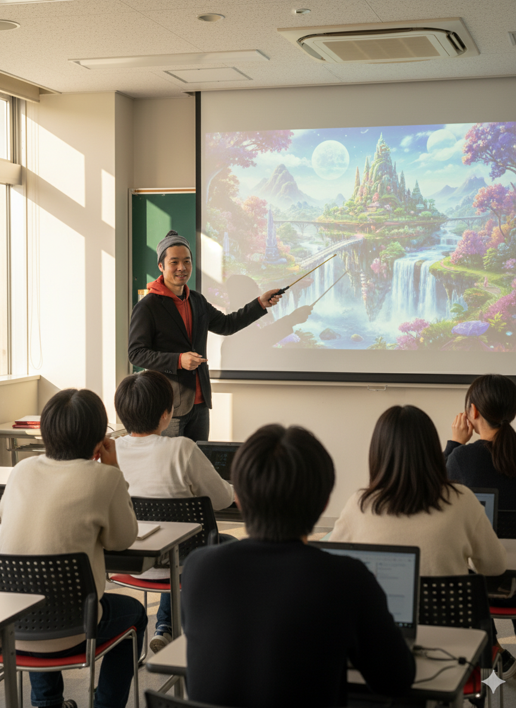
# AIを使って画像生成をしてみよう

**クリエイティブな画像を簡単に作成**
---

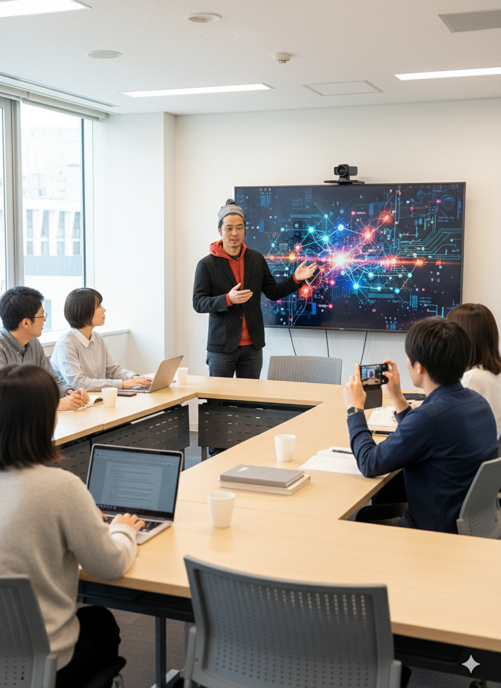
## 本日の目標

- AI画像生成の仕組みを理解する
- 効果的なプロンプトの書き方を学ぶ
- NanoBananaでキャラクターを作成してみる
- 仕事での活用方法を知る
---

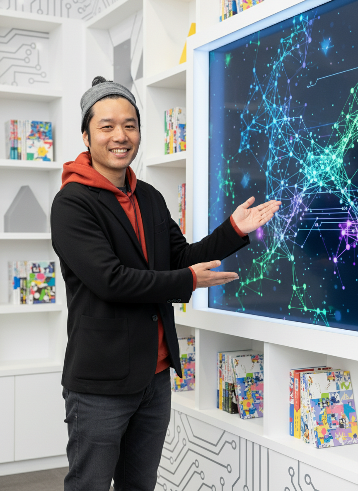
# 第1部：AI画像生成の基礎
---

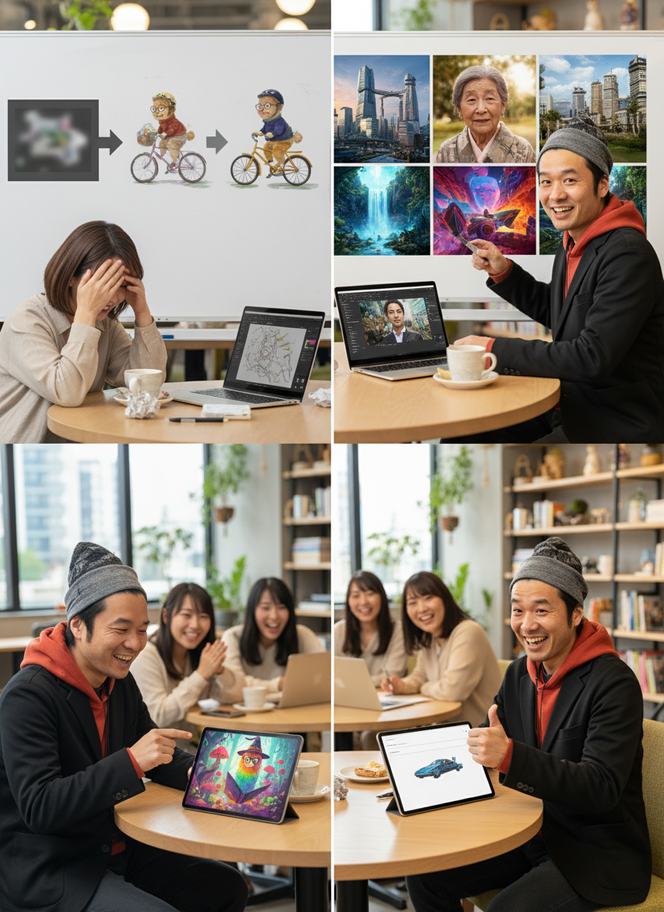
## AI画像生成とは？

**テキストの指示から画像を作り出す技術**

### 特徴
- 文章で説明するだけで画像が生成される
- 数秒〜数分で完成
- 何度でも作り直せる
- デザインスキル不要
---

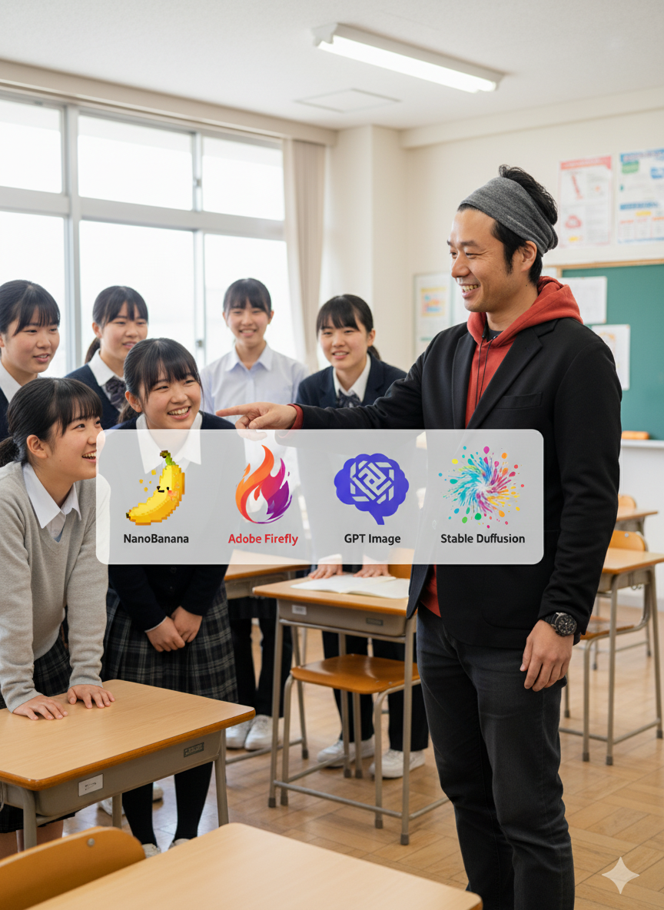
## 主なAI画像生成ツール

| ツール | 特徴 | 料金 |
|--------|------|------|
| **NanoBanana** | Gemini 2.5 Flash Image、無料 | 無料 |
| **Adobe Firefly** | 商用利用可、高品質 | 一部無料 |
| **GPT Image** | ChatGPT統合 | 有料 |
| **Midjourney** | 高クオリティ | 有料 |
| **Stable Diffusion** | オープンソース | 無料 |
---


## 今日使うツール

### NanoBanana (Gemini 2.5 Flash Image)
- Googleが提供する最新画像生成AI
- 無料で利用可能
- 日本語対応
- キャラクター生成に強い
- 縦長画像に最適

### アクセス方法
**https://gemini.google.com/**
Geminiで「画像を生成」と指示するだけ
---

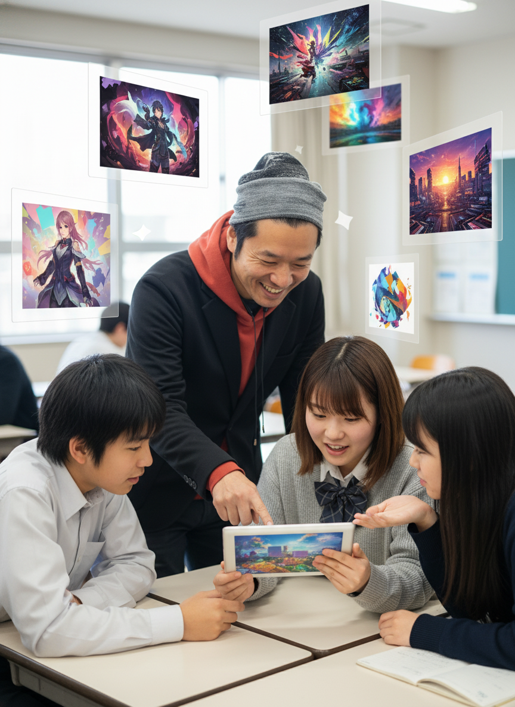
## AI画像生成でできること

### 1. イラスト・アート作成
- キャラクター
- 風景画
- 抽象アート

### 2. ビジネス用画像
- プレゼン資料
- SNS投稿
- ブログのアイキャッチ

### 3. デザインのアイデア出し
- ロゴの下絵
- レイアウト案
- 配色イメージ
---


## AI画像生成の仕組み

### 簡単に言うと...

1. **学習**：大量の画像とその説明文を学習
2. **理解**：プロンプト（指示文）を分析
3. **生成**：学習した知識から画像を作成
4. **調整**：ユーザーの要望に応じて修正
---

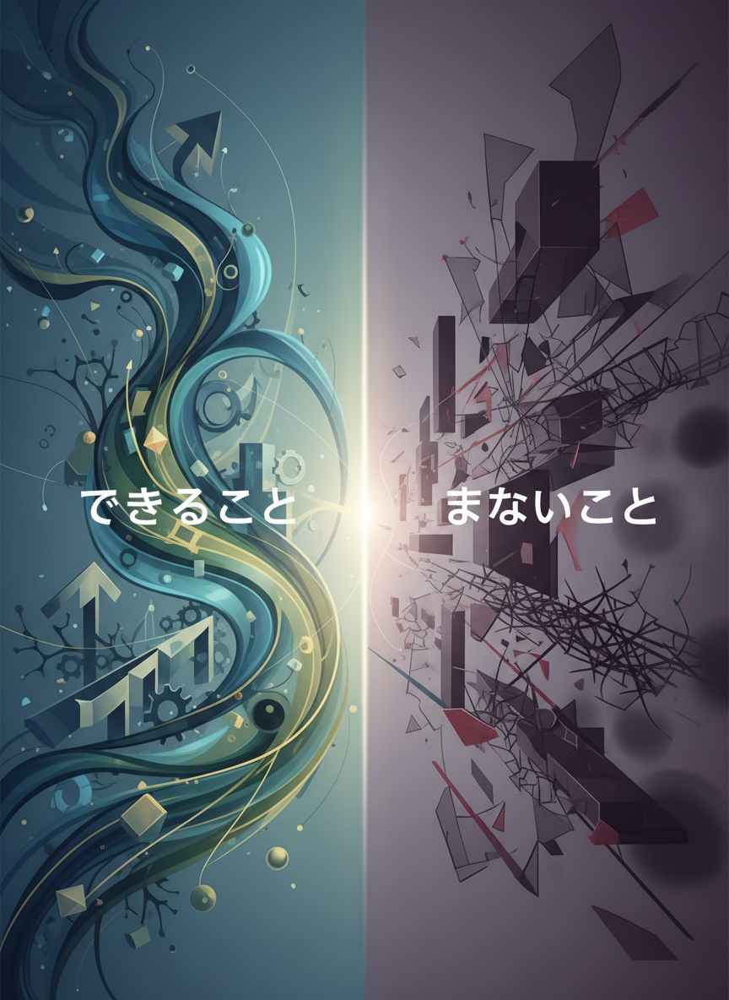
## できることとできないこと

### ✅ できること
- オリジナルの画像を作る
- スタイルを指定する
- 複数のバリエーションを作る
- 細かい調整

### ❌ 苦手なこと
- 実在の特定人物の再現
- 複雑な文字の生成
- 正確な解剖学的構造
- 完全に写実的な表現（改善中）
---

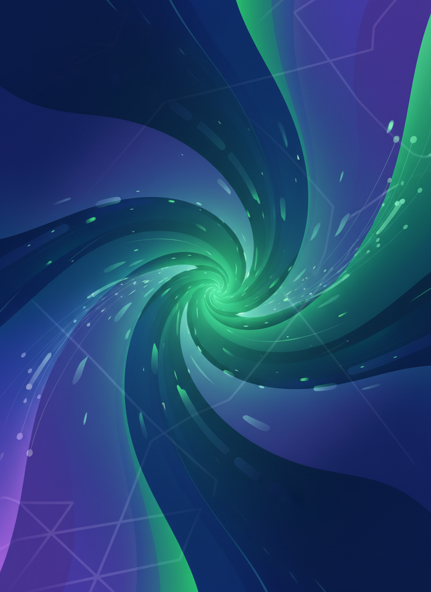
# 第2部：プロンプトの書き方（30分）
---

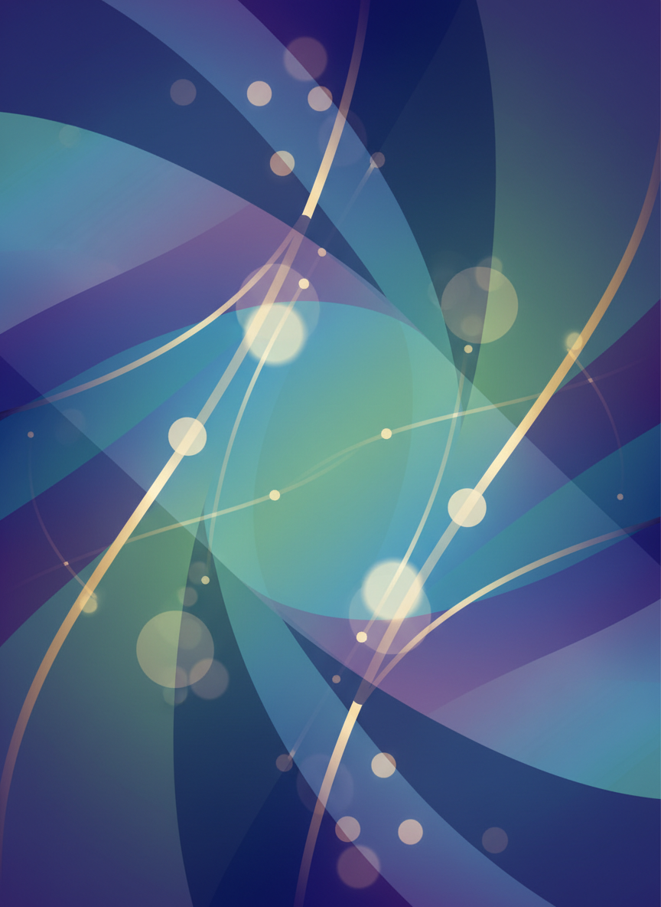
## プロンプトとは？

**AI画像生成への指示文**

### 基本構成
1. **主題**：何を描くか
2. **スタイル**：どんな雰囲気か
3. **詳細**：色、構図、要素
4. **品質**：解像度、クオリティ
---

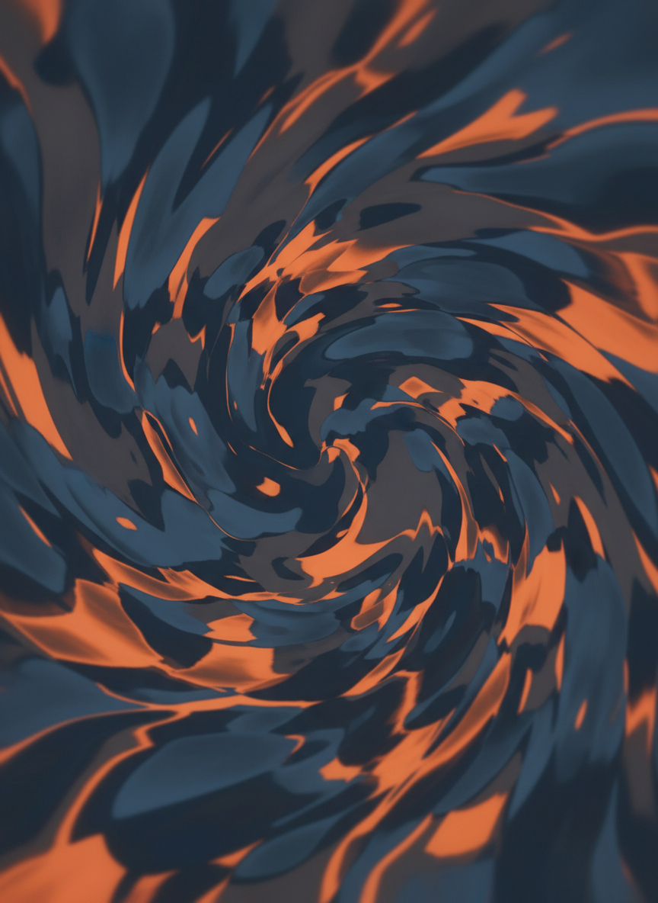
## プロンプトの例：悪い例

❌ **悪い例**
```
猫
```

### 何が足りない？
- どんな猫？
- どんな場所？
- どんなスタイル？
- 何をしている？
---

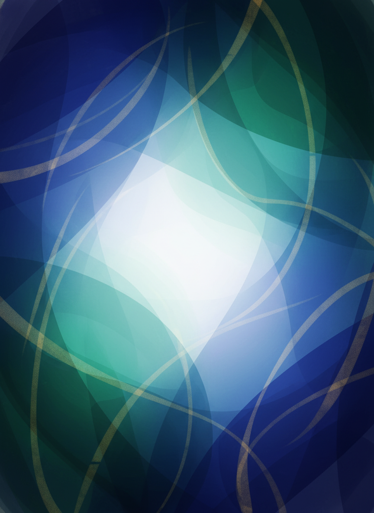
## プロンプトの例：良い例

✅ **良い例**
```
白い子猫が窓辺で日向ぼっこをしている、
水彩画風、柔らかい光、温かみのある色合い、
リラックスした雰囲気
```

### なぜ良い？
- 具体的
- スタイル指定
- 雰囲気が伝わる
- イメージしやすい
---


## プロンプトの構成要素

### 1. 主題（必須）
```
猫、風景、人物、建物 など
```

### 2. スタイル
```
水彩画、アニメ風、写実的、
イラスト、3D、ミニマル など
```

### 3. 雰囲気・トーン
```
明るい、暗い、神秘的、
温かい、クール、レトロ など
```
---

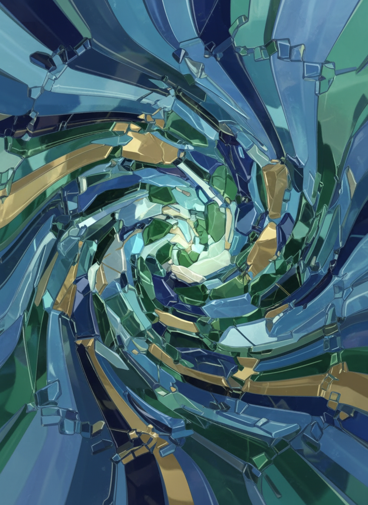
## プロンプトの構成要素（続き）

### 4. 色
```
パステルカラー、モノクロ、
鮮やかな、淡い、ビビッド など
```

### 5. 構図・視点
```
正面から、俯瞰、アップ、
全体像、中央配置 など
```

### 6. 詳細要素
```
背景、光の方向、時間帯、
季節、小物 など
```
