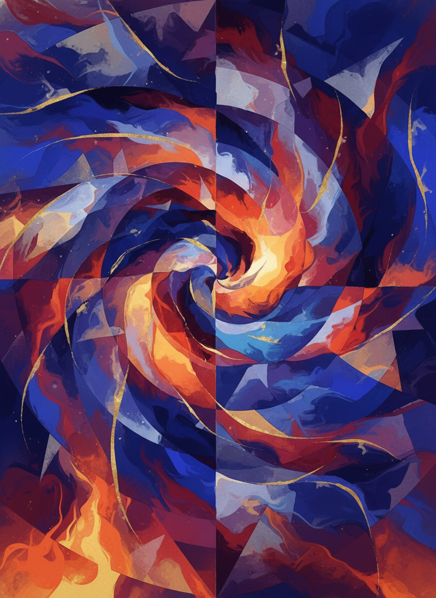
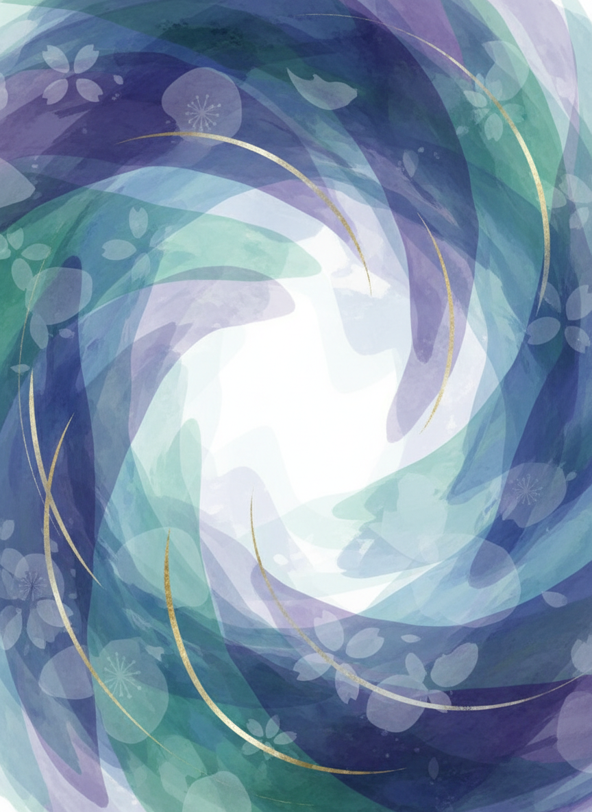
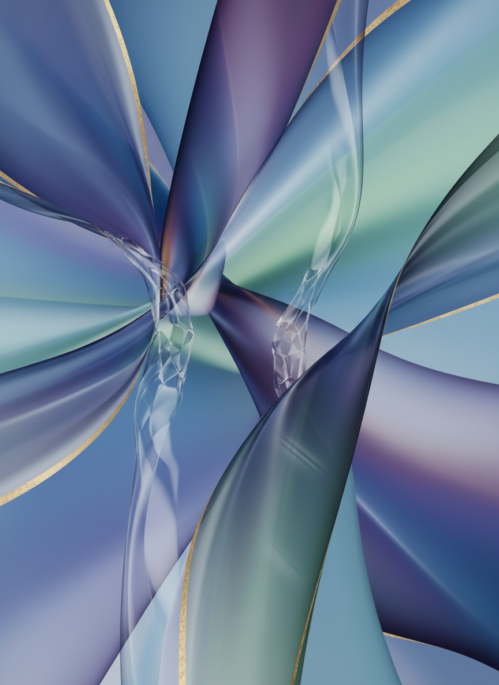
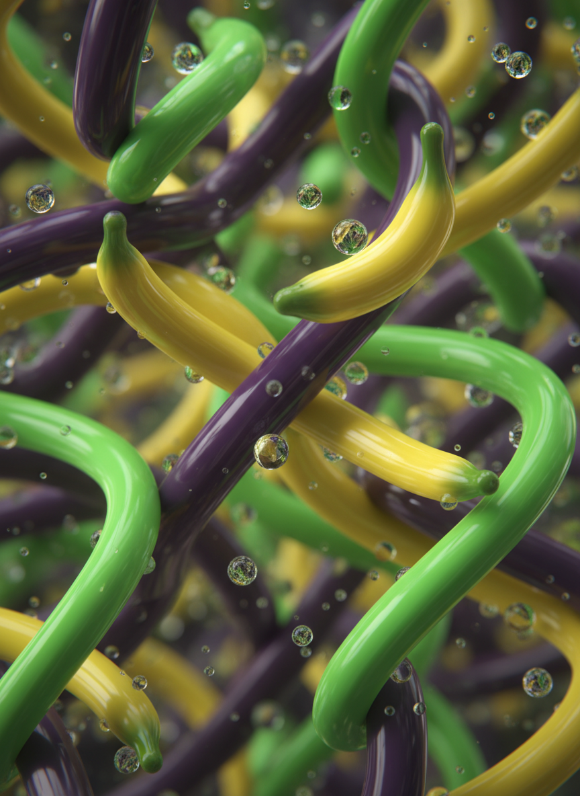
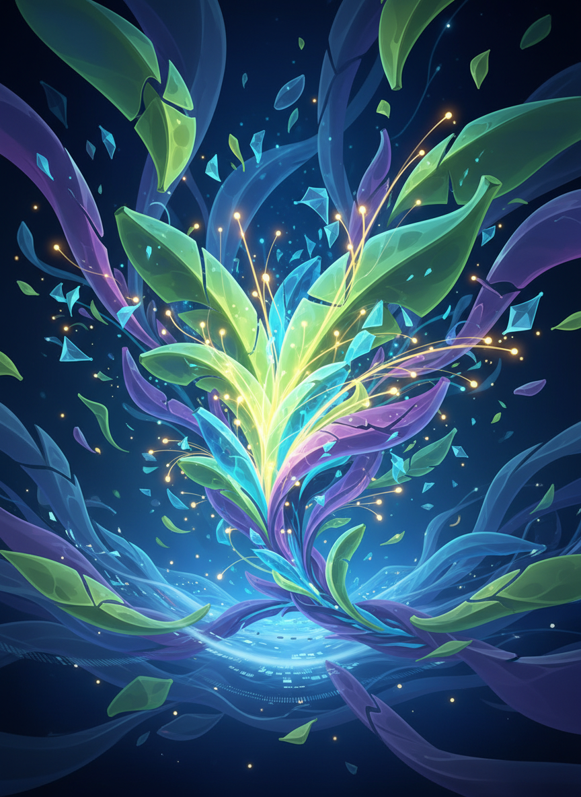
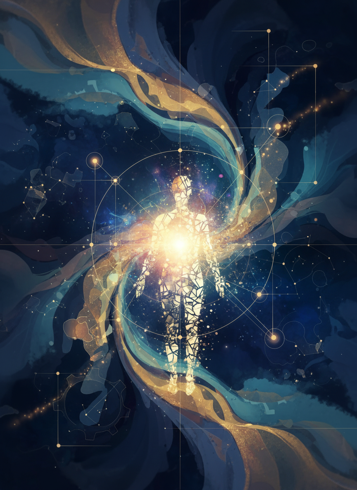
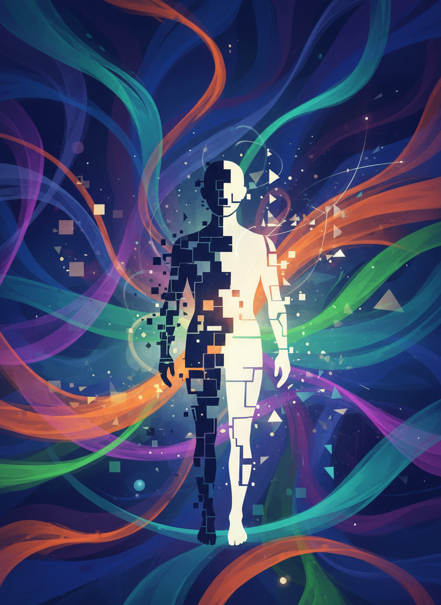

## 実習1：プロンプトを書いてみよう（15分）

### 課題1
「カフェ」の画像を作るプロンプトを考える

### テンプレート
```
【主題】カフェの店内
【スタイル】○○風
【雰囲気】○○な感じ
【色】○○系
【詳細】○○がある
```

**実際に書いてみましょう**
---


## プロンプト例の比較

### シンプル版
```
おしゃれなカフェ
```

### 詳細版
```
北欧風のおしゃれなカフェの店内、
木のテーブルと白い椅子、大きな窓から
柔らかい自然光が差し込む、観葉植物、
温かみのある雰囲気、ミニマルデザイン
```

**どちらが良い画像が生成されるでしょうか？**
---


## スタイル指定の例

### アート系
- 水彩画風
- 油絵風
- イラスト風
- アニメ風
- 漫画風

### デザイン系
- ミニマル
- モダン
- レトロ
- ビンテージ
- フラットデザイン

### その他
- 写実的
- 3Dレンダリング
- ピクセルアート
- 手描き風
---


## 実習2：スタイルを試す（15分）

### 課題
同じ主題で、異なるスタイルを試す

### 例：「山の風景」
1. 水彩画風
2. アニメ風
3. 写実的
4. ミニマルアート

**それぞれどう違うか観察しましょう**
---


## 休憩（10分）
---


# 第3部：NanoBananaでキャラクター作成（40分）
---


## NanoBananaとは？

**Googleの最新AI画像生成モデル**

### 特徴
- Gemini 2.5 Flash Imageベース
- キャラクターデザインに強い
- 無料で利用可能
- Geminiから直接アクセス可能
- 縦長画像生成に最適

### アクセス方法
Gemini（gemini.google.com）で「画像を生成」と指示
---


## NanoBananaの強み

### キャラクター生成で優れている点

1. **表情が豊か**
   - 感情表現が細かい
   - 自然な笑顔や驚き顔

2. **スタイルの自由度**
   - アニメ、イラスト、リアル
   - 様々なテイストに対応

3. **ディテールが高品質**
   - 髪の毛、服装の細部
   - 小物やアクセサリー
---


## 実習3：初めてのキャラクター作成（15分）

### 課題1：シンプルなキャラクター
```
かわいい女の子のキャラクター、
笑顔、カジュアルな服装、
アニメ風イラスト、明るい雰囲気、
シンプルな背景
```

### 課題2：個性的なキャラクター
```
冒険者の男性キャラクター、
勇敢な表情、ファンタジー風の衣装、
剣を持っている、ゲームイラスト風
```

**実際に生成してみましょう**
---


## キャラクター生成のコツ

### プロンプトに含めるべき要素

1. **基本情報**
   - 年齢、性別、体型

2. **表情・ポーズ**
   - 笑顔、真剣、驚き
   - 立っている、座っている

3. **服装・アクセサリー**
   - 具体的な服の種類
   - 小物やアイテム

4. **スタイル**
   - アニメ、マンガ、リアル
---


## 実習4：キャラクターのバリエーション（15分）

### 課題
同じキャラクターで異なる表情・ポーズを作成

### バリエーション例
```
【基本】元気な女子高生キャラクター
【表情1】笑顔で手を振っている
【表情2】驚いた表情で口を開けている
【表情3】考え込んでいる表情
【ポーズ1】走っている
【ポーズ2】座って本を読んでいる
```

**キャラクターの一貫性を保ちながら表現を変える**
---


## 実習5：ストーリーキャラクター作成（10分）

### 課題
ストーリーに登場するキャラクターを作成

### 例：絵本のキャラクター
```
森に住む優しいクマのキャラクター、
丸い体型、温かみのある表情、
赤いマフラーを身につけている、
絵本風イラスト、柔らかい色合い
```

### 例：SNS用アバター
```
自分をモデルにしたアバターキャラクター、
[自分の特徴]、カジュアルな服装、
親しみやすい笑顔、SNS用イラスト風
```

**用途に合わせたキャラクター作り**
---


## キャラクターの修正テクニック

### よくある調整ポイント

1. **表情の調整**
   - 「もっと優しい表情に」
   - 「少し真剣な顔に」

2. **服装の変更**
   - 「服の色を青に変えて」
   - 「アクセサリーを追加して」

3. **背景の調整**
   - 「背景をシンプルに」
   - 「森の中に立っているように」

Geminiに修正指示を出して理想のキャラクターに近づけましょう
---


# 第4部：実務での活用（20分）
---


## 活用シーン1：プレゼン資料

### Before
- 無料素材を探す（30分）
- イメージに合わない
- 他の人と被る

### After
- AIで生成（5分）
- イメージ通り
- オリジナル
