## プレゼン用画像のプロンプト例

### 表紙画像
```
ビジネスプレゼンテーション用の背景画像、
抽象的な幾何学模様、青とグレーのグラデーション、
プロフェッショナル、モダン、ミニマル
```

### セクション区切り
```
成長を表すイメージ、
上昇する矢印と緑の芽、
希望と前進の雰囲気、シンプル
```
---

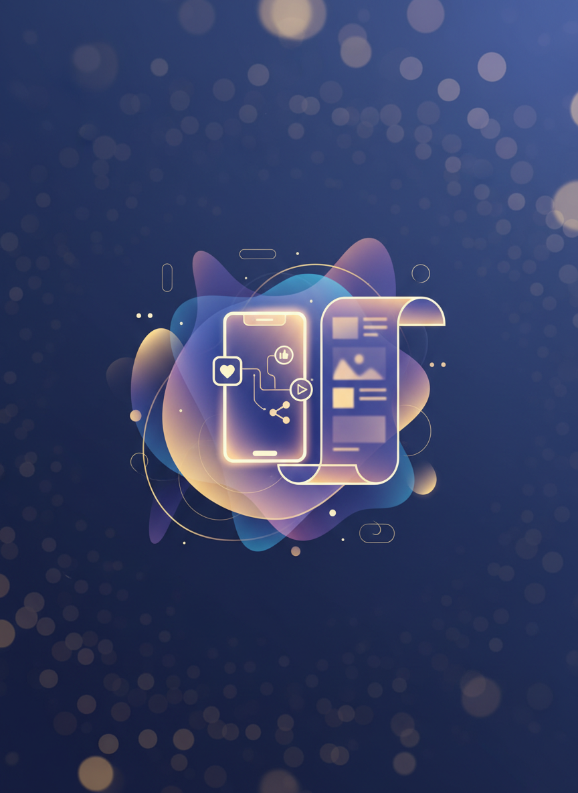
## 活用シーン2：SNS・ブログ

### 用途
- アイキャッチ画像
- 投稿用ビジュアル
- ヘッダー画像
- サムネイル

### サイズ指定
```
横長の画像（16:9）
正方形の画像
縦長の画像（Instagram Stories用）
```
---


## SNS用画像のプロンプト例

### Instagram投稿
```
カフェの朝食プレート、
トーストとコーヒー、サラダ、
上から見た構図、
明るく爽やかな雰囲気、
北欧風、自然光
```

### ブログアイキャッチ
```
「働き方改革」をテーマにした画像、
ノートパソコンとコーヒー、
明るいオフィス空間、
前向きで希望に満ちた雰囲気
```
---

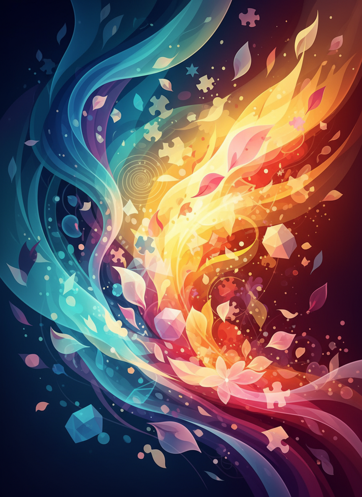
## 活用シーン3：デザインのアイデア出し

### 使い方
1. **ラフ案作成**
   - デザインの方向性を視覚化

2. **配色検討**
   - 色の組み合わせを試す

3. **レイアウト参考**
   - 構図のヒント
---

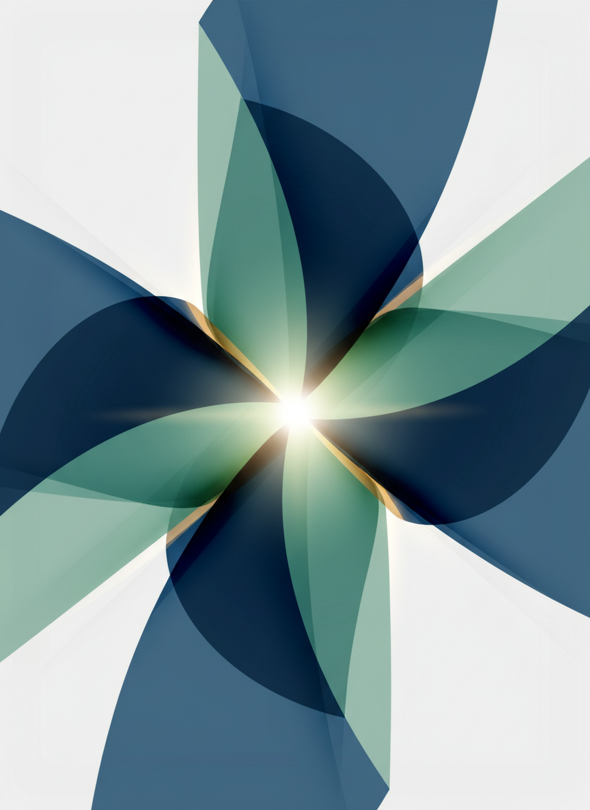
## デザイナーへの依頼にも活用

### Before
```
「おしゃれな感じで」
→ 抽象的で伝わらない
```

### After
```
AIで生成した画像を見せる
「こんなイメージで」
→ 具体的で伝わりやすい
```
---

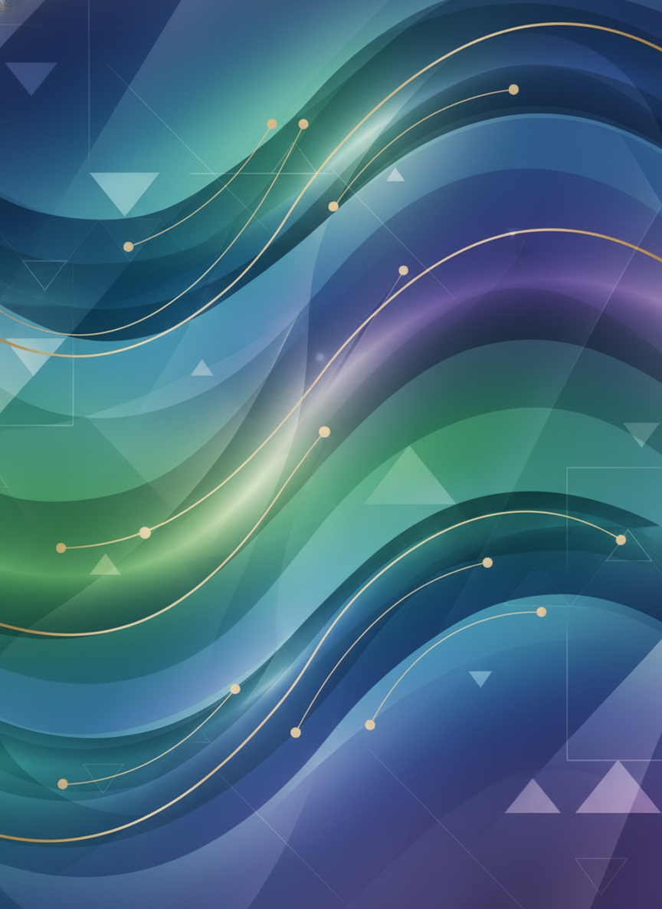
## 実習6：実務用画像作成（15分）

### 課題
実際に使える画像を作る

### テーマ選択
1. プレゼン表紙
2. SNS投稿画像
3. ブログアイキャッチ
4. イベントフライヤー

**実務を想定して作ってみましょう**
---

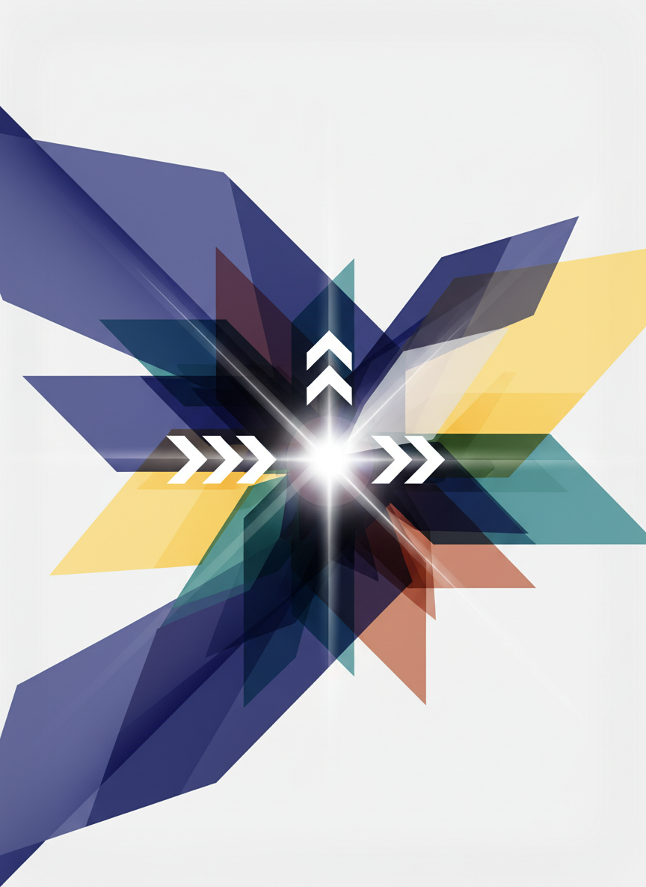
# 第5部：注意点とルール（10分）
---


## 著作権について

### 基本ルール
- ✅ 生成した画像は基本的に使える
- ✅ 商用利用は各サービスの規約確認
- ❌ 実在人物の肖像権侵害
- ❌ 既存キャラクターの無断使用

### NanoBananaの場合
- 個人利用：OK
- 商用利用：規約を確認
- AI生成であることの明示を推奨
---

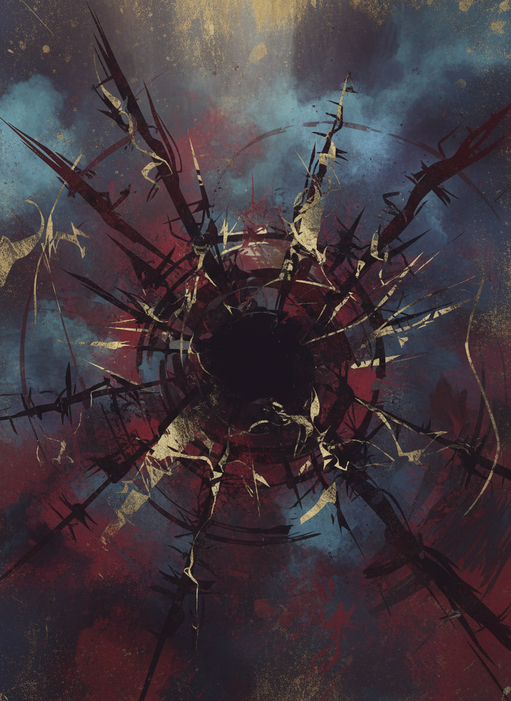
## やってはいけないこと

### ❌ 禁止事項
1. **有害なコンテンツ**
   - 暴力的、差別的な画像

2. **誤情報の拡散**
   - フェイクニュース用の画像

3. **権利侵害**
   - 既存作品の模倣
   - 実在人物の無断使用

4. **悪意ある利用**
   - 詐欺、なりすまし
---

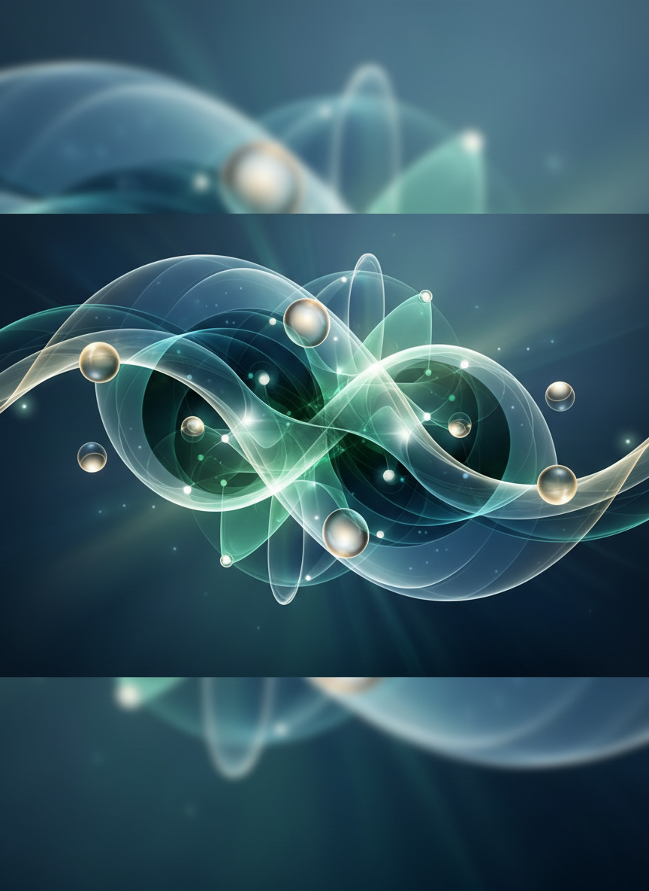
## 倫理的な使用

### 心がけること

1. **透明性**
   - AI生成であることを明示

2. **誠実性**
   - 誤解を招く使い方をしない

3. **尊重**
   - 他者の権利を侵害しない

4. **責任**
   - 生成物の使用に責任を持つ
---

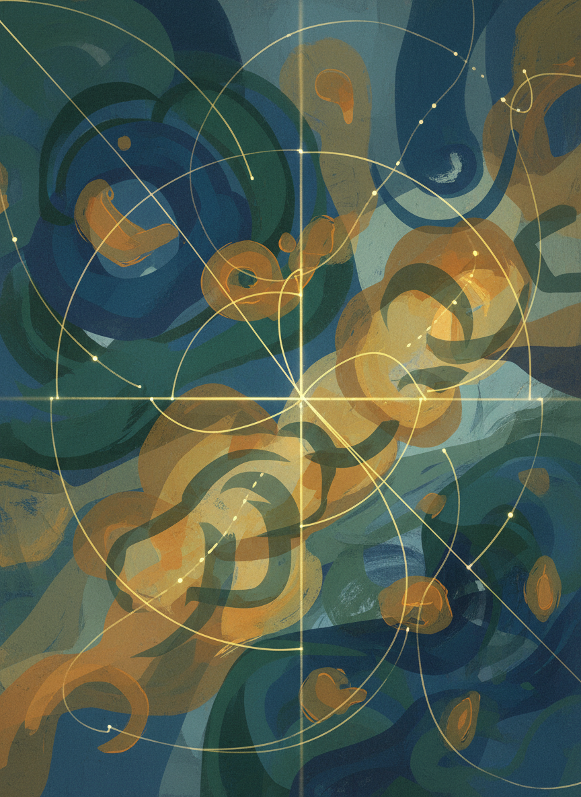
## クオリティの見極め

### チェックポイント
- 手足の描写（指の本数など）
- 顔の対称性
- 文字の正確性
- 物理法則（影、遠近感）

### 不自然な部分は修正
- 再生成
- 画像編集ツールで調整
- プロンプトを具体化
---

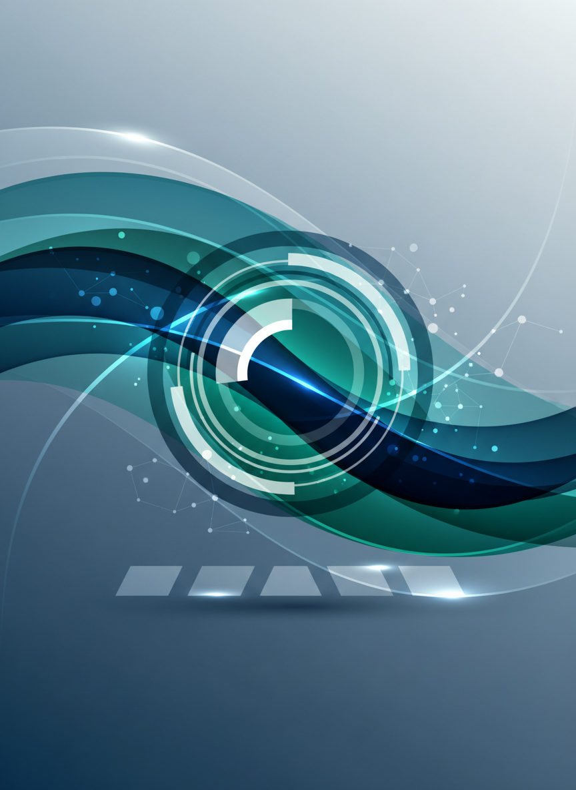
# まとめ（5分）
---

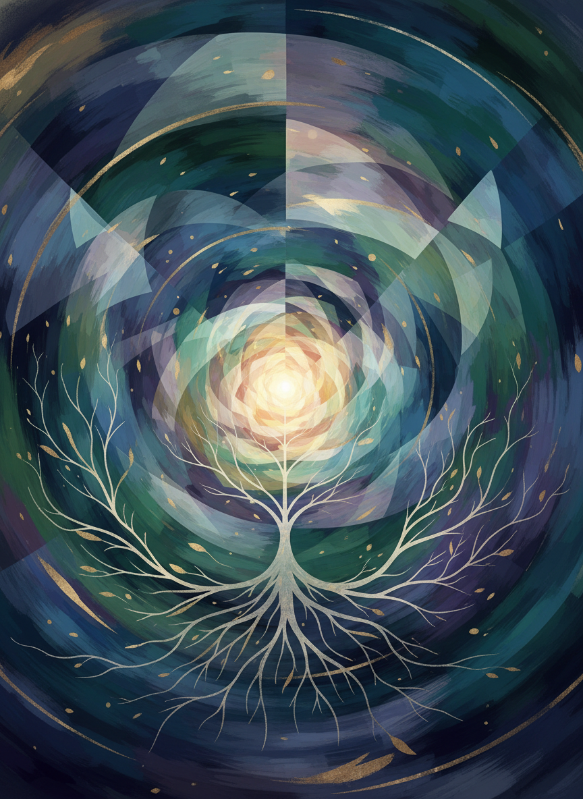
## 今日学んだこと

✅ AI画像生成の基礎
✅ 効果的なプロンプトの書き方
✅ NanoBananaでキャラクター作成
✅ 実務での活用方法
✅ 著作権と倫理
---

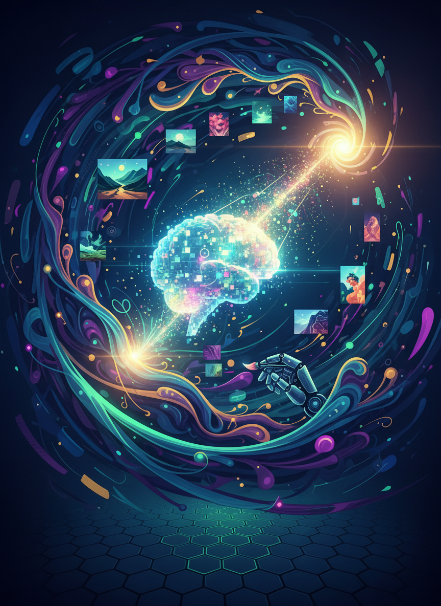
## AI画像生成マスターへの道

### レベル1：基本的な画像が作れる
### レベル2：プロンプトを工夫できる
### レベル3：修正指示が的確にできる
### レベル4：実務で効果的に活用できる
### レベル5：独自のスタイルを確立

**あなたは今どのレベル？**
---

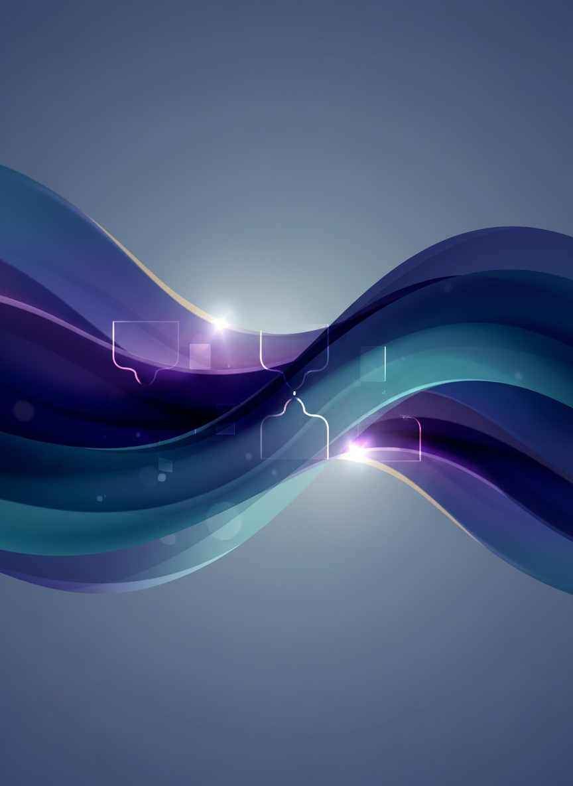
## 実践課題

### 今週のチャレンジ

1. **毎日1枚画像生成**
   - 様々なテーマで練習
   - プロンプトのパターンを増やす

2. **実務で使ってみる**
   - 資料やSNSで実際に使用
   - 反応を確かめる

3. **プロンプト集作成**
   - 良かったプロンプトを保存
   - 再利用できるようにする
