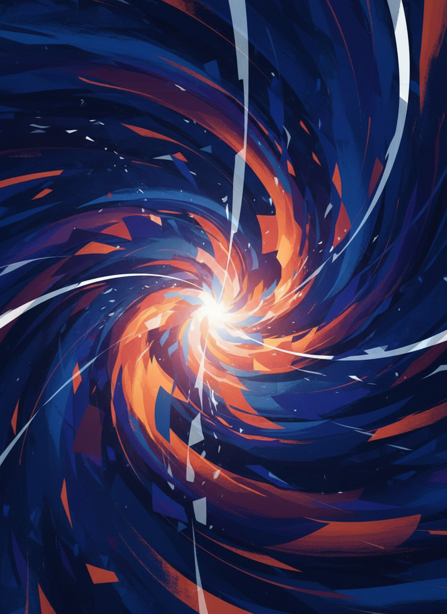
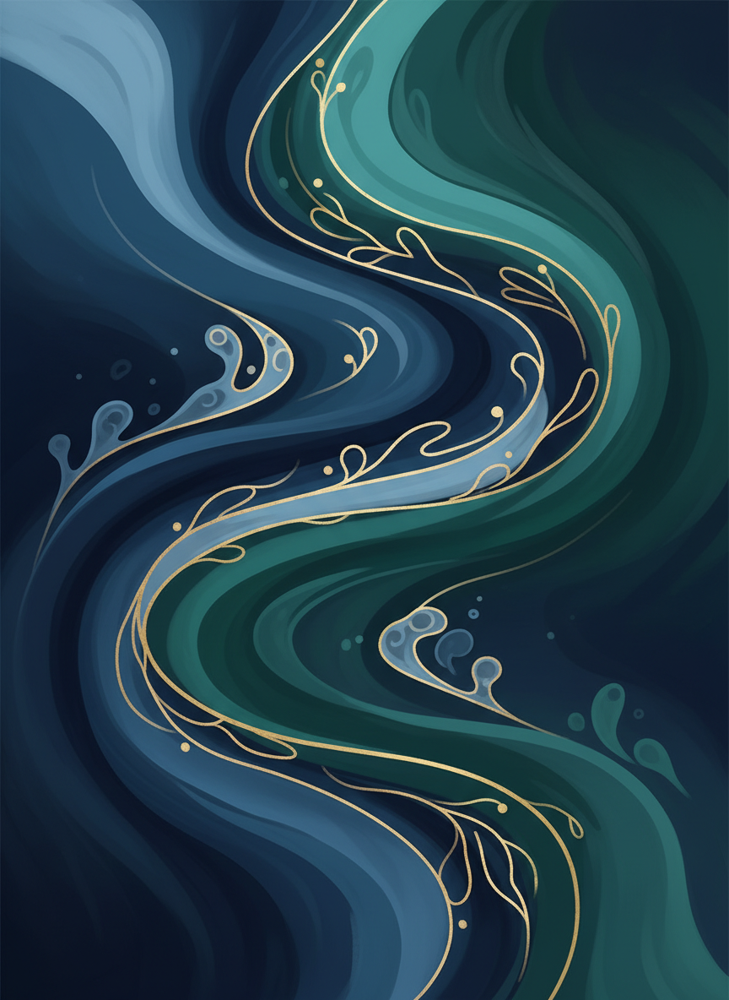
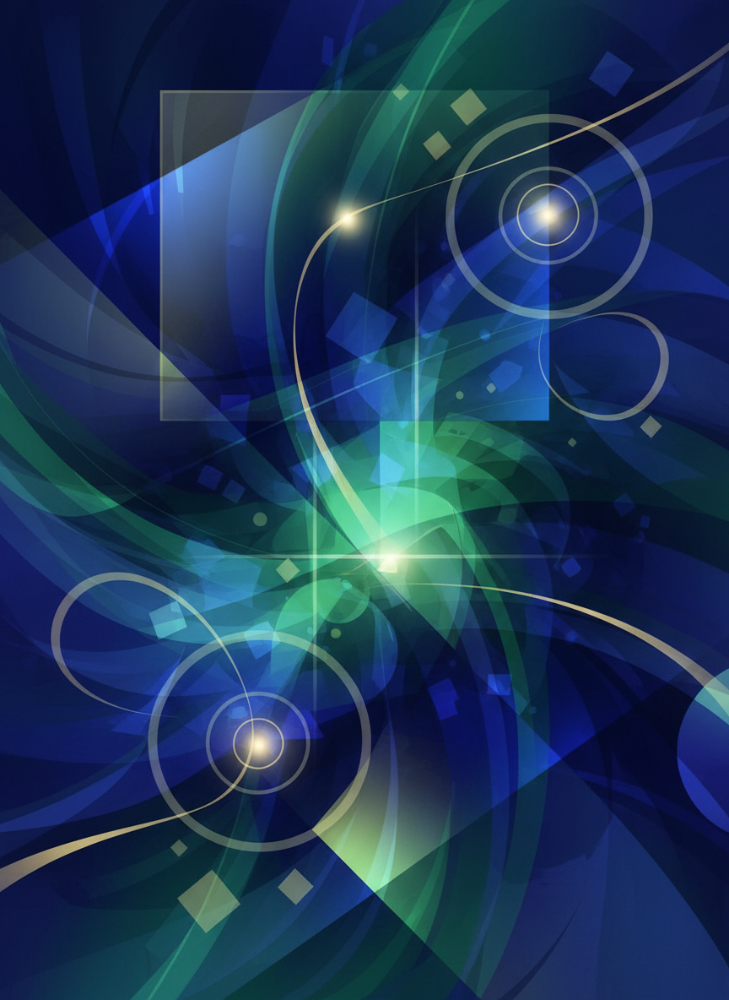
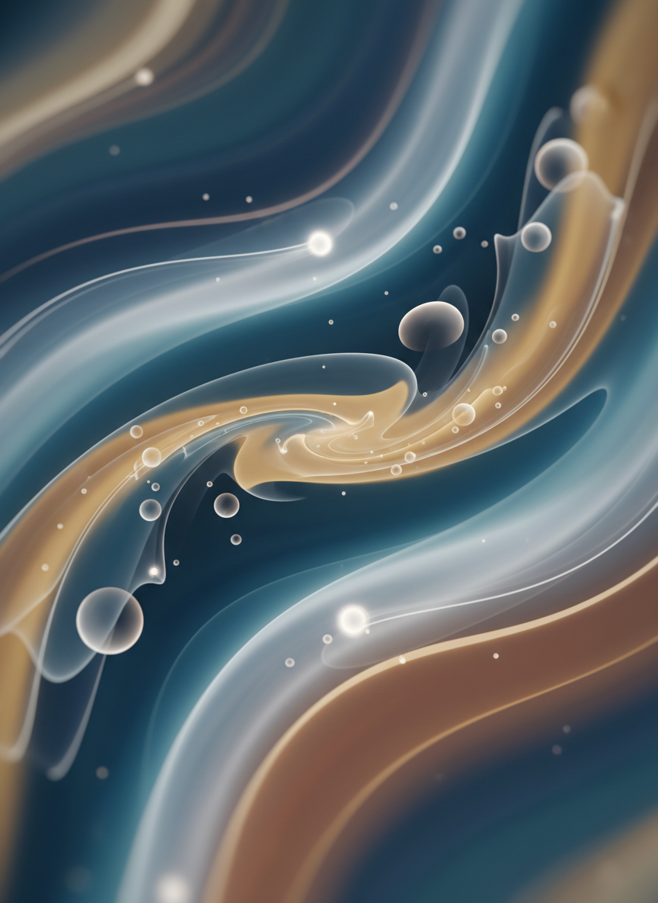
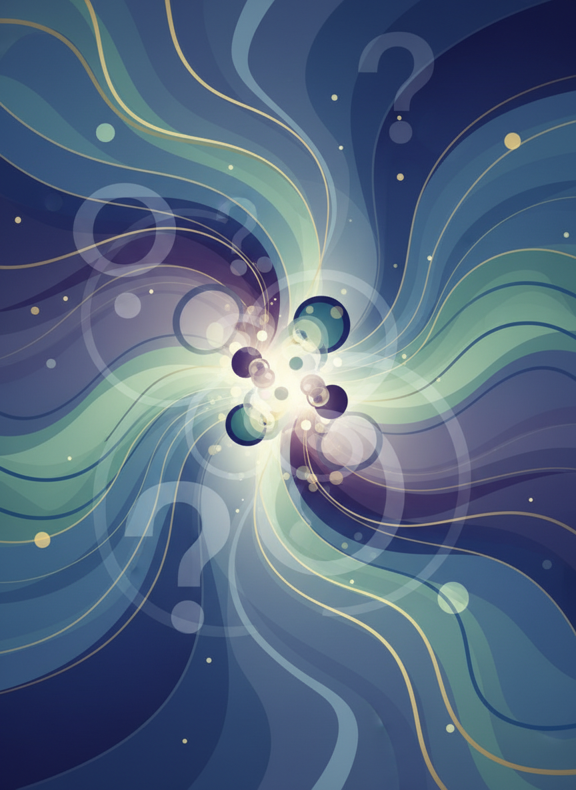
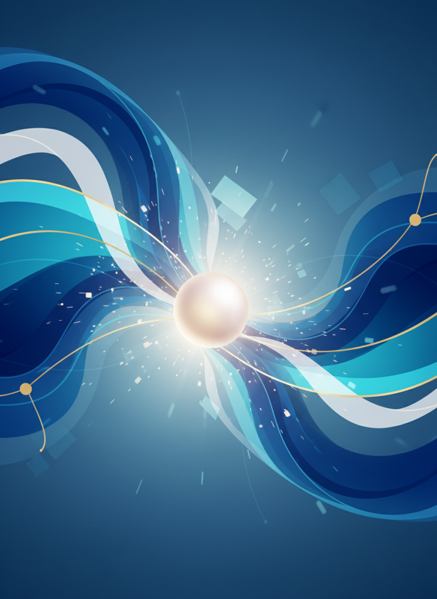
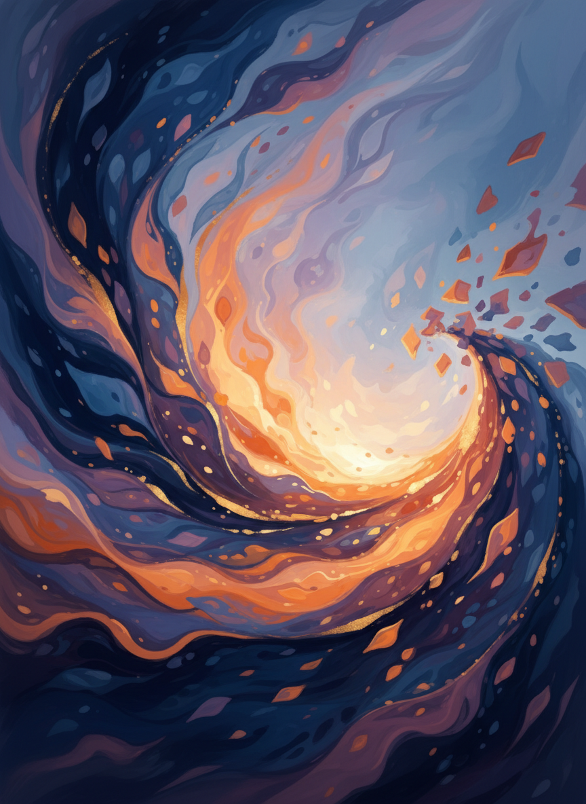

## 時短効果

### Before AI
- 素材探し：30-60分
- イメージ通りのものが見つからない
- 有料素材の購入

### After AI
- 画像生成：5-10分
- イメージ通りの画像
- 無料または低コスト

**50分以上の時短 + コスト削減！**
---


## 次回予告

### 「バナー作り」講座

- Canvaの使い方
- AIとデザインツールの組み合わせ
- 魅力的なバナーデザイン
- 実践的なバナー作成
---


## 参考リソース

### ツール
- **NanoBanana**: Gemini 2.5 Flash Image
- **GPT Image**: ChatGPT画像生成
- **Adobe Firefly**: 商用向け高品質
- **Canva**: 画像編集・加工

### 学習リソース
- プロンプトライブラリ
- AI画像生成コミュニティ
- デザインギャラリー
---


## プロンプトテンプレート集

### 風景
```
[場所]の風景、[時間帯]、[天気]、
[スタイル]、[雰囲気]
```

### 人物
```
[年齢・性別]が[行動]している、
[場所]、[服装]、[表情]、
[スタイル]、[雰囲気]
```

### 抽象・アート
```
[テーマ]を表現した抽象アート、
[色]、[形]、[質感]、[雰囲気]
```
---


## ワンポイントアドバイス

### AI画像生成のコツ

1. **具体的に**
   - 詳しく説明する

2. **試行錯誤**
   - 何度でもチャレンジ

3. **参考画像を見る**
   - 良い画像を研究

4. **プロンプトを保存**
   - 再利用できるように
---


## 質問タイム

**わからないこと、もっと知りたいことはありますか？**
---


## メッセージ

### クリエイティビティは誰にでもある

- デザインスキルは不要
- アイデアがあれば画像が作れる
- AIはあなたの創造力を形にするツール

**AIを味方につけて、クリエイターになろう！**
---


## お疲れ様でした！

次回の講座でお会いしましょう

**あなたの想像力が形になる！**
