# AIとCanvaでバナー作り

**魅力的なデザインを簡単に作成**
秋田県IT女性育成プログラム
120分講座
---


## 本日の目標

- バナーデザインの基本を理解する
- Canvaの使い方をマスターする
- AIを活用したデザイン制作を学ぶ
- 実際にバナーを作成できるようになる
---


## アイスブレイク（5分）

### 質問
デザインでこんな悩みはありませんか？

- デザインの知識がない
- Photoshopは難しそう
- センスがないと思っている
- プロに頼むと高額

**Canva + AIで解決！**
---


# 第1部：バナーデザインの基本（25分）
---


## バナーとは？

**情報を視覚的に伝える広告・告知用の画像**

### 用途
- Webサイトの広告
- SNS投稿
- イベント告知
- キャンペーン宣伝
- ブログのアイキャッチ
---


## バナーの種類とサイズ

### Web広告
- レクタングル：300×250px
- ビッグバナー：728×90px
- スカイスクレイパー：160×600px

### SNS
- Instagram投稿：1080×1080px
- Facebook カバー：820×312px
- Twitter ヘッダー：1500×500px

### その他
- YouTube サムネイル：1280×720px
- ブログ アイキャッチ：1200×630px
---


## 良いバナーの3原則

### 1. 一目でわかる
- メッセージが明確
- 視線誘導がスムーズ
- 3秒ルール（3秒で理解できる）

### 2. 目を引く
- インパクトのある色
- 魅力的なビジュアル
- 適度なコントラスト

### 3. 行動を促す
- 明確なCTA（Call To Action）
- わかりやすいボタン
- 誘導する言葉
---


## 悪いバナーの例

```
┌─────────────────┐
│ 新商品発売！！！    │
│ とってもお得です    │
│ 詳しくはこちら      │
│ 今すぐクリック      │
│ 期間限定です        │
│ お見逃しなく！      │
└─────────────────┘
```

### 問題点
- 文字が多すぎる
- 何の商品かわからない
- ごちゃごちゃしている
- ビジュアルがない
---


## 良いバナーの例

```
┌───────────────────┐
│     [商品画像]        │
│                       │
│  春の新作コーヒー     │
│     50%OFF            │
│                       │
│    [詳細を見る]       │
└───────────────────┘
```

### 改善点
- ビジュアルが目立つ
- メッセージが明確
- シンプル
- CTAがわかりやすい
---


## バナーデザインの構成要素

### 1. キャッチコピー
大きく目立ち、短くインパクトのあるものにする。

### 2. ビジュアル（画像）
商品やサービスを表現する高品質な画像を使用する。

### 3. 補足情報
期間、価格、特典などを読みやすいサイズで配置する。

### 4. CTA（行動喚起）
「詳細を見る」「今すぐ購入」などのボタンやリンクを設置する。
---


## デザインの基本ルール

### 色の使い方
- **3色まで**：ベース、メイン、アクセント
- **コントラスト**：文字が読みやすく
- **色の意味**：赤=情熱、青=信頼、緑=安心

### フォント
- **2種類まで**：タイトルと本文
- **サイズに差**：階層を明確に
- **読みやすさ**：ゴシック体が無難

### レイアウト
- **余白**：詰め込まない
- **整列**：要素を揃える
- **視線誘導**：Z型、F型
---


# 第2部：Canvaの基本（30分）
---


## Canvaとは？

**無料で使えるオンラインデザインツール**

### 特徴
- ✅ ブラウザで動作
- ✅ 豊富なテンプレート
- ✅ ドラッグ&ドロップで簡単
- ✅ 無料プランが充実
- ✅ AI機能搭載

### アクセス
**https://www.canva.com/**
---


## Canvaでできること

### 1. バナー・SNS画像
- 各種サイズのテンプレート
- すぐに作れる

### 2. プレゼン資料
- スライド作成
- アニメーション

### 3. 印刷物
- チラシ、名刺、ポスター

### 4. 動画編集
- 簡単な動画作成
---


## Canvaの登録（5分）
---

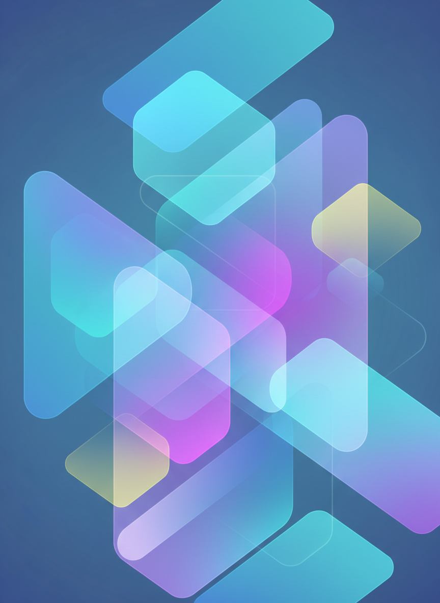
## Canvaの画面構成

### 主要エリア
1. **テンプレート**：左側
2. **キャンバス**：中央（作業エリア）
3. **ツールバー**：上部
4. **素材パネル**：左側

### 基本操作
- ドラッグ&ドロップ
- クリックで選択
- ダブルクリックで編集
---


## 実習1：テンプレートから作成（15分）

### 課題
Instagram投稿用のバナーを作る

### 手順
1. 「デザインを作成」をクリック
2. 「Instagram 投稿」を選択
3. テンプレートを選ぶ
4. 文字を自分の内容に変更
5. 色や画像をカスタマイズ
6. ダウンロード
---


## テキストの編集

### 基本操作
1. テキストをクリック
2. 内容を入力
3. フォントを選択
4. サイズ調整
5. 色変更
6. 配置調整

### ショートカット
- **Ctrl + B**：太字
- **Ctrl + Z**：元に戻す
- **Ctrl + D**：複製
---

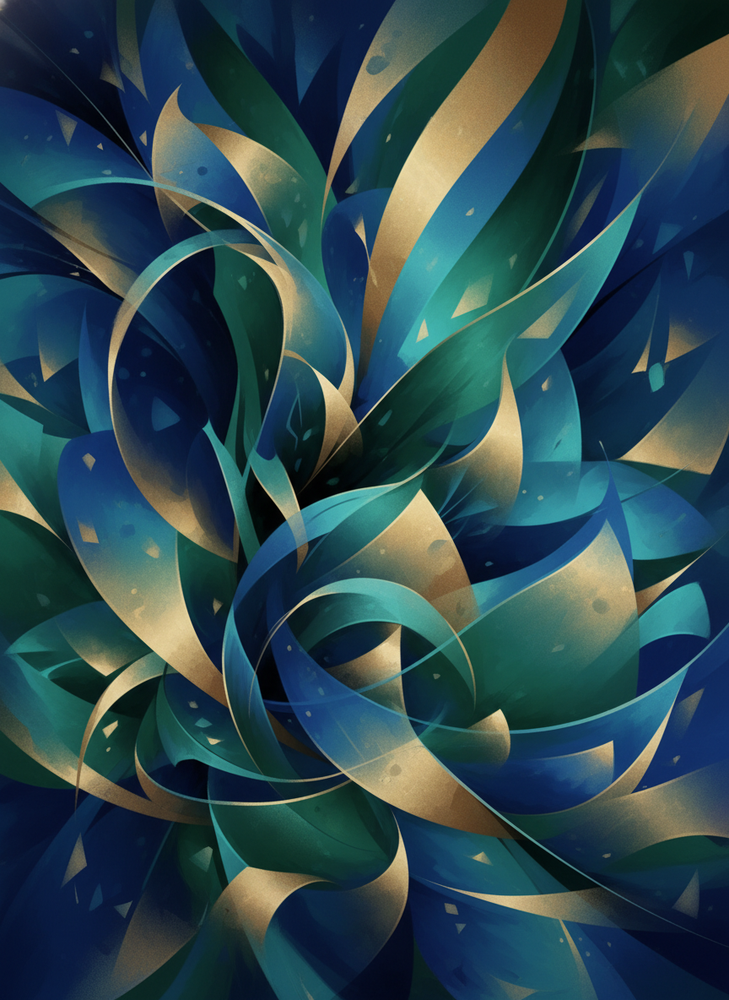
## 画像の追加と編集

### 画像を追加
1. 左メニューから「素材」
2. 検索バーで画像検索
3. 気に入った画像をクリック
4. キャンバスに配置

### 編集
- サイズ変更：角をドラッグ
- 移動：ドラッグ
- 削除：選択してDelete
---


## 実習2：ゼロから作成（10分）

### 課題
空白のキャンバスからバナー作成

### テーマ
「カフェの新メニュー告知」

### 手順
1. 空白のデザインを開始
2. 背景色を設定
3. テキストを追加
4. 画像を追加
5. 装飾を加える
---


## 休憩（10分）
---


# 第3部：AIを活用したデザイン（35分）
---


## CanvaのAI機能

### 1. Magic Write（文章生成）
- キャッチコピー作成
- 説明文作成

### 2. Magic Design（デザイン生成）
- 自動レイアウト
- カラーパレット提案

### 3. Background Remover（背景削除）
- ワンクリックで背景除去

### 4. Magic Edit（画像編集）
- AI画像補正
---

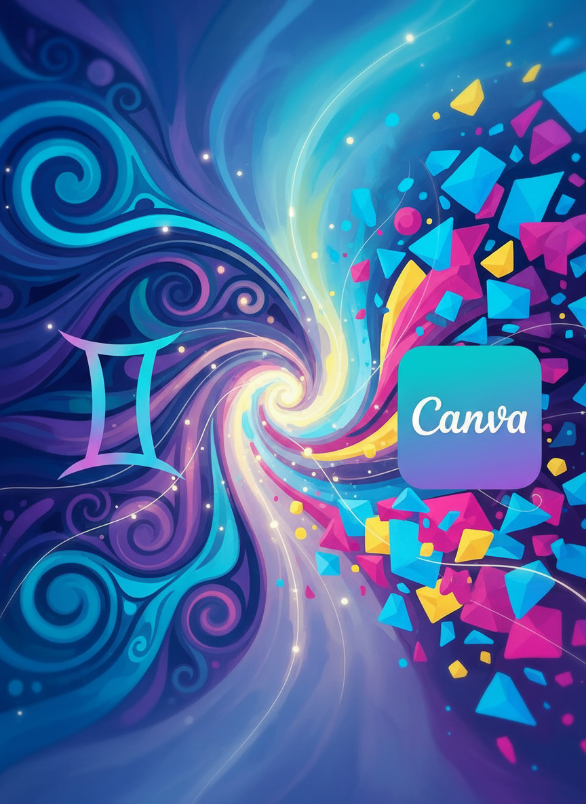
## GeminiでCanvaを支援

### デザイン前の準備

```
以下の内容でInstagram投稿用バナーを
作りたいです。

目的：新商品の告知
商品：オーガニックコーヒー
ターゲット：30代女性
トーン：ナチュラル、おしゃれ

効果的なキャッチコピーと
デザインの方向性を提案してください。
```
---


## 実習3：Gemini + Canva（20分）

### ステップ1：Geminiで企画
```
バナーのテーマ：[あなたのテーマ]
目的：[目的]
ターゲット：[ターゲット]

キャッチコピー、配色、
デザインの方向性を提案してください。
```

### ステップ2：Canvaで実装
Geminiの提案をもとにデザイン
---

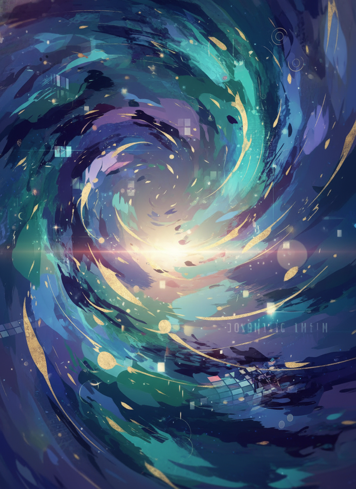
## キャッチコピーをGeminiに依頼

### プロンプト例
```
以下の商品・サービスのバナー用
キャッチコピーを5パターン作成してください。

商品：Webデザイン講座
特徴：初心者向け、オンライン、3ヶ月
ターゲット：IT転職希望の女性
訴求ポイント：未経験OK、実践的、就職支援

各コピーは15文字以内で。
```
---


## 配色をGeminiに相談

### プロンプト例
```
以下のイメージに合う配色を
3パターン提案してください。

イメージ：
・ナチュラル
・女性向け
・温かみがある
・信頼感

各色のカラーコード（#XXXXXX）と
使い方（背景、メイン、アクセント）も
教えてください。
```
---


## レイアウトの相談

### プロンプト例
```
バナーのレイアウトについて
アドバイスをください。

サイズ：1080×1080px（Instagram投稿）
要素：
- 商品画像
- キャッチコピー
- 説明文（1行）
- CTAボタン

効果的な配置を教えてください。
```
---

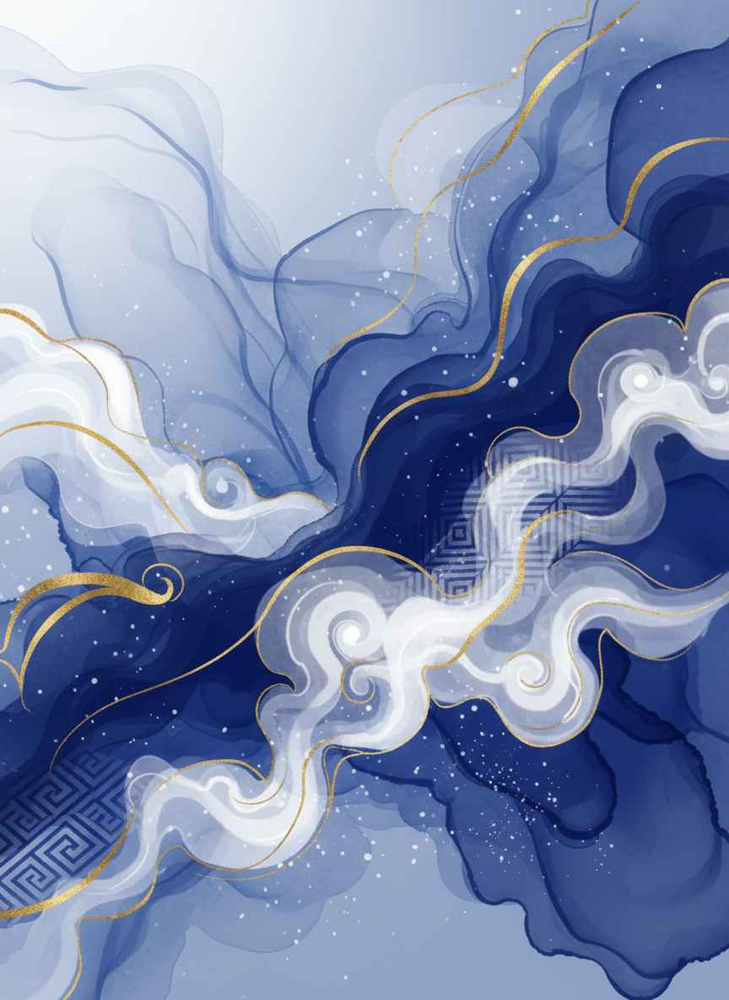
## 実習4：完全オリジナルバナー（15分）

### 課題
GeminiとCanvaを使って完全オリジナル

### テーマ例
1. イベント告知
2. サービス紹介
3. セール告知
4. 求人募集

**アイデア→デザイン→完成まで**
---

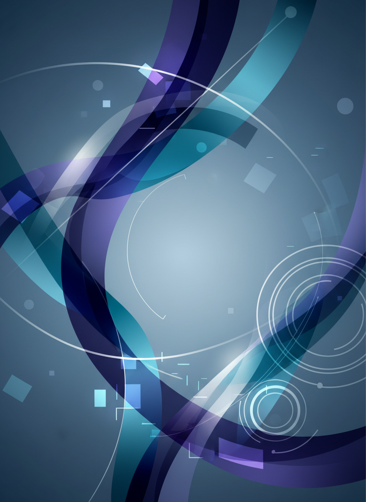
# 第4部：実践テクニック（15分）
---


## テクニック1：背景をAI画像で

### 手順
1. Geminiで背景画像を生成
2. ダウンロード
3. Canvaにアップロード
4. 背景として使用

### メリット
- オリジナリティ
- イメージ通り
- 無料
---


## テクニック2：ブランドキット

### 統一感のあるデザイン

### 設定内容
- ブランドカラー（3色）
- ブランドフォント（2種類）
- ロゴ

### Geminiに相談
```
以下のブランドのカラーパレットと
フォントを提案してください。

ブランド：[名前]
業種：[業種]
イメージ：[イメージ]
```
---


## テクニック3：複数サイズを一括作成

### Canvaの機能
1. デザインを作成
2. 「サイズ変更」をクリック
3. 別のサイズを選択
4. 自動で調整

### 便利な使い方
Instagram → Twitter → Facebook
と一度に複数サイズ作成
---

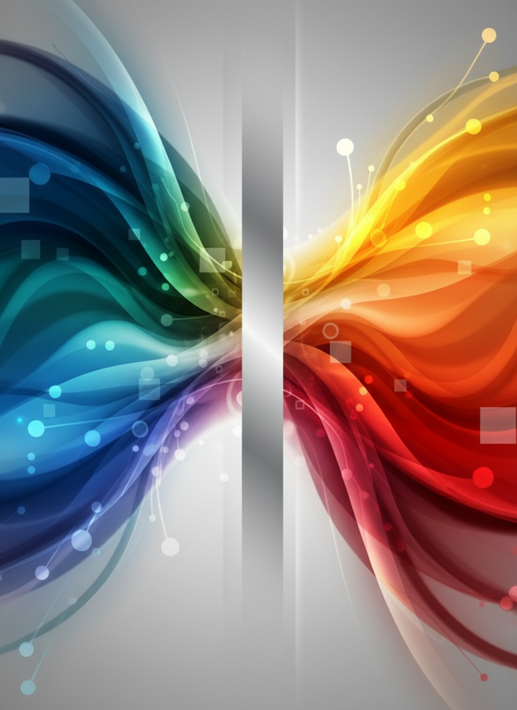
## テクニック4：A/Bテスト用バリエーション

### Geminiに依頼
```
同じ内容で、異なるデザインアプローチの
バナーを3パターン提案してください。

内容：[バナーの内容]

1. 文字中心
2. 画像中心
3. ミニマル

それぞれの特徴とターゲット層への
訴求力を説明してください。
```
---

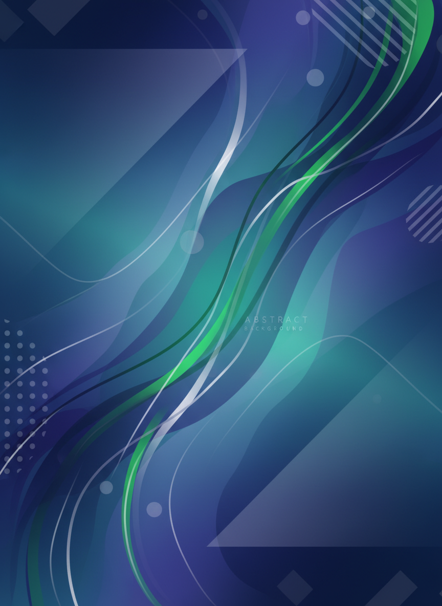
## 実習5：テクニック活用（10分）

### 複数パターン作成

1. 同じ内容で3パターン
2. 色違い
3. レイアウト違い
4. トーン違い

**どれが一番効果的か比較**
---


# 第5部：実務での活用（10分）
---


## 活用シーン1：SNS運用

### 定期投稿用バナー
- テンプレート化
- ブランドカラーで統一
- 短時間で大量生産

### ストーリーズ
- 縦長サイズ
- 動きのある要素
- スワイプアップ訴求
---

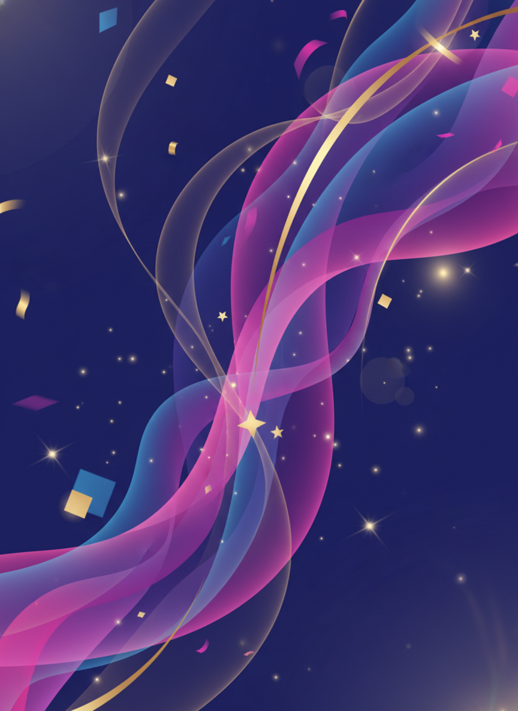
## 活用シーン2：イベント告知

### 必要なバナー
- メインビジュアル
- SNS投稿用
- Webサイト用
- メール署名用

### 全てCanvaで一括作成
---

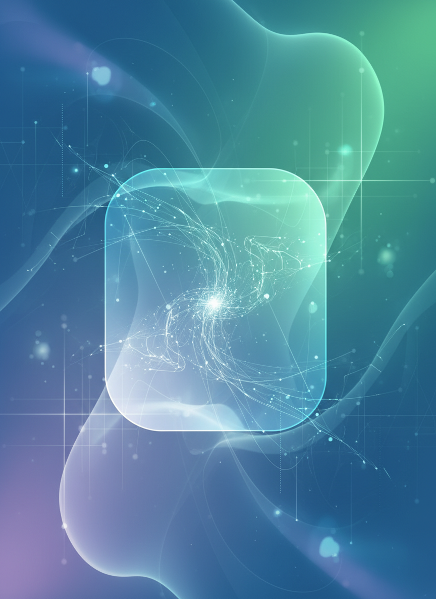
## 活用シーン3：Webサイト

### 使用箇所
- ヒーローイメージ
- セクション見出し
- CTA（行動喚起）ボタン
- バナー広告

### Canvaで統一感
同じデザインルールで作成
---


## 活用シーン4：営業・提案資料

### ビジュアル強化
- 表紙画像
- セクション区切り
- 図解
- アイコン

### 説得力UP
文字だけより視覚的に訴求
---


## 実習6：実務用バナー作成（10分）

### 課題
実際に使えるバナーを作る

### 用途を選択
1. SNS投稿（自己PR）
2. イベント告知
3. サービス紹介
4. ブログアイキャッチ

**即実戦投入できるクオリティで**
---


# まとめ（5分）
---

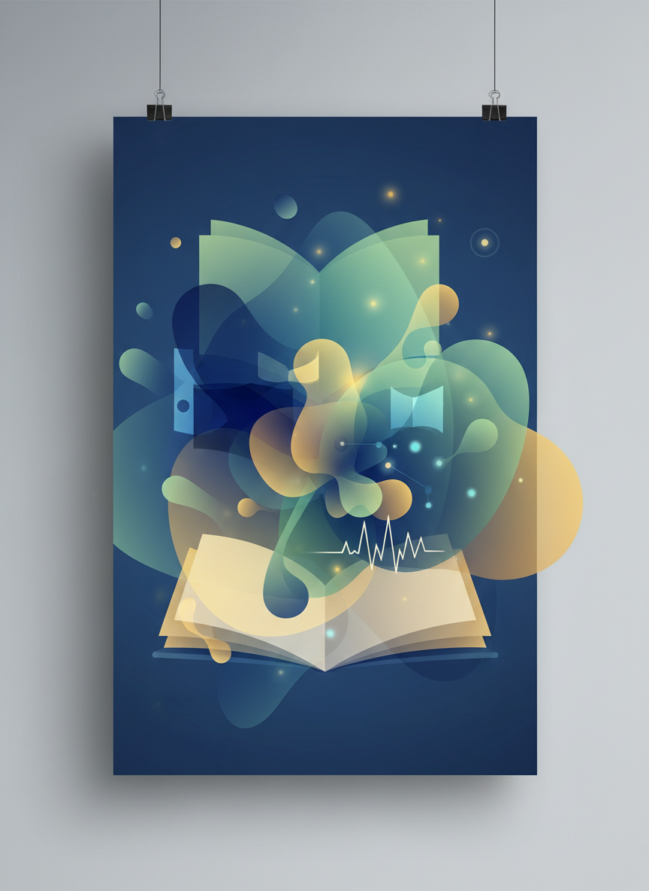
## 今日学んだこと

✅ バナーデザインの基本原則
✅ Canvaの使い方
✅ AIを活用したデザイン制作
✅ 実践的なテクニック
✅ 実務での活用方法
---


## 実践課題

### 今週のチャレンジ

1. **毎日1枚作成**
   - 様々なテーマで練習
   - スキルアップ

2. **SNSで発信**
   - 作ったバナーを実際に使う
   - 反応を確認

3. **テンプレート作成**
   - 再利用可能なフォーマット
   - ブランドキット設定
---

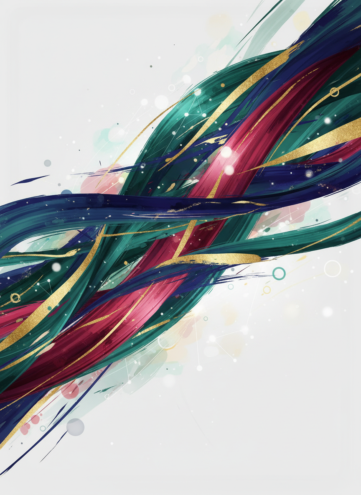
## バナーデザインマスターへの道

### レベル1：テンプレートを編集できる
### レベル2：ゼロから作成できる
### レベル3：AIを活用して効率化できる
### レベル4：ブランディングを意識できる
### レベル5：複数パターンを短時間で作れる

**あなたは今どのレベル？**
---

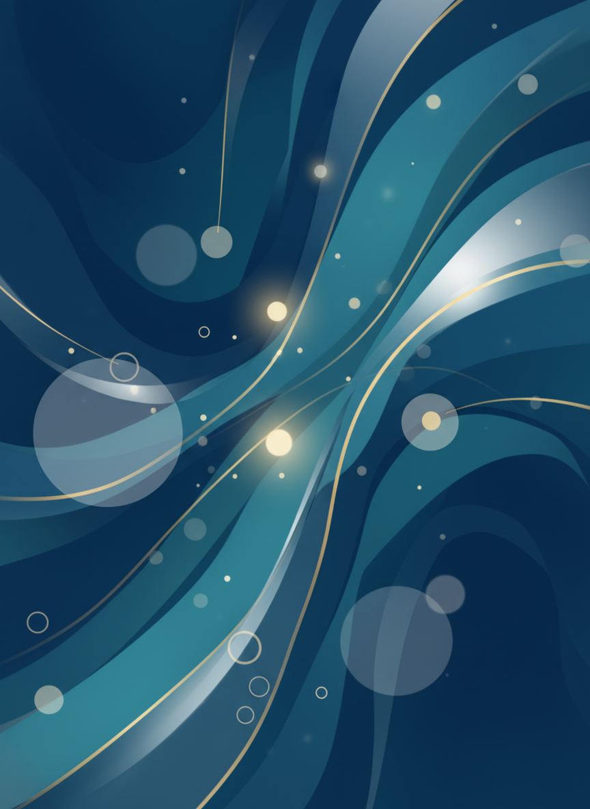
## ワンポイントアドバイス

### デザインのコツ

1. **模倣から始める**
   - 良いデザインを研究
   - 真似て学ぶ

2. **シンプルに**
   - 詰め込みすぎない
   - 引き算の美学

3. **統一感**
   - 色、フォント、スタイル
   - ブランドイメージ

4. **AIを活用**
   - アイデアはGemini
   - 制作はCanva
---


## 質問タイム

**わからないこと、もっと知りたいことはありますか？**
---

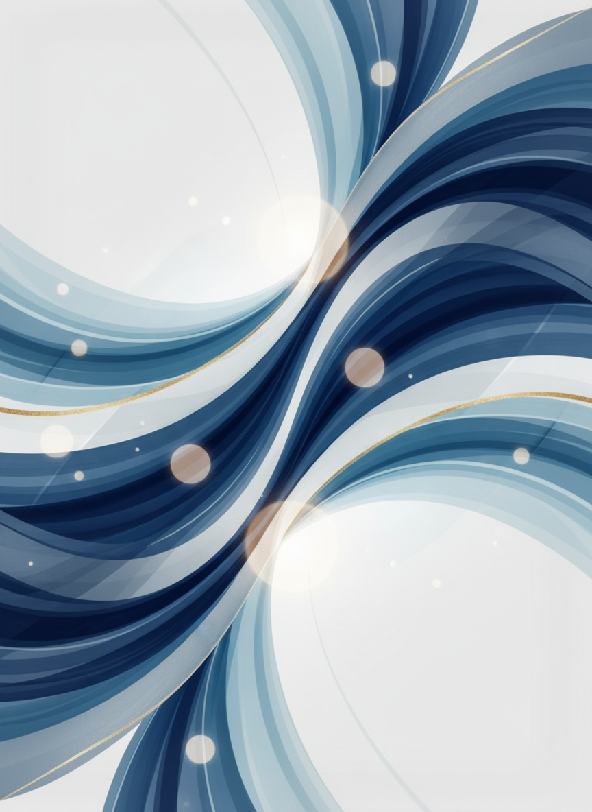
## メッセージ

### デザインは誰にでもできる

- センスは後からついてくる
- ツールが助けてくれる
- AIがアイデアをくれる
- 実践が一番の学習

**今日からあなたもデザイナー！**
---

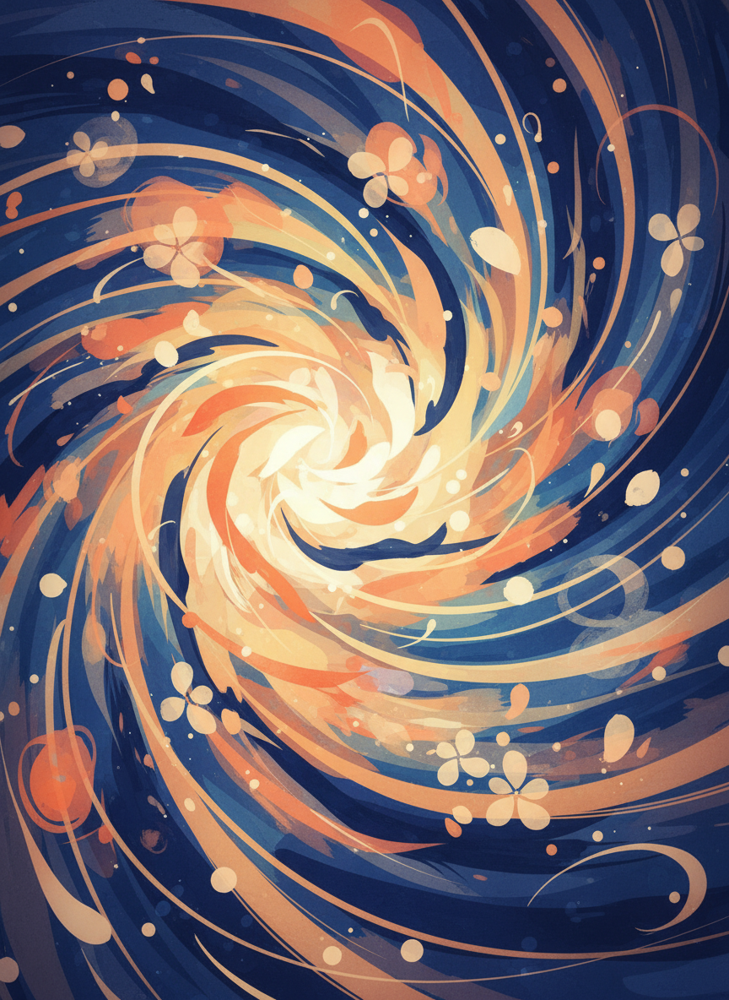
## お疲れ様でした！

次回の講座でお会いしましょう

**あなたのデザインが世界を彩る！**