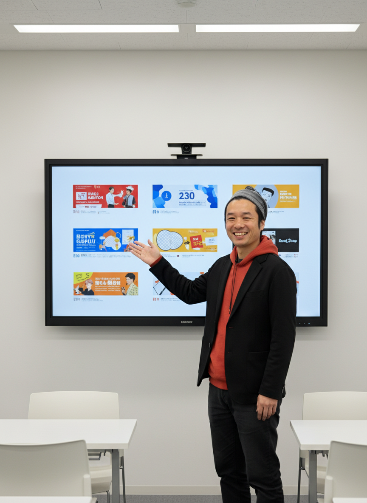
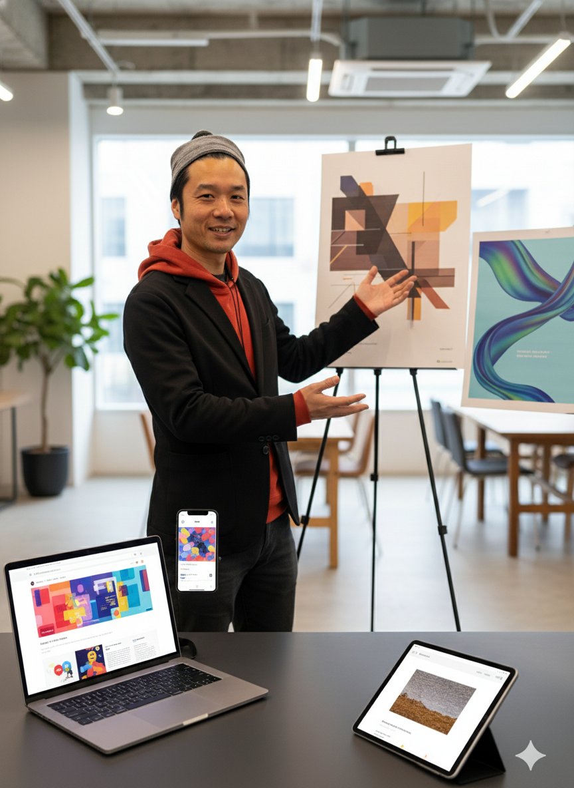
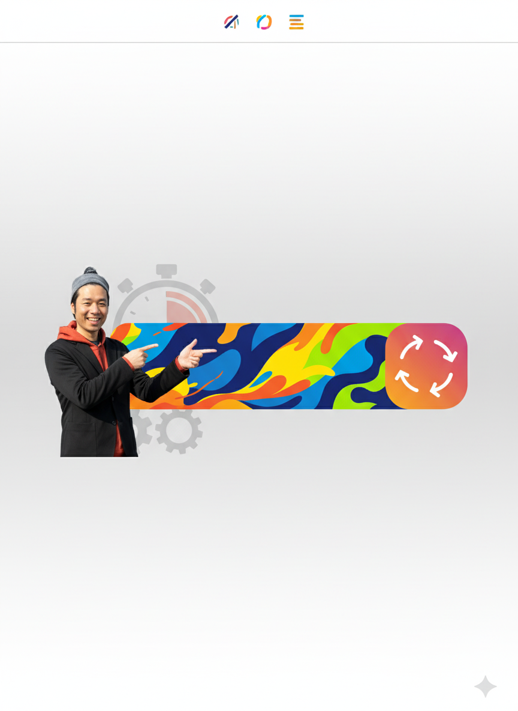
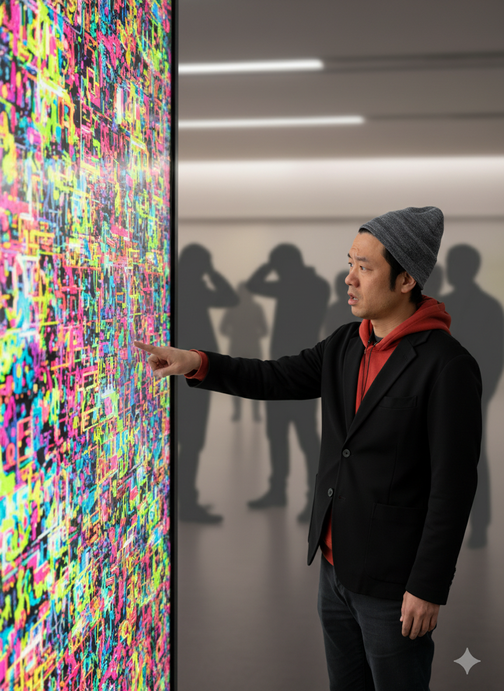
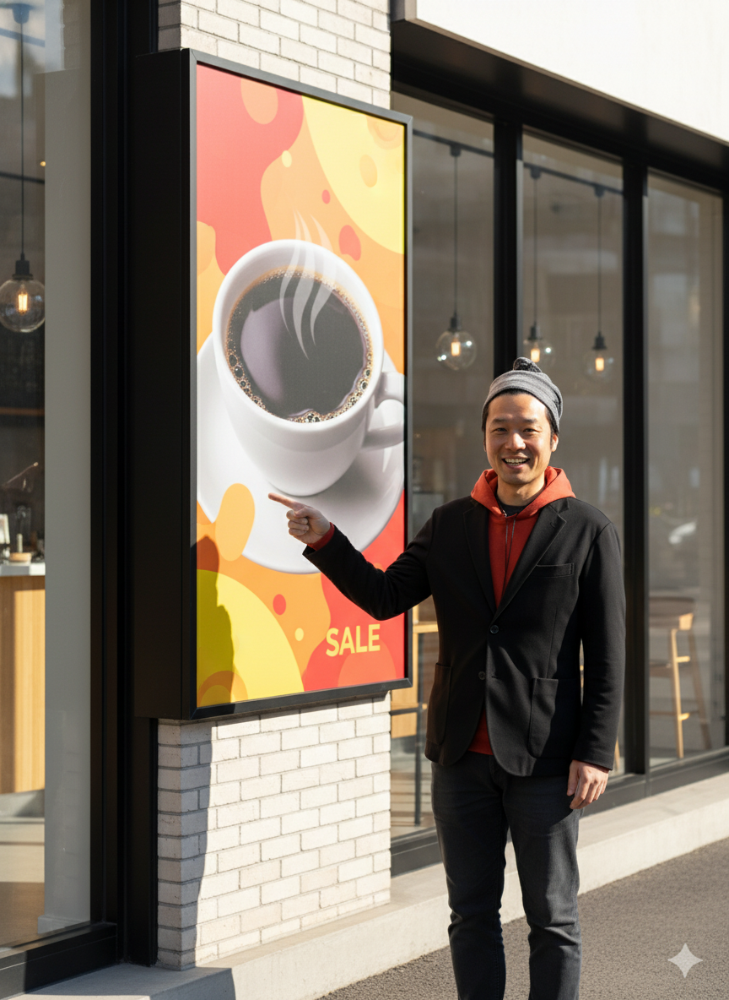
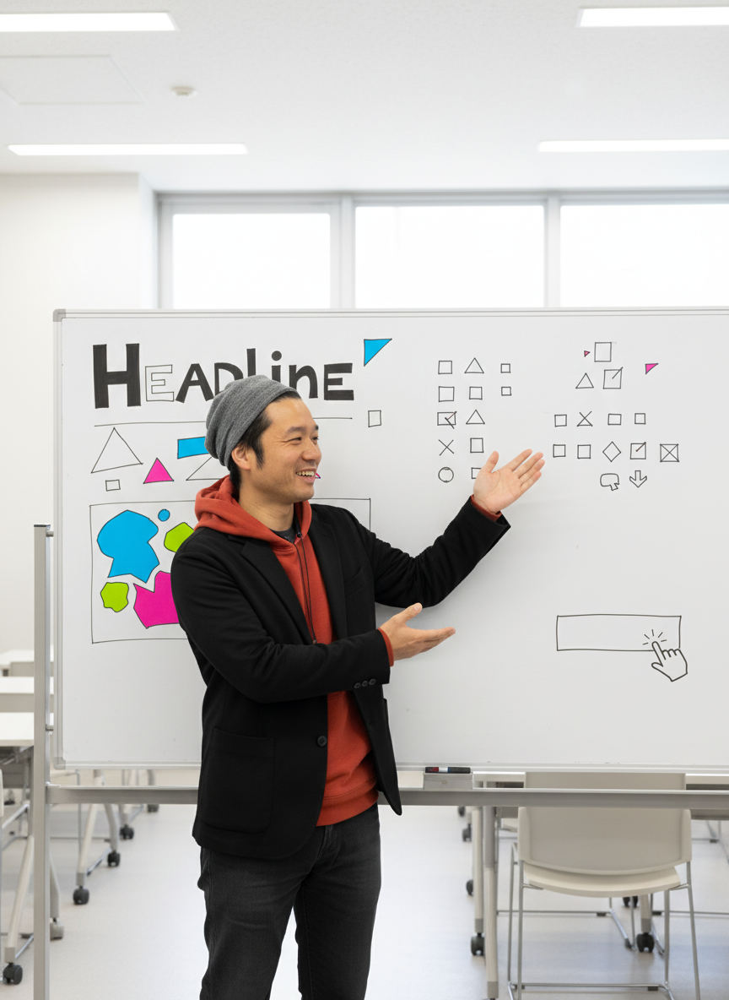
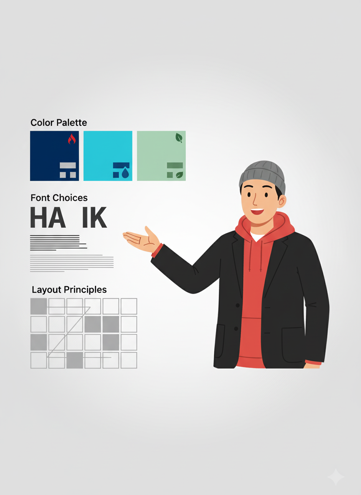
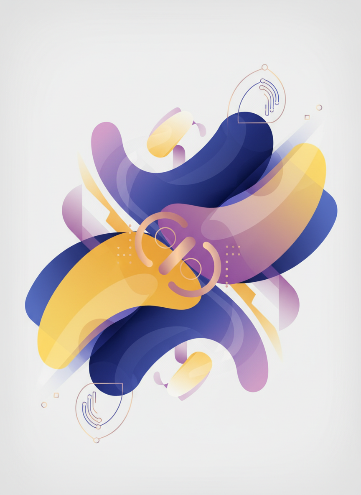

# AIとCanvaでバナー作り

**魅力的なデザインを簡単に作成**
秋田県IT女性育成プログラム
120分講座
---


## 本日の目標

- バナーデザインの基本を理解する
- Canvaの使い方をマスターする
- AIを活用したデザイン制作を学ぶ
- 実際にバナーを作成できるようになる
---


## アイスブレイク（5分）

### 質問
デザインでこんな悩みはありませんか？

- デザインの知識がない
- Photoshopは難しそう
- センスがないと思っている
- プロに頼むと高額

**Canva + AIで解決！**
---


# 第1部：バナーデザインの基本（25分）
---


## バナーとは？

**情報を視覚的に伝える広告・告知用の画像**

### 用途
- Webサイトの広告
- SNS投稿
- イベント告知
- キャンペーン宣伝
- ブログのアイキャッチ
---


## バナーの種類とサイズ

### Web広告
- レクタングル：300×250px
- ビッグバナー：728×90px
- スカイスクレイパー：160×600px

### SNS
- Instagram投稿：1080×1080px
- Facebook カバー：820×312px
- Twitter ヘッダー：1500×500px

### その他
- YouTube サムネイル：1280×720px
- ブログ アイキャッチ：1200×630px
---


## 良いバナーの3原則

### 1. 一目でわかる
- メッセージが明確
- 視線誘導がスムーズ
- 3秒ルール（3秒で理解できる）

### 2. 目を引く
- インパクトのある色
- 魅力的なビジュアル
- 適度なコントラスト

### 3. 行動を促す
- 明確なCTA（Call To Action）
- わかりやすいボタン
- 誘導する言葉
---


## 悪いバナーの例

```
┌─────────────────┐
│ 新商品発売！！！    │
│ とってもお得です    │
│ 詳しくはこちら      │
│ 今すぐクリック      │
│ 期間限定です        │
│ お見逃しなく！      │
└─────────────────┘
```

### 問題点
- 文字が多すぎる
- 何の商品かわからない
- ごちゃごちゃしている
- ビジュアルがない
---


## 良いバナーの例

```
┌───────────────────┐
│     [商品画像]        │
│                       │
│  春の新作コーヒー     │
│     50%OFF            │
│                       │
│    [詳細を見る]       │
└───────────────────┘
```

### 改善点
- ビジュアルが目立つ
- メッセージが明確
- シンプル
- CTAがわかりやすい
---


## バナーデザインの構成要素

### 1. キャッチコピー
大きく目立ち、短くインパクトのあるものにする。

### 2. ビジュアル（画像）
商品やサービスを表現する高品質な画像を使用する。

### 3. 補足情報
期間、価格、特典などを読みやすいサイズで配置する。

### 4. CTA（行動喚起）
「詳細を見る」「今すぐ購入」などのボタンやリンクを設置する。
---


## デザインの基本ルール

### 色の使い方
- **3色まで**：ベース、メイン、アクセント
- **コントラスト**：文字が読みやすく
- **色の意味**：赤=情熱、青=信頼、緑=安心

### フォント
- **2種類まで**：タイトルと本文
- **サイズに差**：階層を明確に
- **読みやすさ**：ゴシック体が無難

### レイアウト
- **余白**：詰め込まない
- **整列**：要素を揃える
- **視線誘導**：Z型、F型
---


# 第2部：Canvaの基本（30分）
---


## Canvaとは？

**無料で使えるオンラインデザインツール**

### 特徴
- ✅ ブラウザで動作
- ✅ 豊富なテンプレート
- ✅ ドラッグ&ドロップで簡単
- ✅ 無料プランが充実
- ✅ AI機能搭載

### アクセス
**https://www.canva.com/**
---


## Canvaでできること

### 1. バナー・SNS画像
- 各種サイズのテンプレート
- すぐに作れる

### 2. プレゼン資料
- スライド作成
- アニメーション

### 3. 印刷物
- チラシ、名刺、ポスター

### 4. 動画編集
- 簡単な動画作成
---


## Canvaの登録（5分）
