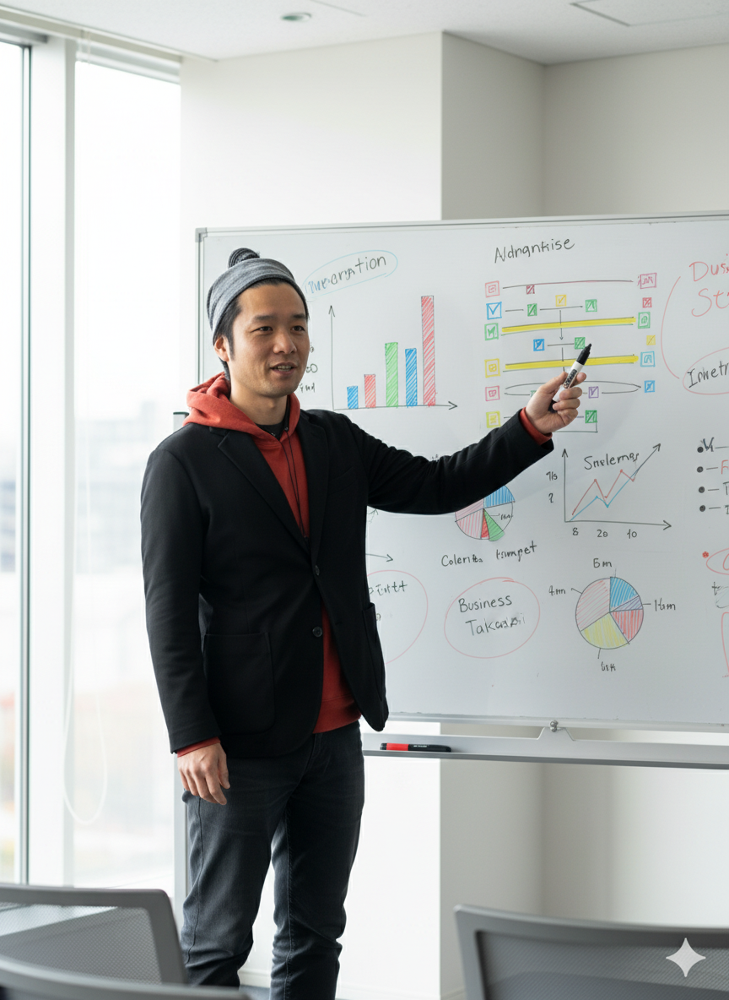
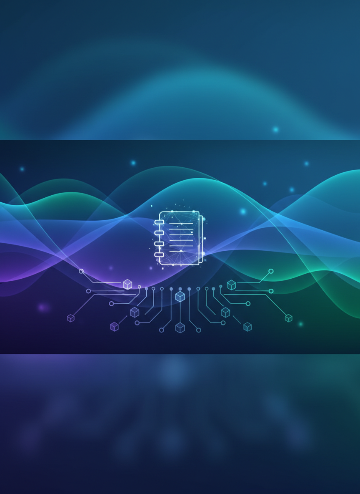
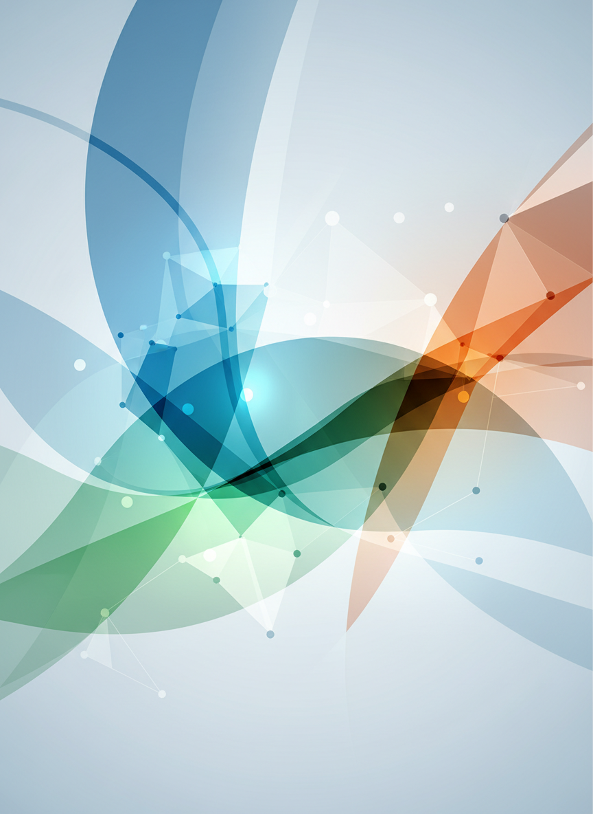
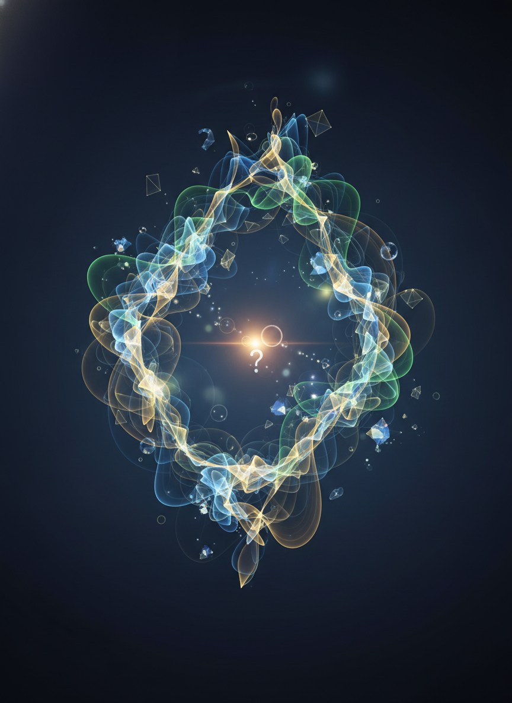

# AIでビジネスリサーチ&戦略立案

情報を集めて、戦略を練る

秋田県IT女性育成プログラム
120分講座


---


# 本日の目標

- ディープリサーチで競合・市場を分析
- 広報戦略・ビジネスプランの立案方法
- 調査結果を簡潔なレポートにまとめる
- NotebookLMで情報を一元管理
- AIを使った実践的なビジネススキル習得


---


# こんな悩みありませんか？

## ビジネスでの課題

- 競合他社の動向がわからない
- 効果的な広報戦略が立てられない
- 調査に時間がかかりすぎる
- 情報が散在して管理できない
- レポート作成が苦手


---


# 第1部：ビジネスリサーチ基礎（20分）

戦略立案のための情報収集術


---


# ディープリサーチとは

**表面的な検索を超えた、戦略的な情報収集**

## ビジネスでの活用場面
- 新規事業の立ち上げ
- マーケティング戦略策定
- 競合分析と差別化
- 広報・PR戦略立案


---


# リサーチの3つのレベル

## Level 1: 表面的な検索
- Google検索で上位記事を読む

## Level 2: 比較・分析
- 複数の情報源を比較検討

## Level 3: ディープリサーチ
- 多角的な分析と戦略立案


---


# 第2部：競合分析実践（30分）

ライバルを知り、差別化する


---


# 競合分析フレームワーク

## SWOT分析をAIで効率化

```
[企業名]のSWOT分析をしてください：
- Strengths（強み）
- Weaknesses（弱み）
- Opportunities（機会）
- Threats（脅威）
```


---


# 実習1：競合3社比較（15分）

## 課題：カフェの競合分析

```
秋田市内のカフェを開業する場合、
スターバックス、ドトール、地元カフェの
以下の点を比較してください：
- 価格帯
- ターゲット層
- 強み・弱み
- 差別化ポイント
```


---


# 競合分析から戦略へ

## 分析結果の活用

1. **ポジショニング決定**
   - 競合がいない市場を探す

2. **差別化戦略**
   - 独自の価値提案を作る

3. **価格戦略**
   - 競合を意識した価格設定


---


# 第3部：広報戦略立案（30分）

効果的な情報発信を設計する


---


# 広報戦略の基本要素

## 5W1Hで整理する

- **Who**: ターゲットは誰か
- **What**: 何を伝えるか
- **When**: いつ発信するか
- **Where**: どのメディアを使うか
- **Why**: なぜ発信するか
- **How**: どのように伝えるか


---


# 実習2：SNS戦略立案（15分）

## プロンプト例

```
地方の和菓子店がSNSで認知度を上げる
戦略を立ててください：

1. ターゲット層の設定
2. 使用するSNSの選定と理由
3. 投稿内容のアイデア（5つ）
4. 投稿頻度と時間帯
5. 成果指標（KPI）
```


---


# プレスリリース作成

## AIでプレスリリース下書き

```
以下の情報でプレスリリースを作成：

- 企業名：〇〇
- 発表内容：新サービス開始
- 特徴：地域初の〇〇
- 開始日：〇月〇日
- ターゲット：30代女性
```


---


# 第4部：ビジネスプラン作成（20分）

アイデアを事業計画に落とし込む


---


# ビジネスプランの構成

## 基本的な構成要素

1. **事業概要**
2. **市場分析**
3. **競合分析**
4. **マーケティング戦略**
5. **収支計画**
6. **リスクと対策**


---


# 実習3：簡易事業計画（10分）

## 課題：副業ビジネスプラン

```
以下の副業ビジネスプランを作成：

事業：オンライン〇〇教室
初期投資：10万円以内
目標月収：5万円

必要な要素を整理してください
```


---


# 収支シミュレーション

## 数値計画をAIで作成

```
月5万円の売上を達成するための
価格設定と必要顧客数を
3パターン提示してください：

- 高単価少人数
- 中単価中人数
- 低単価多人数
```


---


# 第5部：レポート作成術（20分）

調査結果を説得力ある文書に


---


# 効果的なレポート構成

## エグゼクティブサマリー方式

1. **要約**（1ページ）
   - 結論を最初に

2. **詳細分析**
   - データと根拠

3. **提案**
   - 具体的アクション


---


# 実習4：1ページレポート作成

## 課題：調査レポート作成

```
これまでの調査内容を
A4用紙1枚のレポートにまとめて：

- タイトル
- 調査目的
- 主要な発見（3点）
- 結論と提案
- 次のアクション
```


---


# ビジュアル化のコツ

## 図表の活用

```
この分析結果を以下の形式で
視覚化してください：

- 比較表
- 円グラフの数値
- フローチャート
- マインドマップ構造
```


---


# 第6部：NotebookLMで情報管理（20分）

調査データを一元管理する


---


# NotebookLMとは

## Googleの知識管理AI

**できること**
- 複数の資料をアップロード
- AIが内容を理解・整理
- 質問に即座に回答
- 要約や関連情報の抽出
- オーディオ形式で解説


---


# NotebookLMの活用手順

## セットアップ

1. **ノートブック作成**
   - プロジェクト毎に分ける

2. **ソースをアップロード**
   - PDF、テキスト、URL
   - 調査レポート、議事録

3. **AIと対話**
   - 質問で情報を引き出す


---


# 実習5：NotebookLM活用（10分）

## 実践ワーク

1. NotebookLMにアクセス
2. 新規ノートブック作成
3. 調査資料をアップロード
4. 以下を質問：
   - 「主要なポイントは？」
   - 「〇〇について詳しく」
   - 「要約して」


---


# 情報の体系化

## ナレッジベース構築

**フォルダ構成例**
```
プロジェクトA/
├── 市場調査/
├── 競合分析/
├── 顧客インタビュー/
└── 戦略メモ/
```


---


# オーディオ要約の活用

## 移動時間を学習時間に

NotebookLMの音声要約機能：
- アップロードした資料を音声解説
- 2人の会話形式で理解しやすい
- 通勤中に復習可能
- チーム共有に便利


---


# 第7部：実践演習（10分）

総合演習で実力チェック


---


# 総合演習：新規事業立案

## 課題：地域活性化ビジネス

秋田の特産品を活用した
新規ビジネスを企画：

1. 市場調査
2. 競合分析
3. ビジネスモデル
4. 広報戦略
5. 1ページレポート作成


---


# プロンプトチェーン

## 段階的に深掘り

```
1. 秋田の特産品トップ5を教えて
2. [選んだ特産品]の市場規模は？
3. 競合他社を3社分析して
4. 差別化できるポイントは？
5. ビジネスプランにまとめて
```


---


# 成果物チェックリスト

## 今日できるようになったこと

✅ 競合分析レポート作成
✅ SWOT分析の実施
✅ 広報戦略の立案
✅ ビジネスプラン作成
✅ 1ページレポート作成
✅ NotebookLMでの情報管理


---


# 実践課題

## 今週の宿題

**課題1：自社/自分の分析**
- SWOT分析を実施
- 改善点を3つ特定

**課題2：NotebookLM活用**
- 仕事の資料を整理
- AIに質問して insights を得る


---


# 便利なテンプレート集

## コピペで使えるプロンプト

**市場調査**
「[業界]の市場規模と成長率を教えて」

**競合分析**
「[企業A]と[企業B]を10項目で比較」

**戦略立案**
「[目的]を達成する戦略を5つ提案」


---


# リサーチツール紹介

## 併用すると効果的

- **Gemini**: 総合的な調査
- **Perplexity**: 最新情報収集
- **Claude**: 長文分析
- **NotebookLM**: 情報管理
- **ChatGPT**: ブレスト


---


# まとめ

## 本日の学び

✅ ディープリサーチの手法
✅ 競合分析→戦略立案の流れ
✅ 効果的な広報戦略
✅ ビジネスプラン作成
✅ プロ仕様のレポート作成
✅ NotebookLMで情報一元管理


---


# ビジネススキルの向上

## あなたの新しい武器

**Before**: 検索して終わり
**After**: 分析→戦略→実行

**Before**: 情報が散在
**After**: 体系的に管理

**Before**: 長いレポート
**After**: 1ページで完結


---


# 次回予告

## 「プレゼン資料作成」講座

- パワポ資料の自動生成
- 説得力のあるストーリー構成
- ビジュアルデザインのコツ
- プレゼンスキル向上


---


# 参考リンク

- **NotebookLM**: notebooklm.google.com
- **Gemini**: gemini.google.com
- **市場データ**: 統計局、業界団体
- **プレスリリース例**: PR TIMES


---


# 質疑応答

**実践で困ったことはありませんか？**

よくある質問：
- 競合が見つからない場合
- レポートの説得力を上げるには
- NotebookLMの容量制限


---


# 最後のメッセージ

## 情報を武器に変える

調べるだけでなく、
分析し、戦略を立て、実行する。

**あなたも今日から
ビジネスリサーチのプロ！**


---


# ありがとうございました！

実践あるのみ！

次回もお楽しみに
