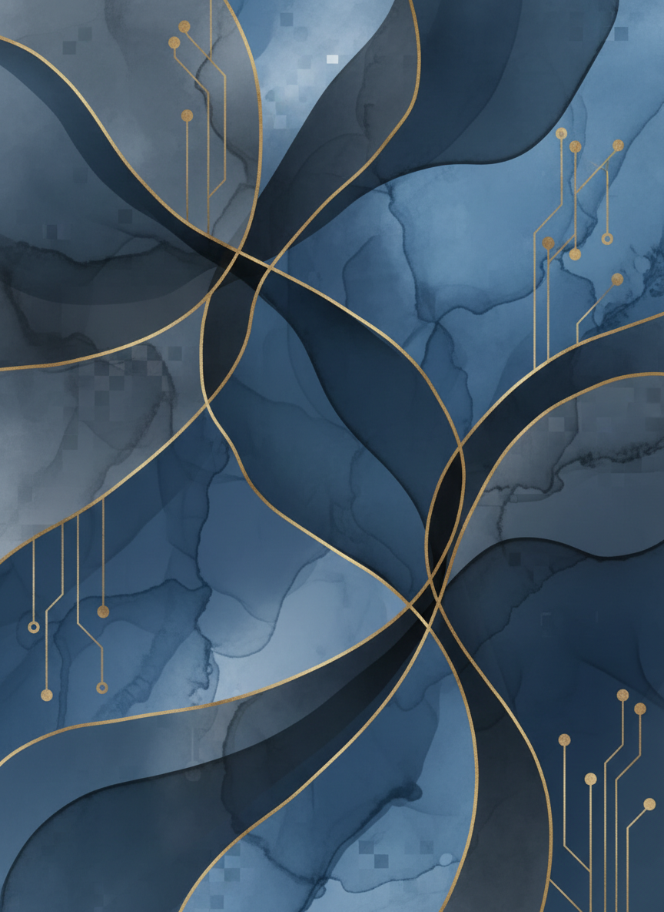
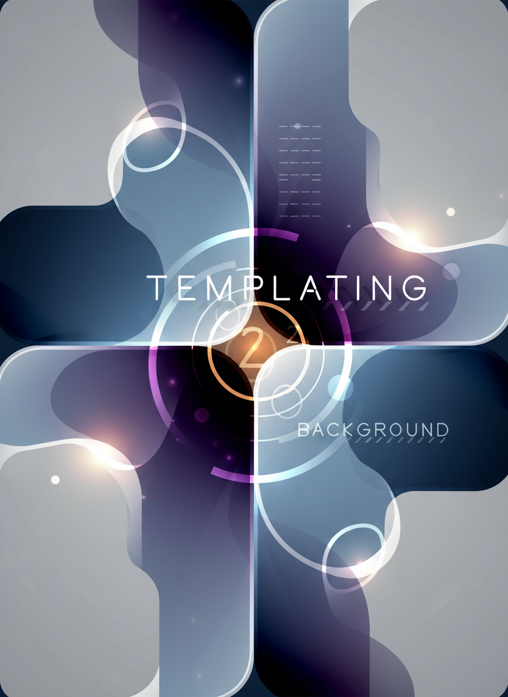
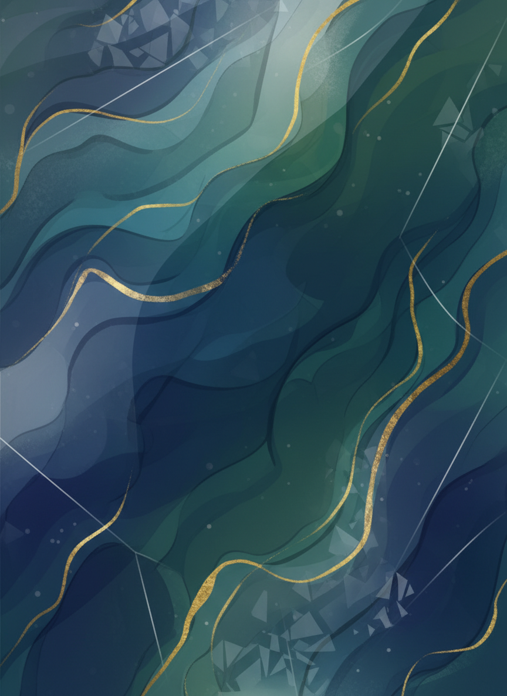

# Geminiで
ディープリサー
チ

情報収集の達人に
なろう

秋田県IT女性育成プロ
グラム
120分講座


---


# 本日の目標

- 効率的な情報収集の
  方法を学ぶ
- Geminiを
  使った高度な検索テ
  クニックを習得
- リサーチ結果を
  まとめるスキルを
  身につける
- 仕事で
  使える実践的なリサ
  ーチ力を養う


---


# アイスブレイク
（5分）

## 質問
最近、
インターネットで
何かを調べた時、
こんな経験は
ありませんか？

- 情報が
  多すぎて迷った
- 正しい情報か不安だ
  った
- 時間が
  かかりすぎた

---


# アイスブレイク
（5分） (2)

---


# 第1部：
リサーチの基本
（25分）

リサーチの基礎を
学びましょう


---


# リサーチとは
？

**目的を持って情報を
集め、整理し、
活用すること**

## 日常のリサーチ例
- 商品の比較検討
- 旅行先の情報収集
- レシピ検索
- ニュースのチェック


---


# 仕事で
のリサーチ

## よくあるシーン
1. **競合調査**：
他社のサービス・価格
を調べる
2. **市場調査**：
業界のトレンドを
把握
3. **技術調査**：
新しいツールの使い方
を学ぶ
4. **顧客調査**：
ターゲット層のニーズ
を知る

---


# 仕事で
のリサーチ (2)

---


# 従来のリサーチ
の問題点

## Google検索の課題
- 大量の検索結果から
  選ぶのに時間が
  かかる
- 複数のページを
  開いて比較が面倒
- 情報が
  散らばっていて整理
  が大変
- 最新情報と
  古い情報が混在

## 結果

---


# 従来のリサーチ
の問題点 (2)

**時間が
かかりすぎる！**


---


# AIを
使ったリサーチ
の利点

## Geminiの強み
✅ 複数の情報源を
瞬時に統合
✅ 要点を
まとめて提示
✅ 質問に直接答える
✅ 追加質問で深掘りで
きる
✅ 情報を
整理して出力


---


# ディープリサー
チとは？

**表面的な情報収集で
はなく、
深く掘り下げて調査す
ること**

## 特徴
1. 多角的な視点
2. 詳細な分析
3. 信頼性の確認
4. 実用的な形に
まとめる


---


# 第2部：
Geminiで
リサーチ実践（
50分）

実際にGeminiを
使ってみましょう


---


# リサーチの基本
ステップ

1. **目的を
明確にする**
2. **質問を
設計する**
3. **情報を
収集する**
4. **情報を
整理する**
5. **結論を導く**


---


# ステップ1：
目的を
明確にする

## ❌ 悪い例
```
AIについて調べて
```

## ✅ 良い例
```
中小企業が
AIを
導入する際のコストと
期待できる効果に
ついて調べたい。
導入事例も知りたい。

---


# ステップ1：
目的を
明確にする (2)

```


---


# ステップ2：
質問を
設計する

## 効果的な質問の作り
方

**5W1Hを意識する**
- What（何を）
- Why（なぜ）
- Who（誰が）
- When（いつ）
- Where（どこで）
- How（どうやって）


---


# 実習1：
基本的なリサー
チ（10分）

## 課題
「秋田県で
Web制作の仕事を
する場合の平均年収」

## Geminiへの質問例
```
秋田県で
Web制作・Webデザイナ
ーとして働く場合の
平均年収に
ついて教えてください
。

---


# 実習1：
基本的なリサー
チ（10分） (2)

また、
必要なスキルや資格に
ついても知りたいで
す。
```

**実際に
試してみましょう**


---


# Geminiの回答を
評価する

## チェックポイント
1. **情報源は
明確か**
2. **最新の情報か**
3. **具体的な数字やデ
ータがあるか**
4. **複数の視点が
含まれているか**


---


# 追加質問で
深掘りする

## 最初の回答から
深掘り

```
先ほどの回答に
ついて、
フリーランスと
正社員で
の収入の違いを
詳しく教えてください
。
```


---


# 追加質問で
深掘りする (2)

**会話形式で
深く掘り下げられる！
**


---


# 実習2：
比較リサーチ（
15分）

## 課題
「Web制作ツールの比較
」

## プロンプト例
```
Web制作初心者が
使いやすいノーコード
ツールを
3つ比較してください。
比較項目：価格、
使いやすさ、
できること、

---


# 実習2：
比較リサーチ（
15分） (2)

サポート体制、
学習リソースの充実度
表形式で
整理してください。
```


---


# 実習2の発展

## さらに深掘り
```
この中で、
小規模なカフェのWebサ
イトを作るなら
どれが
最適で
すか？理由も教えてく
ださい。
```

## 用途を
特定すると精度UP！

---


# 実習2の発展 (2)

---


# 実習3：
トレンドリサー
チ（10分）

## 課題
「2024年のWebデザイン
トレンド」

## プロンプト例
```
2024年のWebデザインの
トレンドを
教えてください。
特に以下の点に
ついて詳しく知りたい
です：
- 人気のデザインスタ

---


# 実習3：
トレンドリサー
チ（10分） (2)

  イル
- よく使われる色
- 注目されているレイ
  アウト
- 事例が
  あれば紹介してくだ
  さい
```


---


# リサーチ結果を
整理する

## Geminiに整理を
依頼

```
これまで
の会話の内容を
元に、
「Web制作初心者向けガ
イド」として
以下の形式で
まとめてください：

1. 必要なスキル

---


# リサーチ結果を
整理する (2)

2. おすすめツール
3. 学習方法
4. 収入の目安
5. 最初の一歩
```


---


# 実習4：
業界調査（15分
）

## 課題
自分が
就職したい業界のリサ
ーチ

## プロンプトテンプレ
ート
```
【業界名】
業界に
ついて調査したいで
す。
以下の項目に

---


# 実習4：
業界調査（15分
） (2)

ついて教えてください
：

1. 業界の現状と
今後の展望
2. 主要な企業
3. 求められるスキル
4. 平均的な給与水準
5. 未経験者の採用状況
6. 秋田県での状況
```


---


# 休憩（10分）

リフレッシュタイム


---


# 第3部：
高度なリサーチ
テクニック（25
分）

プロフェッショナルレ
ベルのテクニック


---


# テクニック1：
役割を
指定する

## 専門家と
して回答してもらう

```
あなたは
キャリアカウンセラー
です。
30代女性が
未経験からIT業界に
転職する際の
メリットと
デメリット、
成功のポイントを

---


# テクニック1：
役割を
指定する (2)

アドバイスしてくださ
い。
```

**役割を
与えると
専門的な回答が
得られる**


---


# テクニック2：
フォーマットを
指定する

## 表形式で整理

```
以下の比較を
表形式で
作成してください：
- 正社員、契約社員、
  フリーランス
- 比較項目：
  収入の安定性、
  自由度、福利厚生、
  スキルアップ機会、
リスク

---


# テクニック2：
フォーマットを
指定する (2)

```


---


# テクニック3：
ペルソナ設定

## 具体的な人物像で
質問

```
以下のペルソナに
最適な学習計画を
提案してください：

- 35歳女性
- 現在：販売職
- 目標：
  Webデザイナー
- 時間：平日夜2時間、

---


# テクニック3：
ペルソナ設定 (2)

  週末4時間
- 期間：6ヶ月
- 予算：月1万円
```


---


# テクニック4：
多角的な視点

## 様々な立場から
の意見を求める

```
「副業でWebライターを
始める」
ことについて、
以下の3つの立場から
意見を
教えてください：
1. 雇用者側の視点
2. 実践者の視点
3. キャリアアドバイザ

---


# テクニック4：
多角的な視点 (2)

ーの視点
```


---


# テクニック5：
段階的な調査

## ステップを
踏んで深掘り

**Step 1**:
 全体像を把握
**Step 2**:
 気になる部分を
詳しく
**Step 3**:
 具体的な行動計画
**Step 4**:
 リスクと対策


---


# 実習5：
総合リサーチ（
15分）

## 課題
「副業を
始めるための完全ガイ
ド」

## 段階的に質問を
組み立てる
1. 人気の副業トップ5
2. それぞれのメリット
・デメリット
3. 自分に
合った副業の選び方
4. 始める際の手続き

---


# 実習5：
総合リサーチ（
15分） (2)

5. 確定申告について


---


# 第4部：
情報の信頼性チ
ェック（15分）

正確な情報を
見極める


---


# AIの回答を
鵜呑みに
しない

## 確認が必要な理由
- AIは
  間違うことが
  ある（ハルシネーシ
  ョン）
- 情報が古い可能性
- 地域差がある情報
- 法律・制度の変更


---


# 情報の信頼性を
確認する方法

## 1. 複数の質問で
裏取り
```
先ほどの回答に
ついて、情報源や
根拠となるデータを
教えてください。
```

## 2. 具体的な数字を
確認
```
○○の数字に

---


# 情報の信頼性を
確認する方法 (2)

ついて、どの調査や
統計に
基づいていますか？
```


---


# クロスチェック
の方法

## Geminiで確認
```
「Web制作の平均年収が
400万円」
という情報は
正確で
すか？最新のデータに
基づいていますか？
```

## 公式サイトで確認
- 政府の統計サイト
- 業界団体の公式サイ

---


# クロスチェック
の方法 (2)

  ト
- 企業の公式ページ


---


# 実習6：
情報の確認（10
分）

## 課題
先ほど調べた情報の信
頼性をチェック

## やること
1. Geminiに情報源を
尋ねる
2. 別の角度から
同じ情報を質問
3. 公式サイトで確認で
きそうか検討


---


# 第5部：
リサーチ結果の
活用（10分）

実務への応用方法


---


# リサーチ結果を
ドキュメント化

## Geminiに依頼
```
これまで
のリサーチ内容を、
上司に
提出する報告書の形式
で
まとめてください。

構成：
1. 調査目的
2. 調査方法
3. 調査結果

---


# リサーチ結果を
ドキュメント化 (2)

4. 考察
5. 提案
```


---


# 実務で
の活用例

## 1. 企画書の裏付け
データ
- 市場調査結果
- 競合分析
- トレンド情報

## 2. 提案資料
- 課題の根拠
- 解決策の妥当性
- 成功事例


---


# 実務で
の活用例（続き
）

## 3. 学習計画
- 必要なスキルの特定
- 学習リソースの選定
- ロードマップの作成

## 4. キャリア設計
- 業界研究
- 職種研究
- スキルマップ


---


# リサーチの時短
テクニック

## まとめて質問
```
以下について一度に
教えてください：
1. ○○とは何か
2. ○○のメリット・デ
メリット
3. ○○の具体例
4. ○○を始める方法
```


---


# テンプレート化

## 自分用のリサーチテ
ンプレート作成

```markdown
【調査テンプレート】
目的：
対象：
知りたいこと：
1. 基本情報
2. メリット・デメリッ
ト
3. 必要なもの
4. 始め方

---


# テンプレート化 (2)

5. 注意点
```


---


# まとめ（5分）

今日の振り返り


---


# 今日学んだこと

✅ 効果的なリサーチの
方法
✅ Geminiを
使った高度な調査テク
ニック
✅ 質問の設計方法
✅ 情報の信頼性チェッ
ク
✅ リサーチ結果の活用
法


---


# 実践課題

## 今週やってみること

1. **仕事で
のリサーチ**
   - 業務に
  関連するテーマを
  1つ選ぶ
   - Geminiで徹底的に
  調べる

2. **キャリアリサーチ
**
   - 目指す職種に

---


# 実践課題 (2)

  ついて深掘り
   - 必要なスキルと
  学習方法を調査


---


# リサーチマスタ
ーへの道

## レベル1：
基本的な質問が
できる
## レベル2：
追加質問で深掘りで
きる
## レベル3：
多角的な視点で調査で
きる
## レベル4：
結果を
実務に活用できる
## レベル5：

---


# リサーチマスタ
ーへの道 (2)

独自のテンプレートを
持つ

**あなたは
今どのレベル？**


---


# 次回予告

## 「議事録作り」
講座

- 会議の内容を
  効率的に記録
- Geminiを
  使った自動議事録
- わかりやすい議事録
  の書き方
- 実務で
  即使えるテクニック


---


# 参考リソース

- **Google Gemini**:
   https:
  //gemini.google.co
  m
- **効果的な質問の作
  り方**:
   プロンプトエンジニ
  アリング入門
- **情報リテラシー**
  : 各種オンライン講
  座


---


# 質問タイム

**わからないこと、
もっと知りたいことは
ありますか？**


---


# メッセージ

## リサーチ力は
武器になる

- 情報を制する者が
  仕事を制する
- AIを
  使えば誰で
  もリサーチの達人に
- 調べる力は
  一生使えるスキル

**今日から
実践して、

---


# メッセージ (2)

リサーチマスターを
目指しましょう！**


---


# お疲れ様で
した！

次回の講座で
お会いしましょう
