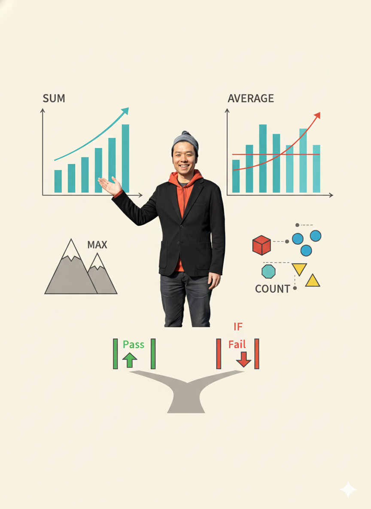

# Geminiでスプレッドシート作成

**データ管理と分析を効率化**
秋田県IT女性育成プログラム
120分講座
---


## 本日の目標

- Googleスプレッドシートの基本を理解する
- Geminiを使ったシート作成を学ぶ
- 実務で使える関数とテクニックを習得
- データ分析の基礎を身につける
---


## アイスブレイク（5分）

### 質問
Excelやスプレッドシートを使っていて
こんな経験はありませんか？

- どの関数を使えばいいかわからない
- 複雑な計算ができない
- グラフの作り方がわからない
- 表の整理に時間がかかる

**Geminiが助けてくれます！**
---


# 第1部：スプレッドシートの基本（20分）
---


## Googleスプレッドシートとは？

**Googleが提供する表計算ソフト**

### Excelとの違い
- ✅ **クラウドベース**：どこからでもアクセス
- ✅ **リアルタイム共同編集**
- ✅ **自動保存**
- ✅ **無料で使える**
- ✅ **Geminiと連携**
---


## スプレッドシートでできること

### 1. データ管理
- 顧客リスト
- 在庫管理
- スケジュール管理
- タスク管理

### 2. 計算・分析
- 売上集計
- 経費計算
- データ分析
- 統計処理
---


## スプレッドシートでできること（続き）

### 3. 可視化
- グラフ作成
- ピボットテーブル
- 条件付き書式

### 4. 自動化
- 関数で自動計算
- データ連携
- レポート作成
---


## 基本用語

### セル
- 1つのマス目
- 例：A1, B3

### 範囲
- 複数のセル
- 例：A1:B10

### 関数
- 計算式
- 例：=SUM(A1:A10)
---


## よく使う基本関数

| 関数 | 用途 | 例 |
|------|------|-----|
| SUM | 合計 | =SUM(A1:A10) |
| AVERAGE | 平均 | =AVERAGE(B1:B10) |
| COUNT | 個数 | =COUNT(C1:C10) |
| MAX/MIN | 最大/最小 | =MAX(D1:D10) |
| IF | 条件分岐 | =IF(A1>100,"合格","不合格") |
---


# 第2部：Geminiでシート作成（50分）
---


## Geminiの活用方法

### 1. テンプレート作成
- シートの構成を提案してもらう

### 2. 関数の生成
- 必要な計算式を教えてもらう

### 3. データの整理
- データを整形してもらう

### 4. 分析サポート
- グラフや分析方法を提案してもらう
---


## 実習1：シートのテンプレート作成（15分)

### 課題
「月次売上管理表」を作る

### Geminiへのプロンプト
```
Googleスプレッドシートで月次売上管理表を
作りたいです。以下の項目を含むシートの
構成を提案してください。

項目：日付、商品名、数量、単価、金額、
顧客名、備考

表形式でサンプルデータ3行も含めて
提示してください。
```
---


## Geminiの回答を活用

### 手順
1. Geminiが提案した構成を確認
2. 新しいスプレッドシートを開く
3. 見出しを入力
4. サンプルデータを入力
5. 書式を整える

**実際に作ってみましょう**
---


## 実習2：関数の作成（15分）

### Geminiへのプロンプト
```
Googleスプレッドシートで以下の計算をする
関数を教えてください：

1. E列（金額）= C列（数量）× D列（単価）
2. 月間売上合計
3. 平均単価
4. 最も売れた商品

それぞれの関数を、セルの位置も含めて
説明してください。
```
---


## 実習4：データ整理（10分）

### 課題
バラバラのデータを整理

### サンプルデータ
```
田中、2024/5/1、りんご、5個、100円
佐藤、2024/5/2、みかん、3個、80円
鈴木、2024/5/3、りんご、2個、100円
```

### Geminiへのプロンプト
```
以下のデータを、見やすい表形式に
整理してください。
列：日付、顧客名、商品名、数量、単価、金額
```
