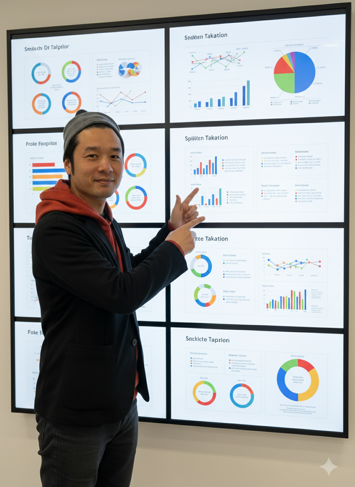
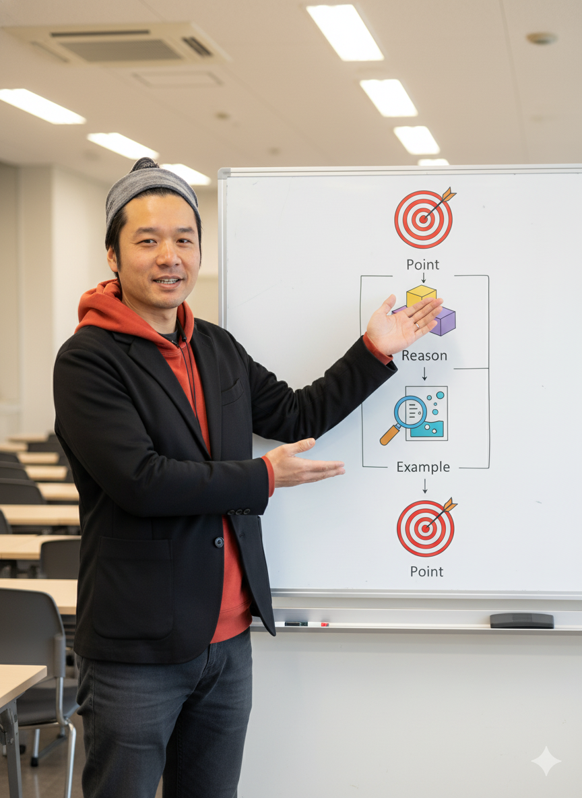
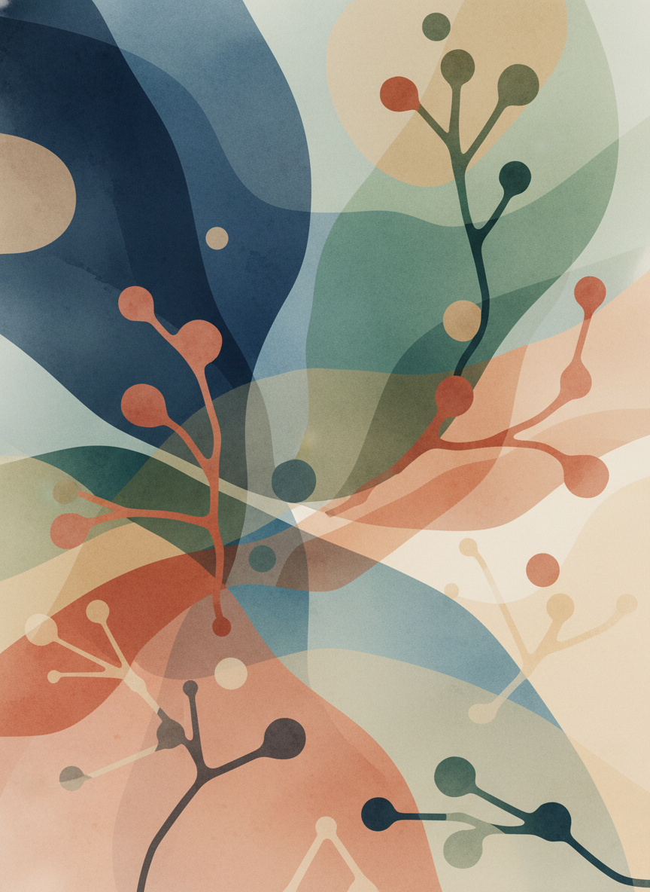
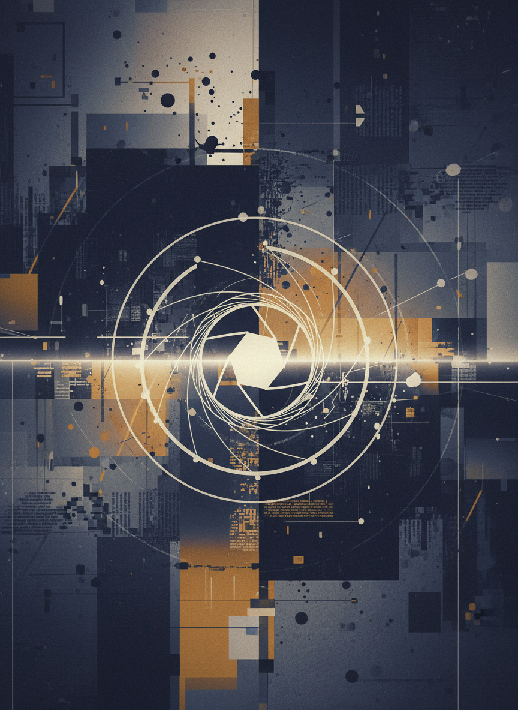
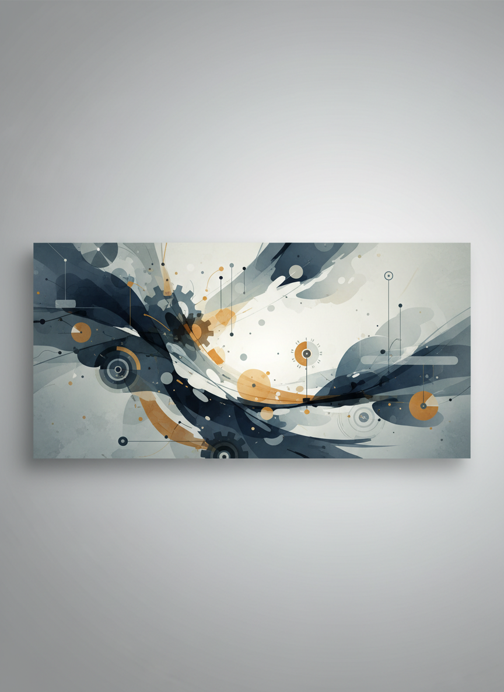
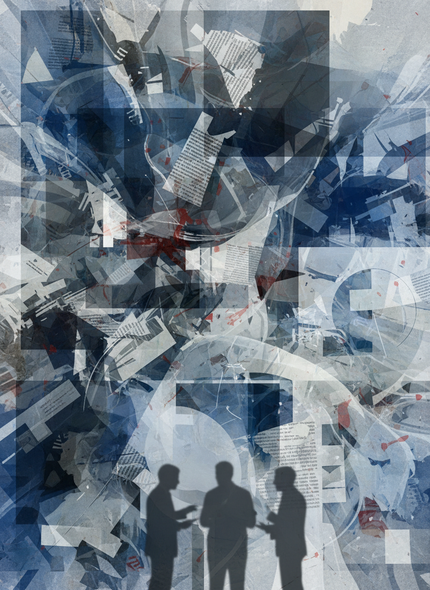
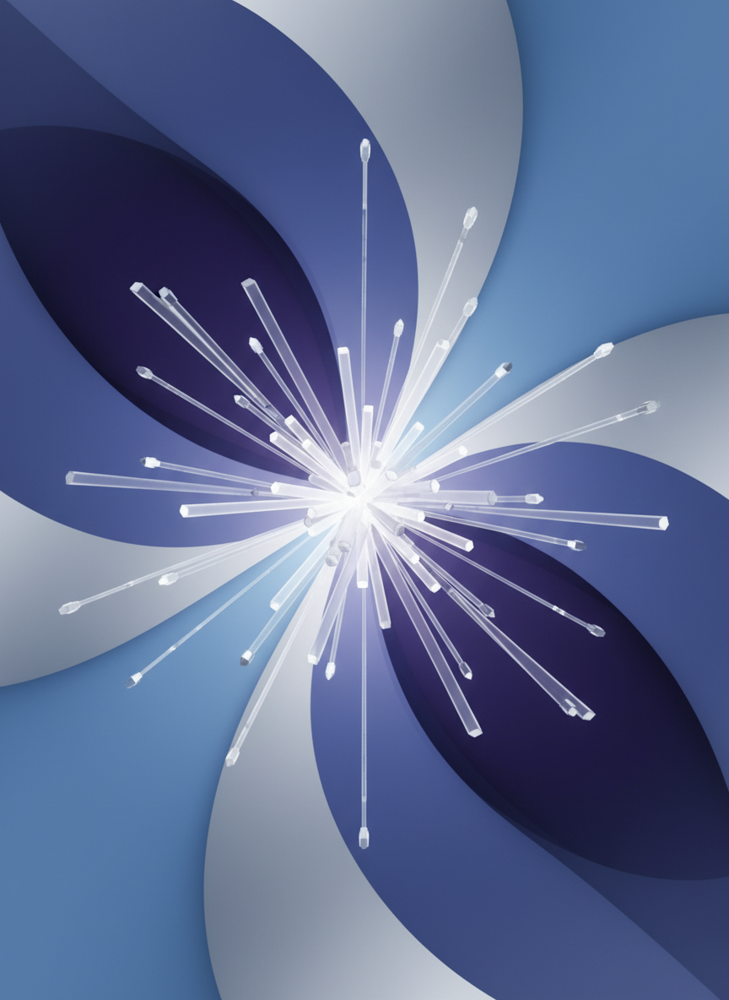
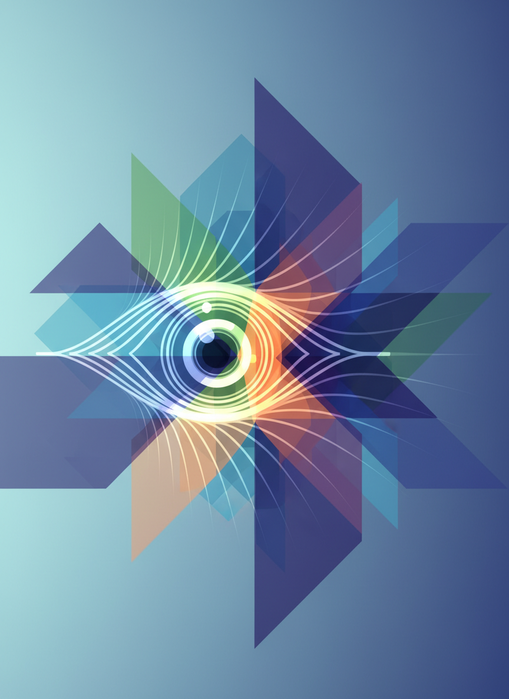
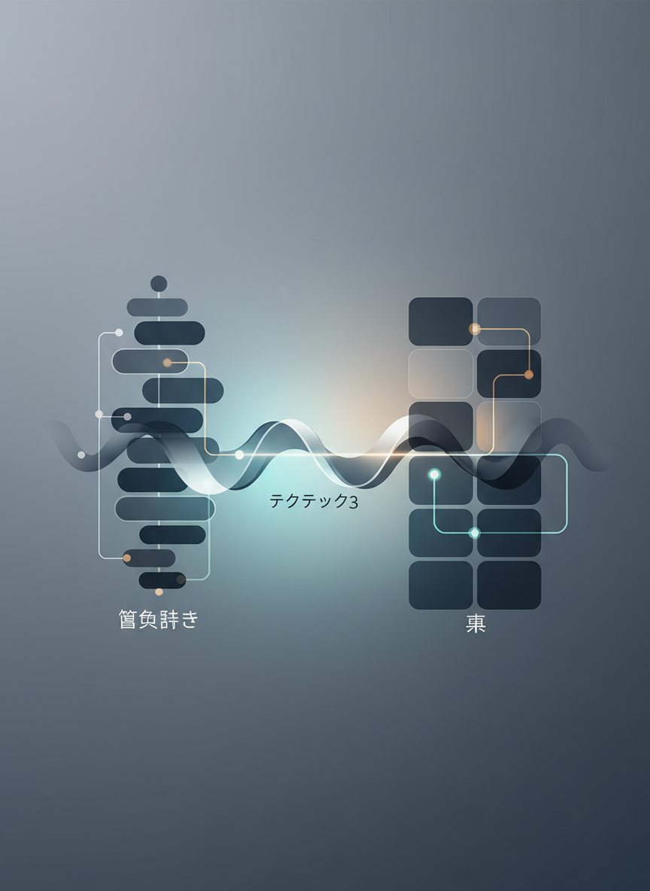
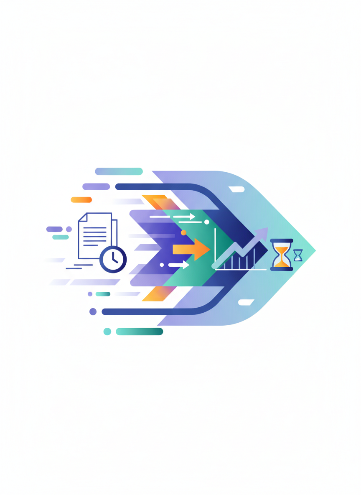

# Geminiで資料作り

**説得力のある資料を効率的に作成**
秋田県IT女性育成プログラム
120分講座
---


## 本日の目標

- 効果的な資料の構成を理解する
- Geminiを使った資料作成の流れを学ぶ
- ビジネス文書の書き方をマスターする
- 時短しながら質の高い資料を作る
---


## アイスブレイク（5分）

### 質問
資料作りでこんな悩みはありませんか？

- 何から書けばいいかわからない
- 構成が思いつかない
- 時間がかかりすぎる
- 説得力が足りない気がする

**AIで解決できます！**
---


# 第1部：資料の基本（25分）
---


## ビジネス資料とは？

**目的を持って情報を伝える文書**

### 主な種類
1. **企画書**：アイデアを提案
2. **報告書**：結果を報告
3. **提案書**：解決策を提示
4. **仕様書**：詳細を記述
---


## 良い資料の3原則

### 1. わかりやすい
- 論理的な構成
- 簡潔な文章
- 視覚的な工夫

### 2. 説得力がある
- 根拠・データ
- 具体例
- 明確な結論

### 3. 読みやすい
- 適切な文量
- 見出しの活用
- 余白のバランス
---


## 資料の基本構成（三段論法）

### 1. 序論（導入）
- 背景・目的
- 問題提起

### 2. 本論（展開）
- 分析・検討
- 提案内容

### 3. 結論（まとめ）
- 結論
- アクションプラン
---


## PREP法

- **P**oint：主張
- **R**eason：根拠
- **E**xample：事例
- **P**oint：再主張
---


## 悪い資料の例

```
【企画書】
新しい商品を作りたいと思います。
いろいろ調べた結果、良さそうです。
予算はそれなりにかかりますが、
頑張って作りたいです。
よろしくお願いします。
```

### 問題点
- 具体性がない
- 根拠が不明
- 数字がない
- 説得力がない
---


## 良い資料の例

```
【新商品企画書】

■背景
市場調査により、30代女性向け商品の需要が
年率15%で成長していることが判明

■提案
北欧風デザインの○○を開発

■根拠
・競合調査：類似商品なし
・顧客アンケート：購入意向85%

■投資計画
開発費：500万円
予想売上：初年度3,000万円
投資回収：8ヶ月
```
---


## 実際に試してみましょう

### Geminiを使った資料作成
ステップ1：構成案を作る
ステップ2：各セクションを書く
ステップ3：ブラッシュアップ
ステップ4：最終チェック
---


## ステップ1：構成案を作る

### Geminiへのプロンプト
```
以下の内容で企画書の構成案を作成してください。

【目的】
新規顧客の獲得、ブランディング

【対象】
30-40代女性

【予算】
50万円程度
```
---


## 実習1：構成案作成（10分）

### 課題
自分が提案したいテーマで構成案を作る

### 例テーマ
- 社内DX推進の提案
- イベント企画書
- 業務改善提案
- サービス紹介資料
---


## 実習3：説得力を強化（10分）

### あなたの資料に説得力を

```
以下の文章に、説得力を持たせるために
データや具体例を追加してください。
業界標準的な数字で構いません。

[自分の書いた文章を貼り付け]
```
---


## ステップ3：ブラッシュアップ

### 文章を洗練させる

```
以下の文章を、ビジネス文書として
より洗練された表現に書き換えてください。

[元の文]
「このプランだとコスパが良くてすごくおすすめです」
「お客さんに喜んでもらえると思います」
「予算的にはちょっと厳しいかもしれません」
```
---


## 長さの調整

### 短くする
```
以下の文章を、要点を残したまま
半分の長さにしてください。

[元の文]
「本提案は、弊社の長年にわたる経験と
実績に基づき、貴社のご要望に対して
最適なソリューションを提供するために
作成したものでございます」
```
---


## 実習4：企画書作成（20分）

### 実践課題
完全な企画書を1つ作成

### テーマ例
「社内勉強会の企画提案」

### 必要な要素
1. 背景・目的
2. 内容
3. スケジュール
4. 予算
5. 期待効果

**Geminiを使って完成させましょう**
---


## 休憩（10分）
---


# 第3部：文書タイプ別の作成法（25分）
---


## タイプ1：企画書

### 特徴
- アイデアを提案
- 承認を得ることが目的

### 重要な要素
1. 明確な目的
2. 実現可能性
3. 費用対効果
4. スケジュール
---


## 企画書のプロンプト例

```
以下の内容で企画書を作成してください。

【企画名】社内AI活用勉強会
【目的】業務効率化、スキルアップ
【対象】全社員30名
【内容】月1回、AIツールの使い方講座
【予算】講師料3万円/回、資料代1万円
【期待効果】業務時間20%削減

構成：目的、背景、内容、スケジュール、
予算、期待効果、リスクと対策
```
---


## タイプ2：新聞・ニュース記事

### 特徴
- 情報を正確に伝える
- 読者の興味を引く

### 重要な要素
1. 信ぴょう性
2. 見出しの工夫
3. 5W1H
4. 写真・画像
---


## 記事の信ぴょう性を上げる

### Geminiに聞いてみよう

```
以下のニュース記事の信ぴょう性を
高めるためのアドバイスをください。

【記事内容】
地域のイベントが成功しました。
たくさんの人が来ました。
楽しかったようです。

具体的な数字や情報源を追加する
提案をしてください。
```
---


## 魅力的な見出しを作る

### AIで見出しを工夫

```
以下の内容を、読者の興味を引く
魅力的な見出しに変えてください。

【元の見出し】
「○○小学校で運動会が行われました」

5つの案を提案してください。
それぞれどんな効果があるかも説明して。
```
---


## 記事を魅力的に伝える

### プロンプト例

```
以下の情報を、読者が興味を持つ
新聞記事として書いてください。

【テーマ】地域の秋祭り
【情報】
- 11月3日開催
- 来場者約500名
- 屋台10店舗出店
- 子ども向けゲーム大会あり

小学生にもわかりやすい文章で。
```
---


## AI画像生成で記事を彩る

### 画像生成のコツ

```
【Geminiへのプロンプト】
新聞記事用のイラストを生成してください。

テーマ：秋祭りの様子
スタイル：親しみやすいイラスト風
含める要素：
- 屋台
- 子どもたち
- 紅葉
- 提灯
```
---


## Canvaで仕上げる

### 新聞レイアウトの作り方

1. **Canvaを開く**
   - テンプレートから「新聞」を検索

2. **記事を配置**
   - AIで作った記事を貼り付け

3. **画像を挿入**
   - AI生成画像をアップロード

4. **レイアウト調整**
   - 見出し、本文、写真のバランス
---


## 実習5：新聞記事作成（15分）

### 課題
以下のテーマで記事を作成

1. **記事テーマを決める**
   - 学校行事、地域イベント、趣味など

2. **Geminiで記事を書く**
   - 信ぴょう性を意識

3. **画像を生成**
   - AIで関連画像を作成

4. **Canvaで仕上げ**
   - 新聞風にレイアウト
---


# 第4部：実践テクニック（15分）
---


## テクニック1：テンプレート活用

### Geminiでテンプレート作成

```
以下の用途のテンプレートを作成してください。
【　】の部分は後で入力できるようにしてください。

用途：クライアント提案書
項目：会社概要、課題認識、提案内容、
スケジュール、見積もり、お問い合わせ
```
---


## テクニック2：トーンの調整

### カジュアル⇔フォーマル

```
以下の文章を、【フォーマル/カジュアル】な
トーンに書き換えてください。

元の文章：
「このプランだと、コスパが良くて
すごくおすすめです！」

フォーマル版：
「本プランは費用対効果に優れており、
最適な選択肢と考えております。」
```
---


## テクニック3：箇条書きと表

### 情報を整理

```
以下の情報を、見やすく表形式に
整理してください。

・プランA：10万円、期間1ヶ月、ページ数5
・プランB：30万円、期間2ヶ月、ページ数10
・プランC：50万円、期間3ヶ月、ページ数15

表の列：プラン名、価格、期間、ページ数、
おすすめ対象
```
---


## テクニック5：多言語対応

### 英語資料も簡単に

```
以下の企画書を英語版に翻訳してください。
ビジネス文書として適切な表現で。

[日本語の企画書]
```
---


## 資料の品質チェックリスト

### Geminiにレビュー依頼

```
以下の資料について、品質チェックを
お願いします。

【チェック項目】
1. 論理構成は適切か
2. 説得力はあるか
3. 読みやすいか
4. 誤字脱字はないか
5. 改善提案

[作成した資料]
```
---


## 読み手の視点でチェック

### ペルソナ設定

```
以下の資料を、「40代の経営者」の視点で
評価してください。

・わかりやすいか
・説得力があるか
・決裁したくなるか
・不足している情報は何か
```
---


## 最終調整

### 細部の仕上げ

```
以下の資料について：
1. より簡潔に（無駄を削る）
2. より具体的に（曖昧さをなくす）
3. より魅力的に（キャッチーに）

の観点で推敲してください。
```
---


## 実習7：最終仕上げ（10分）

### 今日作った資料を完成させる

1. 品質チェック
2. 改善実施
3. 最終確認

**完成度の高い資料に仕上げましょう**
---


# まとめ（5分）
---


## 今日学んだこと

✅ 効果的な資料の構成
✅ Geminiを使った資料作成フロー
✅ 文書タイプ別の作り方
✅ 説得力を高めるテクニック
✅ 品質チェックの方法
---


## 資料作成の時短効果

### After AI
- 構成案作成：5分
- 執筆（Gemini活用）：30分
- 調整・仕上げ：15分
- **合計：50分**

**AIを活用して効率的に！**
---


## 次回予告

### 「スプレッドシート作成」講座

- Geminiでデータ分析
- 関数やグラフの作成
- 業務に使えるシート作り
- 自動化のテクニック
---


## 参考リソース

### ツール
- **Google Gemini**: 資料作成
- **Google Docs**: 文書作成
- **Canva**: デザイン（次回以降）

### フレームワーク
- PREP法
- 三段論法
- ロジックツリー
---


## ワンポイントアドバイス

### 資料作成のコツ

1. **構成が9割**
   - 最初に構成をしっかり作る

2. **完璧主義は捨てる**
   - 80%で一旦完成させる

3. **AIと協働**
   - 下書きはAI、判断は人間
---


## 質問タイム

**わからないこと、もっと知りたいことはありますか？**
---


## メッセージ

### 資料作成は戦略的思考

- 何を伝えるか（内容）
- どう伝えるか（構成）
- なぜ伝えるか（目的）

**AIを味方につけて、説得力のある資料を効率的に！**
---


## お疲れ様でした！

次回の講座でお会いしましょう

**今日からあなたも資料作成のプロ！**
