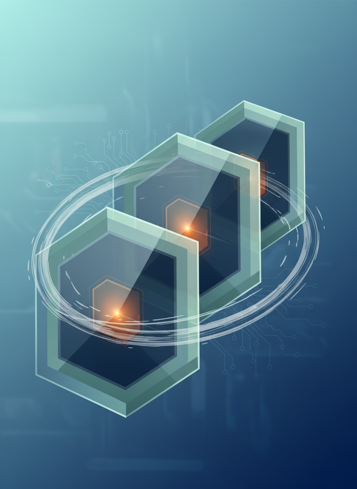

# Geminiで資料作り

**説得力のある資料を効率的に作成**
秋田県IT女性育成プログラム
120分講座
---


## 本日の目標

- 効果的な資料の構成を理解する
- Geminiを使った資料作成の流れを学ぶ
- ビジネス文書の書き方をマスターする
- 時短しながら質の高い資料を作る
---


## アイスブレイク（5分）

### 質問
資料作りでこんな悩みはありませんか？

- 何から書けばいいかわからない
- 構成が思いつかない
- 時間がかかりすぎる
- 説得力が足りない気がする

**AIで解決できます！**
---


# 第1部：資料の基本（25分）
---


## ビジネス資料とは？

**目的を持って情報を伝える文書**

### 主な種類
1. **企画書**：アイデアを提案
2. **報告書**：結果を報告
3. **提案書**：解決策を提示
4. **仕様書**：詳細を記述
---


## 良い資料の3原則

### 1. わかりやすい
- 論理的な構成
- 簡潔な文章
- 視覚的な工夫

### 2. 説得力がある
- 根拠・データ
- 具体例
- 明確な結論

### 3. 読みやすい
- 適切な文量
- 見出しの活用
- 余白のバランス
---


## 資料の基本構成（三段論法）

### 1. 序論（導入）
- 背景・目的
- 問題提起

### 2. 本論（展開）
- 分析・検討
- 提案内容

### 3. 結論（まとめ）
- 結論
- アクションプラン
---


## PREP法

- **P**oint：主張
- **R**eason：根拠
- **E**xample：事例
- **P**oint：再主張
---


## 悪い資料の例

```
【企画書】
新しい商品を作りたいと思います。
いろいろ調べた結果、良さそうです。
予算はそれなりにかかりますが、
頑張って作りたいです。
よろしくお願いします。
```

### 問題点
- 具体性がない
- 根拠が不明
- 数字がない
- 説得力がない
---


## 良い資料の例

```
【新商品企画書】

■背景
市場調査により、30代女性向け商品の需要が
年率15%で成長していることが判明

■提案
北欧風デザインの○○を開発

■根拠
・競合調査：類似商品なし
・顧客アンケート：購入意向85%

■投資計画
開発費：500万円
予想売上：初年度3,000万円
投資回収：8ヶ月
```
---


## 実際に試してみましょう

### Geminiを使った資料作成
ステップ1：構成案を作る
ステップ2：各セクションを書く
ステップ3：ブラッシュアップ
ステップ4：最終チェック
---


## ステップ1：構成案を作る

### Geminiへのプロンプト
```
以下の内容で企画書の構成案を作成してください。

【目的】
新規顧客の獲得、ブランディング

【対象】
30-40代女性

【予算】
50万円程度
```
---


## 実習1：構成案作成（10分）

### 課題
自分が提案したいテーマで構成案を作る

### 例テーマ
- 社内DX推進の提案
- イベント企画書
- 業務改善提案
- サービス紹介資料
---


## 実習3：説得力を強化（10分）

### あなたの資料に説得力を

```
以下の文章に、説得力を持たせるために
データや具体例を追加してください。
業界標準的な数字で構いません。

[自分の書いた文章を貼り付け]
```
---


## ステップ3：ブラッシュアップ

### 文章を洗練させる

```
以下の文章を、ビジネス文書として
より洗練された表現に書き換えてください。

[元の文]
「このプランだとコスパが良くてすごくおすすめです」
「お客さんに喜んでもらえると思います」
「予算的にはちょっと厳しいかもしれません」
```
