# AIで業務効率化！
## 初学者向けAI活用講座

90分で学ぶ、今日から使えるAI活用術

---

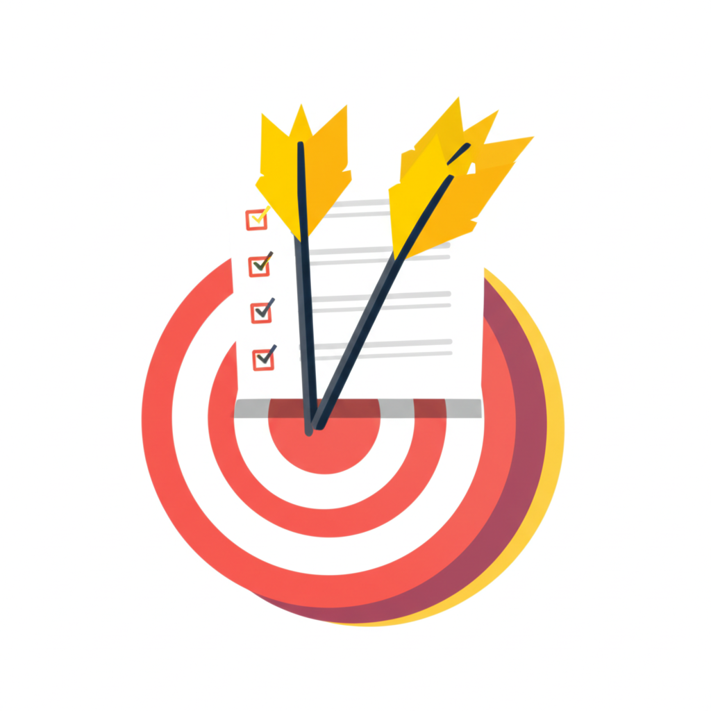
# 本日の目標

- AIの基本を理解する
- **Google Gemini**でテキスト生成を体験
- プロンプトの書き方をマスター
- **NanoBanana Pro**で画像生成
- **Canva**でバナー作成
- **ディープリサーチ**で情報収集

---

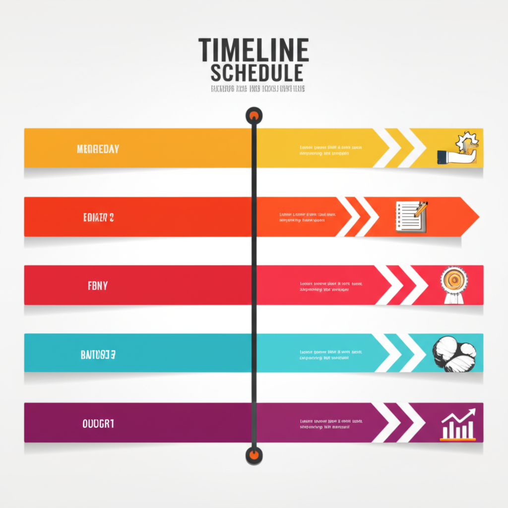
# 講座の流れ（90分）

| 時間 | 内容 |
|------|------|
| 0-15分 | **第1部**: AIの基本とGemini入門 |
| 15-35分 | **第2部**: プロンプトの書き方 |
| 35-55分 | **第3部**: NanoBanana Proで画像生成 |
| 55-70分 | **第4部**: Canvaでバナー作成 |
| 70-85分 | **第5部**: ディープリサーチ入門 |
| 85-90分 | まとめ・質疑応答 |

---


# 第1部：AIの基本
## AIって何ができるの？（15分）

---


# AIとは？

**Artificial Intelligence（人工知能）**

人間の知的な活動をコンピュータで再現する技術

- **学習する** - データから規則性を見つける
- **理解する** - 言葉や画像の意味を把握
- **判断する** - 状況に応じた対応を選択
- **創造する** - 新しい文章や画像を生成

---


# 生成AIでできること

**新しいコンテンツを生み出すAI**

| 種類 | できること | 活用例 |
|------|----------|--------|
| テキスト生成 | 文章を書く | メール、報告書、企画書 |
| 画像生成 | 画像を作る | バナー、イラスト、資料 |
| 要約 | 長文を短く | 議事録、論文のまとめ |
| 翻訳 | 多言語対応 | 海外とのやり取り |

---

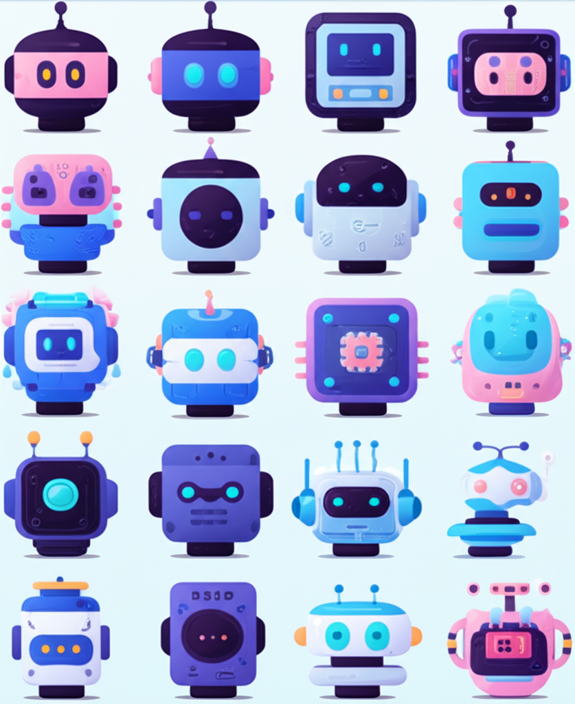
# 代表的な生成AI

| AI名 | 提供元 | 特徴 |
|------|--------|------|
| **Google Gemini** | Google | 検索連携、Google製品と統合 |
| ChatGPT | OpenAI | 会話が得意、プラグイン豊富 |
| Claude | Anthropic | 長文分析、安全性重視 |
| Copilot | Microsoft | Office連携、ビジネス向け |

**本日はGeminiを中心に学びます**

---


# Google Geminiを使おう

## アクセス方法
1. ブラウザで **gemini.google.com** にアクセス
2. Googleアカウントでログイン
3. すぐに使い始められる！

## 無料で使える機能
- テキスト生成
- 画像生成（NanoBanana Pro搭載）
- Google検索との連携
- Gmail、Googleドキュメント連携

---


# 実習1：Geminiに話しかけよう

## やってみよう（2分）

```
こんにちは、私はAIについて学んでいます。
簡単な自己紹介をお願いします。
```

**Geminiにアクセスして入力してみましょう**

---

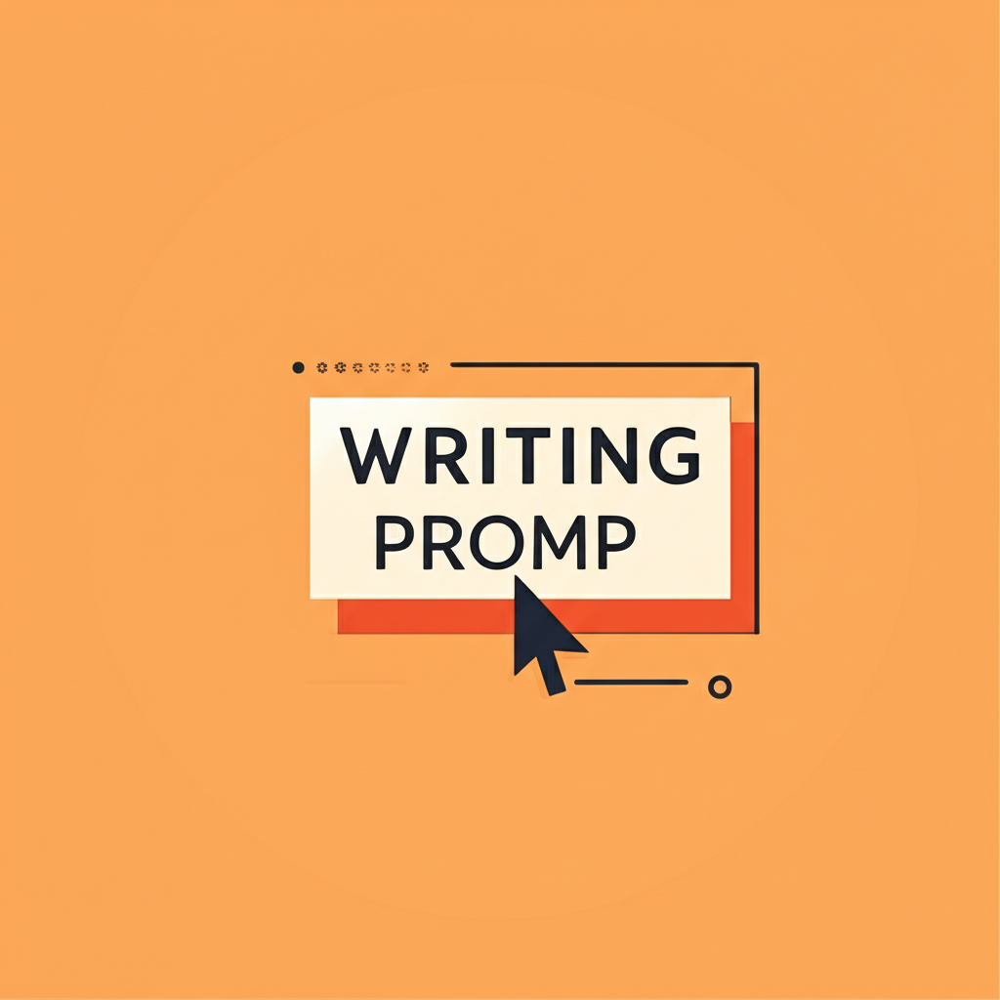
# 第2部：プロンプトの書き方
## AIを上手に使いこなすコツ（20分）

---

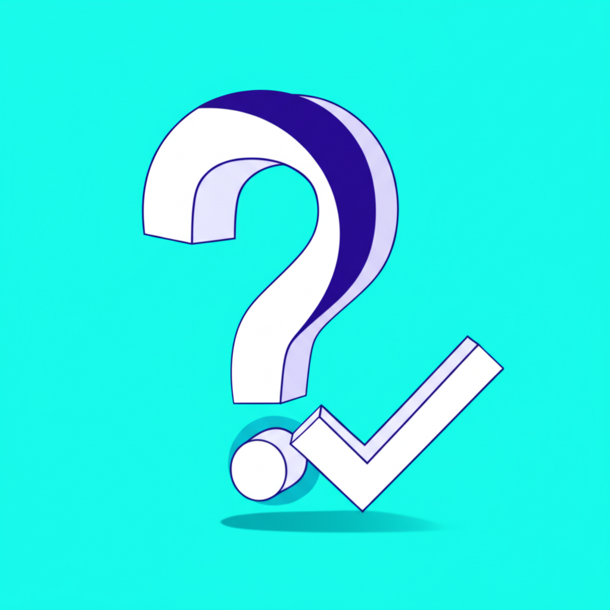
# プロンプトとは？

**AIに対する質問や指示のこと**

プロンプトの質 = AIの回答の質

**良いプロンプトを書けば、良い結果が得られる！**

---


# 悪いプロンプトの例

## ❌ 悪い例
```
メールを書いて
```

### 何が足りない？
- **誰に**送るメール？
- **どんな内容**？
- **どんな雰囲気**？
- **文字数**は？

AIが「何を求められているか」わからない

---


# 良いプロンプトの例

## ✅ 良い例
```
取引先の田中様に、明日の会議の時間を
14時から15時に変更してもらうお願いのメールを、
丁寧な文章で200字程度で書いてください。
```

### なぜ良い？
- **相手**が明確（取引先の田中様）
- **目的**が明確（時間変更のお願い）
- **トーン**が指定（丁寧な文章）
- **分量**が指定（200字程度）

---

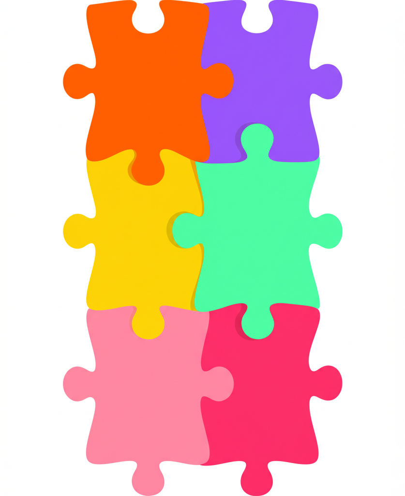
# プロンプトの5つの要素

良いプロンプトには以下の要素を含める：

| 要素 | 説明 | 例 |
|------|------|-----|
| **役割** | AIに演じてほしい立場 | 「あなたはビジネスメールの専門家です」 |
| **背景** | 状況や文脈 | 「新製品の発表会を控えています」 |
| **指示** | 具体的にやってほしいこと | 「案内メールを作成してください」 |
| **条件** | 制約や形式 | 「300字以内、丁寧な口調で」 |
| **出力形式** | 結果の形 | 「箇条書きで」「表形式で」 |

---

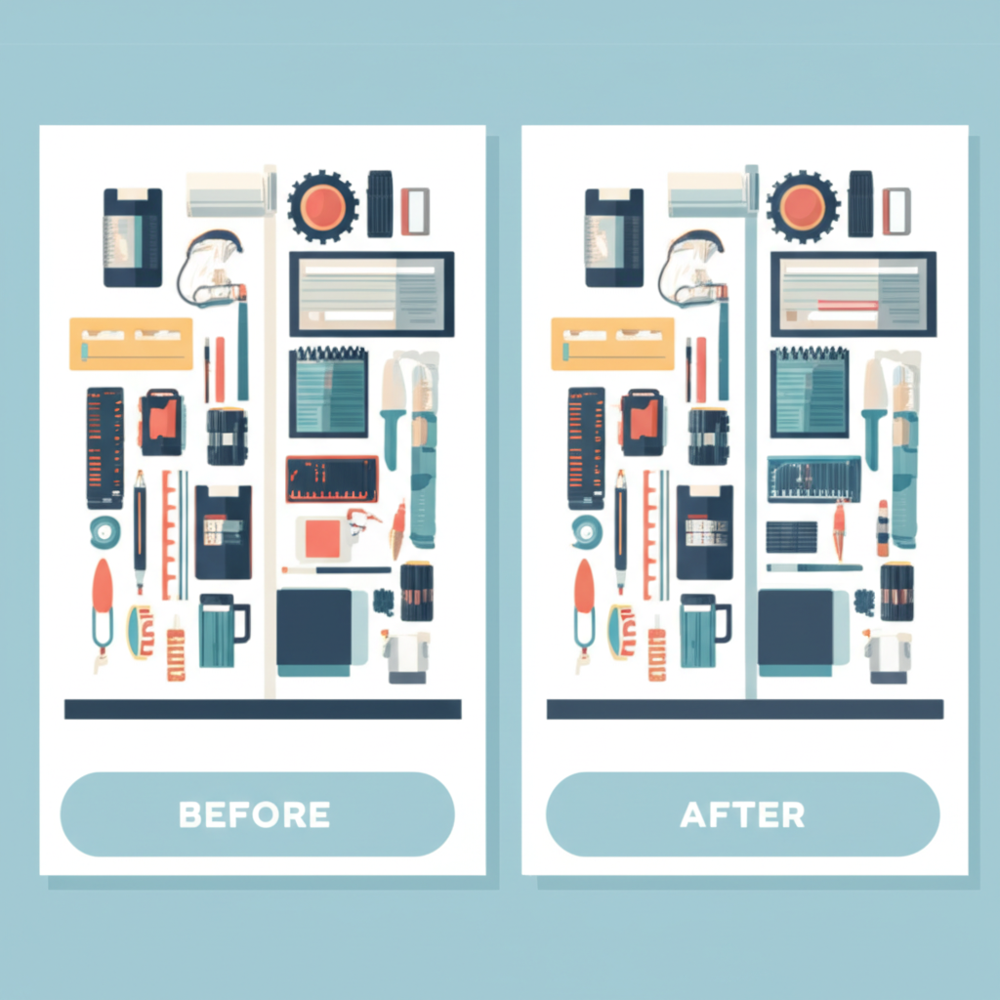
# 実習2：プロンプトを改善しよう

## Before（悪い例）
```
報告書を書いて
```

## After（改善例）
```
あなたは優秀なビジネスパーソンです。
先月の売上報告書を作成してください。

条件：
- 概要、実績、課題、今後の施策の4部構成
- 各セクション100字程度
- 箇条書きを活用
- 上司に提出する想定で丁寧に
```

---

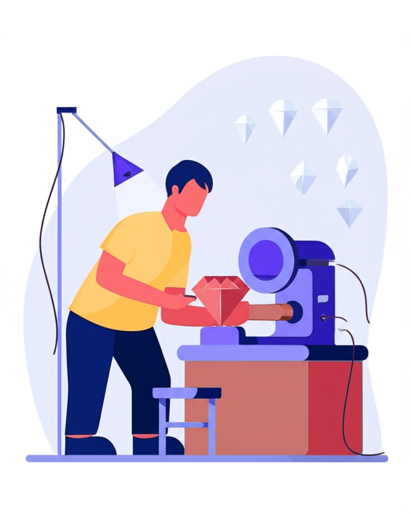
# プロンプト改善の実践

## 課題：以下を改善してみよう

### Before
```
議事録を作って
```

### 考えるポイント
- いつの会議？
- 参加者は？
- 何を決めた？
- どんな形式で？

**3分間で改善プロンプトを考えてみましょう**

---

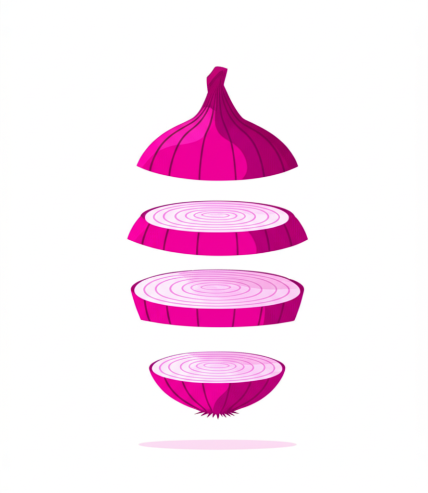
# 段階的に深掘りする技術

**1つのプロンプトで完璧を目指さない**

## ステップ1：まず聞いてみる
```
来月の企画案を考えて
```

## ステップ2：具体化する
```
その中で3番目のアイデアを詳しく教えて
```

## ステップ3：改善する
```
もう少しコストを抑えた案にできる？
```

**対話を重ねて、求める結果に近づける**

---

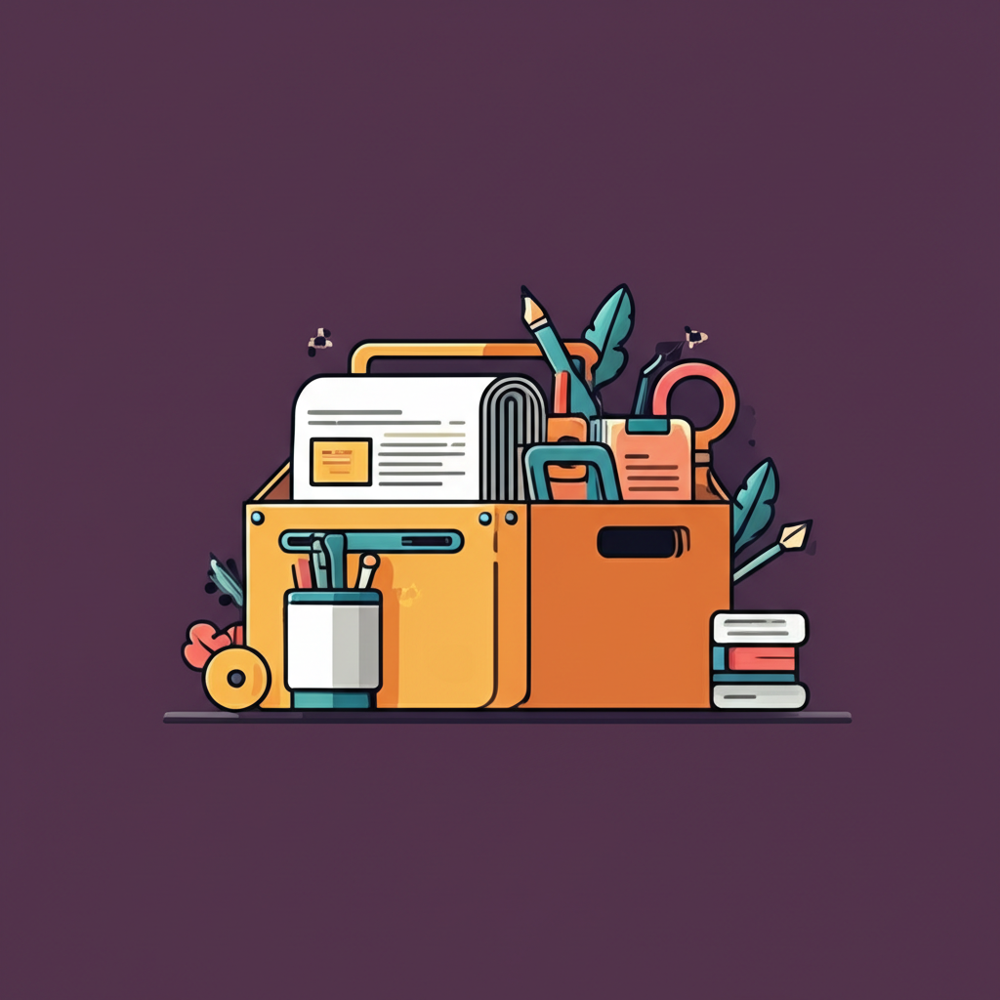
# 業務で使えるプロンプト集

## メール作成
```
[相手]に[目的]を伝えるメールを
[トーン]で[文字数]程度で作成してください
```

## 要約
```
以下の文章を[文字数]で要約してください。
重要なポイントを3つ箇条書きで示してください。
[文章]
```

## アイデア出し
```
[テーマ]について、[条件]を考慮した
アイデアを[数]個提案してください
```

---


# 第3部：NanoBanana Proで画像生成
## AIで画像を作ろう（20分）

---


# NanoBanana Proとは？

**Gemini 2.5 Flash Image**（通称：NanoBanana Pro）

Google Geminiに搭載された最新の画像生成AI

## 大きな進化ポイント

| 従来の課題 | NanoBanana Proでの改善 |
|-----------|----------------------|
| 文字が崩れる | **日本語テキストも綺麗に描画** |
| 一貫性がない | **同じキャラを繰り返し生成可能** |
| 指示通りにならない | **細かい指示への対応力向上** |

**画像生成AIが劇的に実用的になりました！**

---

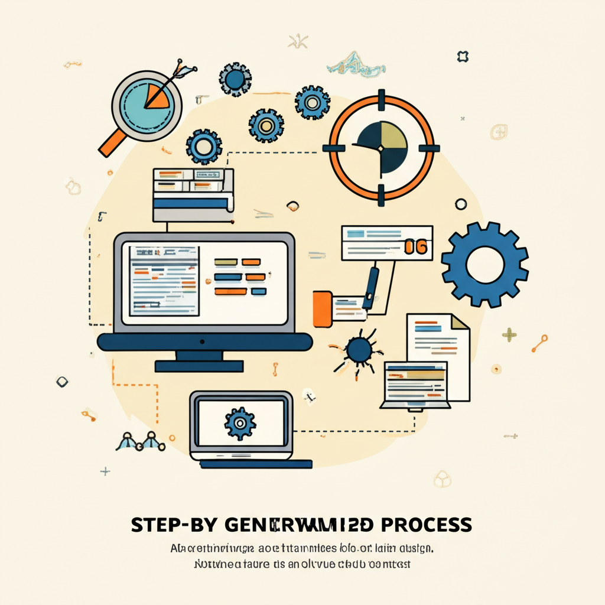
# NanoBanana Proの使い方

## Geminiで画像生成モードにする

```
画像を生成してください：
[作りたい画像の説明]
```

または

```
以下の内容でイラストを作成してください：
[詳細な指示]
```

**Geminiが自動的に画像生成モードになります**

---


# 画像生成プロンプトの基本

## 含めるべき要素

| 要素 | 説明 | 例 |
|------|------|-----|
| **主題** | 何を描くか | 「女性ビジネスパーソン」 |
| **スタイル** | 画風 | 「水彩画風」「写真風」 |
| **背景** | 場所や環境 | 「オフィスの会議室」 |
| **雰囲気** | 印象 | 「明るく前向きな」 |
| **構図** | カメラ位置 | 「上半身アップ」 |

---

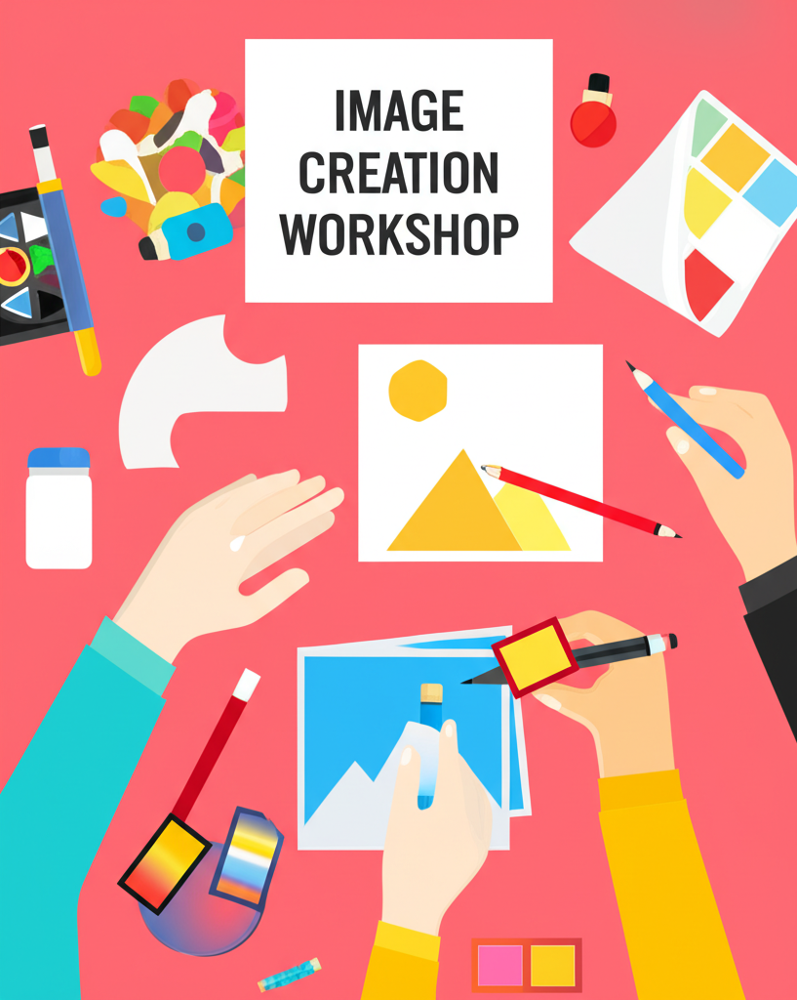
# 実習3：画像を生成してみよう

## 基本的なプロンプト
```
画像を生成してください：
明るいオフィスでノートパソコンを使っている
笑顔の女性ビジネスパーソン、
フラットデザイン風のイラスト
```

**Geminiで試してみましょう（3分）**

---


# 文字入り画像の生成

## NanoBanana Proの強み：テキスト描画

```
画像を生成してください：
「AI活用セミナー」と大きく書かれた
ビジネスイベントのバナー画像、
青と白を基調としたシンプルなデザイン
```

**従来苦手だった日本語テキストも綺麗に！**

---

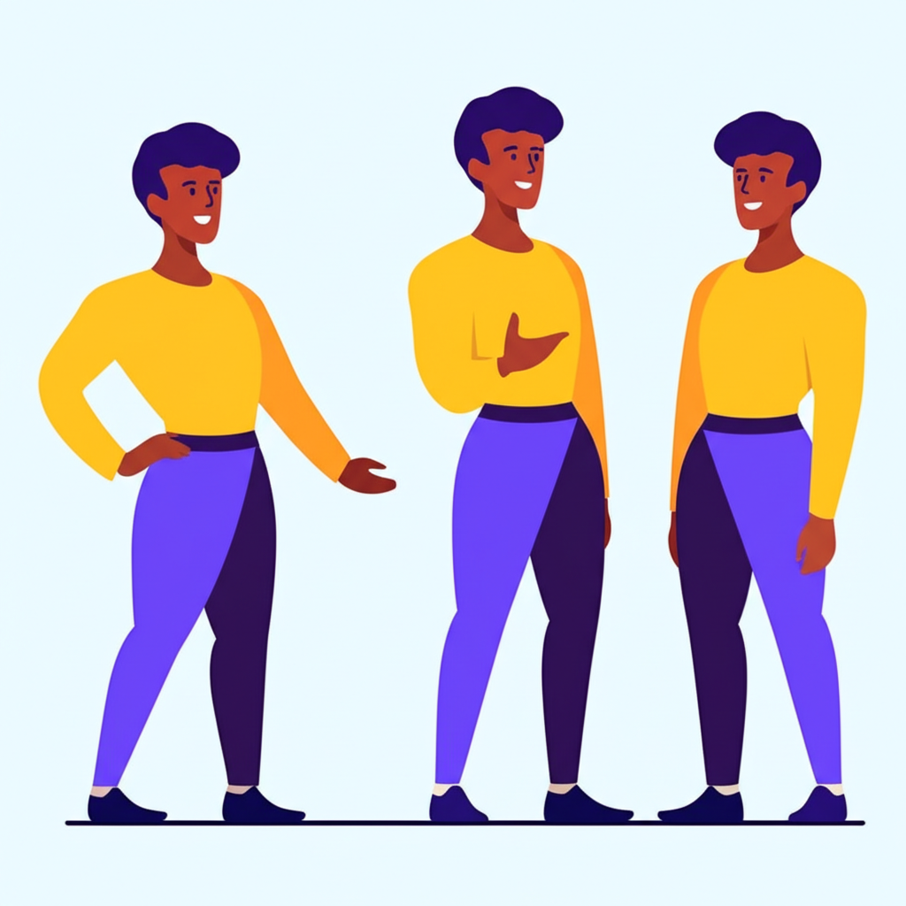
# 一貫性のあるキャラクター生成

## シリーズ画像を作る

```
以下の特徴を持つキャラクターを生成：
- 20代女性、ボブカット、メガネ
- ビジネスカジュアル服
- 明るい笑顔

このキャラクターが「説明している」ポーズで
```

```
同じキャラクターが「考えている」ポーズで
```

**同じキャラを維持したまま、様々なシーンを作成可能**

---


# 業務での画像生成活用例

| 用途 | 活用シーン |
|------|----------|
| **プレゼン資料** | スライド用のイラスト挿入 |
| **社内報** | 記事に合わせたイメージ画像 |
| **SNS投稿** | アイキャッチ画像の作成 |
| **企画書** | コンセプトイメージの可視化 |
| **マニュアル** | 手順説明用の図解 |

---

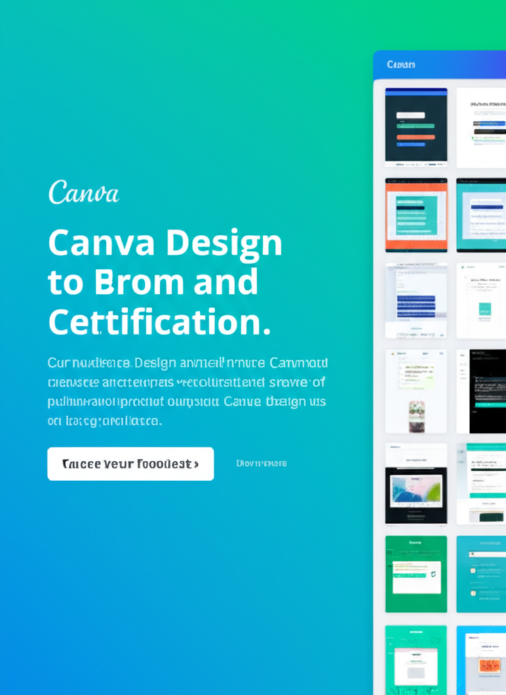
# 第4部：Canvaでバナー作成
## デザインツールとAIの融合（15分）

---


# Canvaとは？

**誰でも簡単にデザインできるツール**

## 特徴
- 無料で使える（有料版もあり）
- テンプレートが豊富
- ドラッグ＆ドロップで編集
- **AI機能が充実**

## アクセス
**canva.com** にアクセス

---

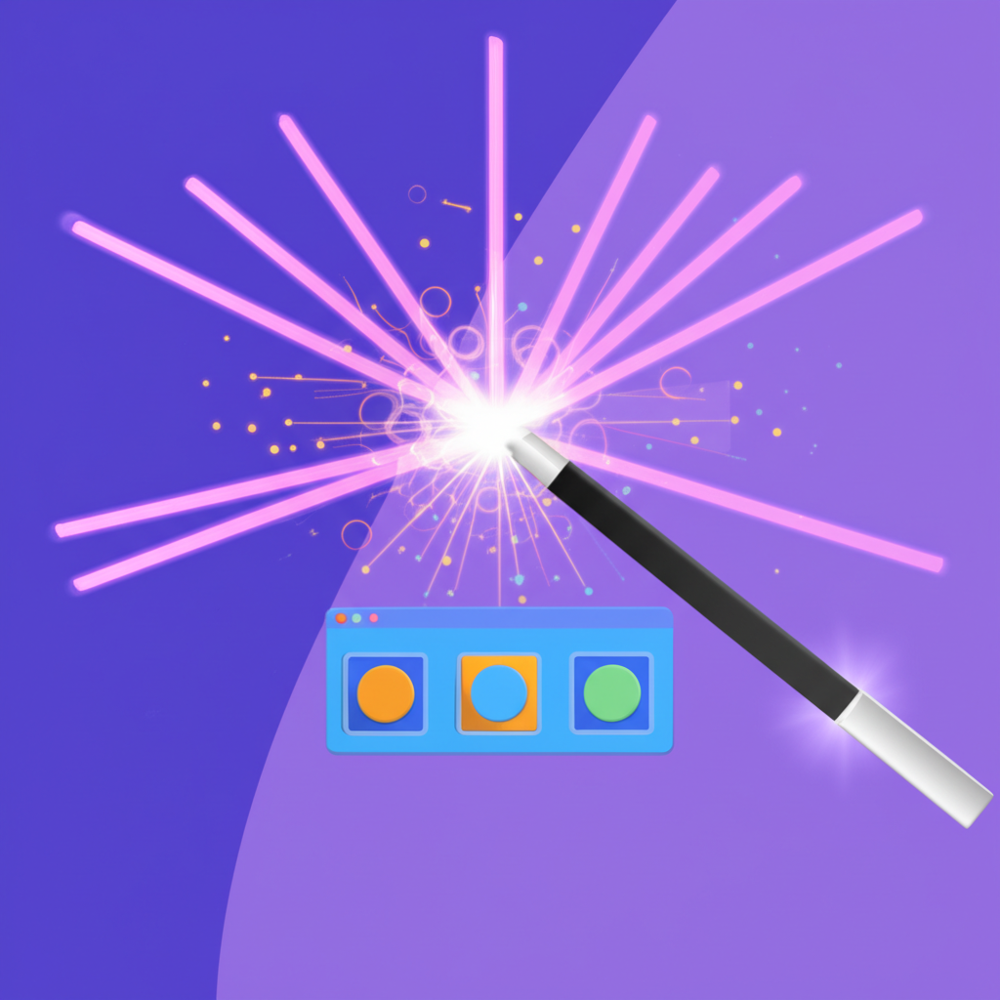
# CanvaでのAI活用

## 使えるAI機能

| 機能 | できること |
|------|----------|
| **Magic Design** | キーワードからデザイン自動生成 |
| **背景除去** | ワンクリックで背景削除 |
| **Magic Expand** | 画像を自然に拡張 |
| **テキスト生成** | キャッチコピー自動作成 |

---

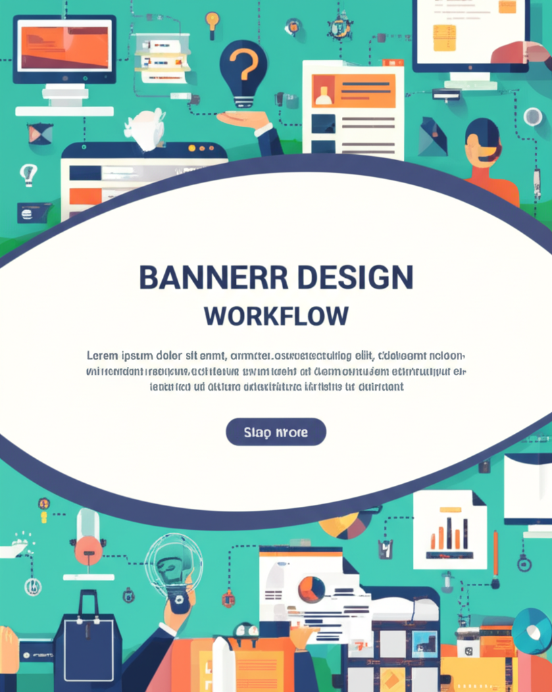
# バナー作成の流れ

## 1. テンプレート選択
- 用途に合ったサイズを選ぶ
- SNS投稿、プレゼン、ポスターなど

## 2. 素材を配置
- Geminiで生成した画像をアップロード
- Canvaの素材ライブラリを活用

## 3. テキストを追加
- タイトル、サブタイトル、日時など

## 4. 仕上げ
- 色味調整、レイアウト微調整

---


# 実習4：シンプルバナーを作ろう

## 課題：セミナー告知バナー

1. Canvaにアクセス
2. 「プレゼンテーション」サイズを選択
3. テンプレートを選ぶ
4. 以下を入力：
   - タイトル：「AI活用入門セミナー」
   - 日時：任意
   - 場所：任意

**5分で簡単なバナーを作ってみましょう**

---

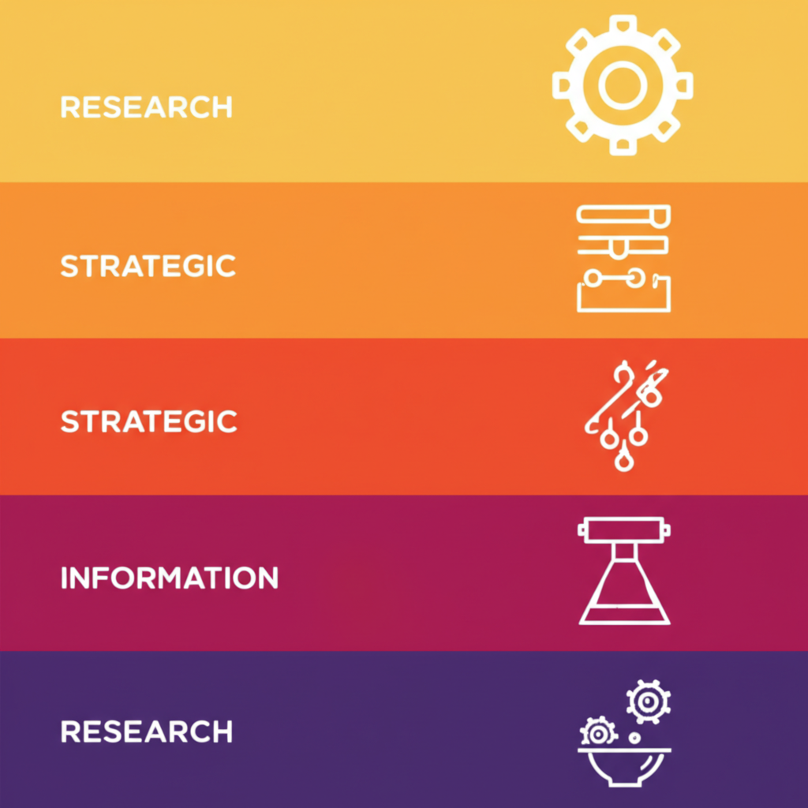
# GeminiとCanvaの連携活用

## 効率的なワークフロー

```
1. Geminiで画像生成
   ↓
2. 画像をダウンロード
   ↓
3. Canvaにアップロード
   ↓
4. テキストやレイアウト調整
   ↓
5. 完成！
```

**AIで素材を作り、Canvaで仕上げる**

---

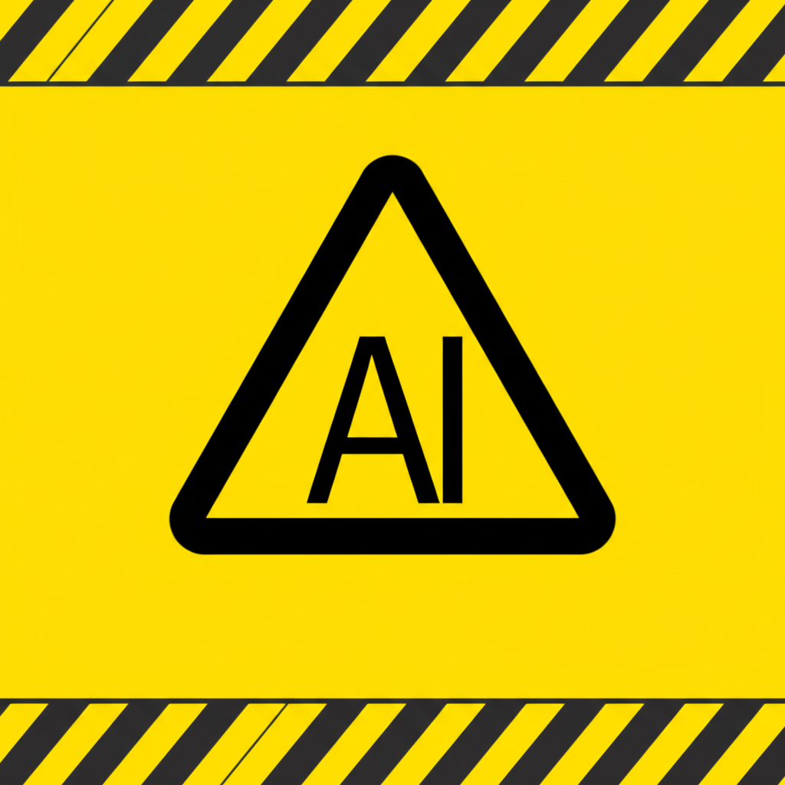
# 第5部：ディープリサーチ入門
## AIで効率的に情報収集（15分）

---


# ディープリサーチとは？

**表面的な検索を超えた、戦略的な情報収集**

| 通常の検索 | ディープリサーチ |
|-----------|---------------|
| キーワードで検索 | 複数の視点で調査 |
| 上位記事を読む | 情報を比較・分析 |
| 1つの答えを探す | 全体像を把握 |

---

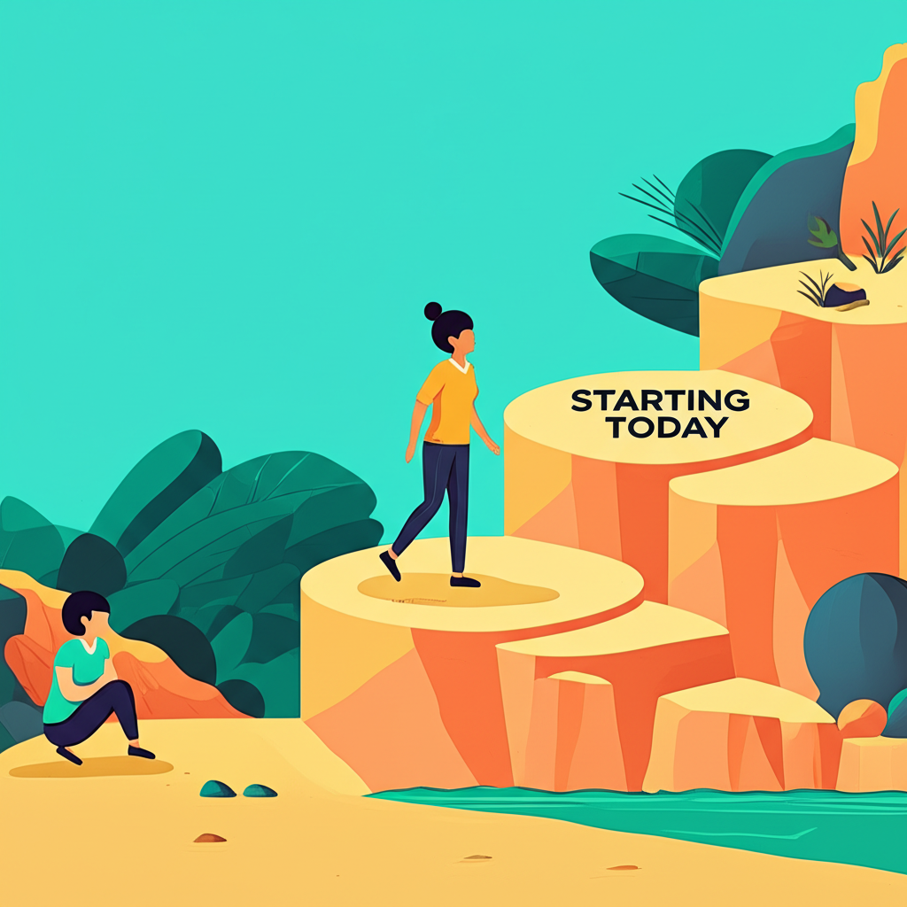
# Geminiでリサーチする

## 基本的な使い方

```
[テーマ]について調べてください：
- 現状の課題
- 最新のトレンド
- 主要なプレイヤー
- 今後の展望
```

## Geminiの強み
- Google検索と連携して最新情報を取得
- 複数の情報源をまとめて提示
- 出典を示してくれる

---


# 競合分析をAIで効率化

## SWOT分析のプロンプト

```
[企業名/サービス名]のSWOT分析をしてください：

- Strengths（強み）
- Weaknesses（弱み）
- Opportunities（機会）
- Threats（脅威）

それぞれ3点ずつ、根拠と共に説明してください。
```

---


# 実習5：クイックリサーチ

## 課題：業界トレンド調査

```
[自分の業界]における
AIの活用事例を3つ教えてください。
それぞれについて：
- 具体的な活用方法
- 得られる効果
- 導入の難易度
を説明してください。
```

**自分の業界に置き換えて試してみましょう（3分）**

---


# レポートにまとめる

## AIで調査結果を整理

```
これまでの調査内容を
以下の形式でまとめてください：

1. 要約（3行）
2. 主要な発見（箇条書き3点）
3. 推奨アクション（箇条書き2点）
4. 参考情報（出典）
```

**AIに聞いたことをAIにまとめさせる**

---


# AIを使う際の注意点

## ❌ やってはいけないこと
- 機密情報を入力する
- 個人情報を入力する
- AIの回答を100%鵜呑みにする

## ✅ 心がけること
- 回答の内容を必ず確認する
- 重要な情報は元ソースを確認
- AIは「アシスタント」として活用

---

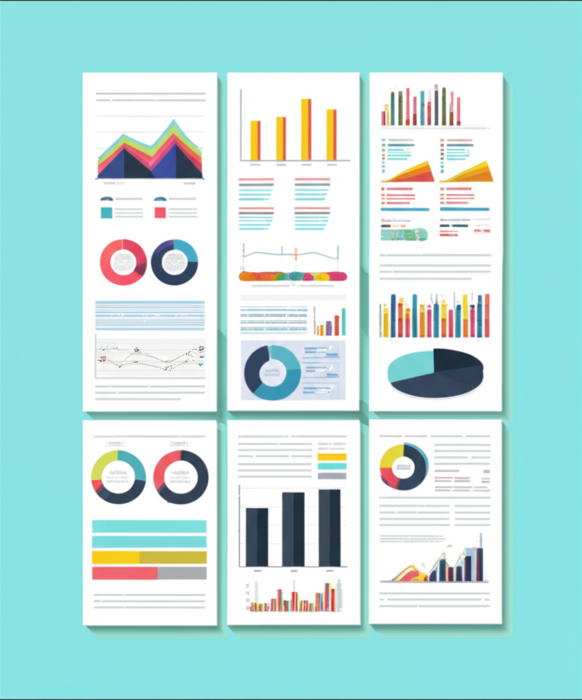
# AIの限界を知る

## ハルシネーション（幻覚）
- 事実でない情報を自信満々に回答することがある
- 特に数字や固有名詞に注意

## 対策
- 複数の情報源で確認
- 「出典を教えて」と聞く
- 最新情報は別途確認

**AIは便利だが、最終判断は人間が行う**

---


# まとめ

## 本日学んだこと

| テーマ | ポイント |
|--------|---------|
| AI基本 | Geminiで手軽にAI活用 |
| プロンプト | 5要素を意識して具体的に |
| 画像生成 | NanoBanana Proで文字も綺麗に |
| バナー作成 | Canva + AIで効率的に |
| リサーチ | AIで調査・整理を効率化 |

---


# 今日から実践できること

## Step 1：毎日触る
- 簡単な質問からGeminiを使う
- メールの下書きを依頼してみる

## Step 2：業務で試す
- 報告書の構成案を相談
- 会議の議事録を整理

## Step 3：画像を作る
- プレゼン用のイラストを生成
- SNS投稿のアイキャッチを作成

---


# 便利なプロンプト集

## すぐ使えるテンプレート

**メール作成**
```
[相手]に[目的]のメールを[トーン]で作成して
```

**要約**
```
以下を[文字数]で要約して。重要点を3つ示して
```

**アイデア出し**
```
[テーマ]のアイデアを[数]個、メリット付きで
```

**画像生成**
```
[主題]を[スタイル]で、[雰囲気]のイメージで生成
```

---

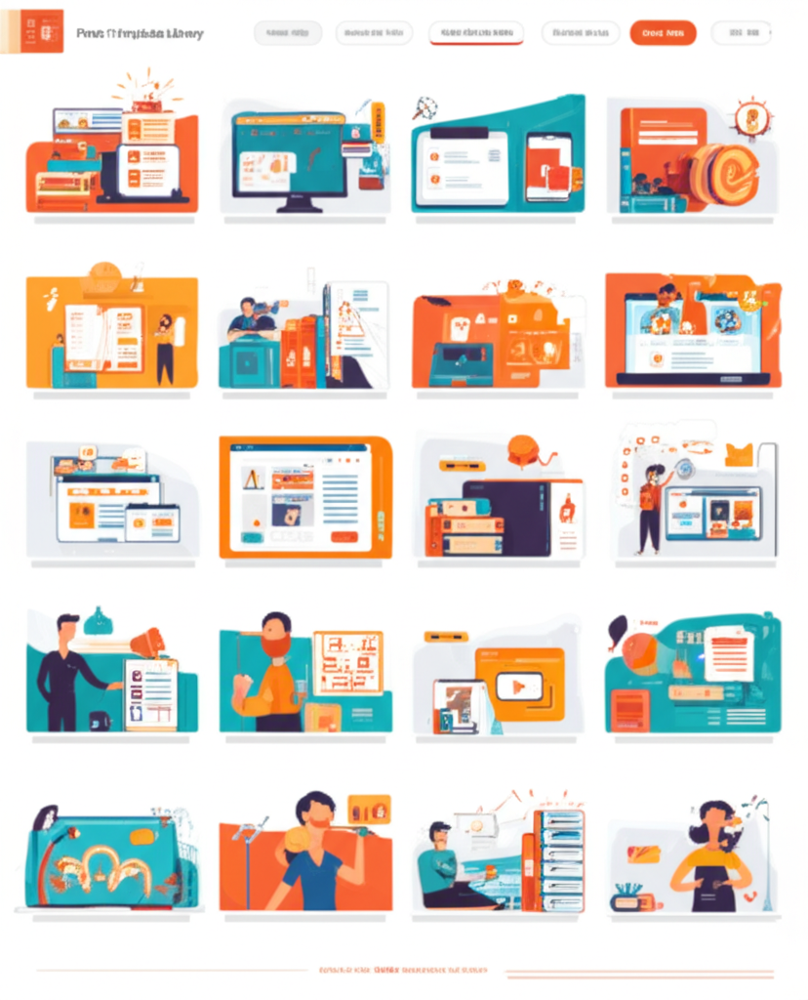
# 参考リンク

- **Google Gemini**: gemini.google.com
- **Canva**: canva.com
- **Google公式ヘルプ**: Geminiの使い方ガイド

---

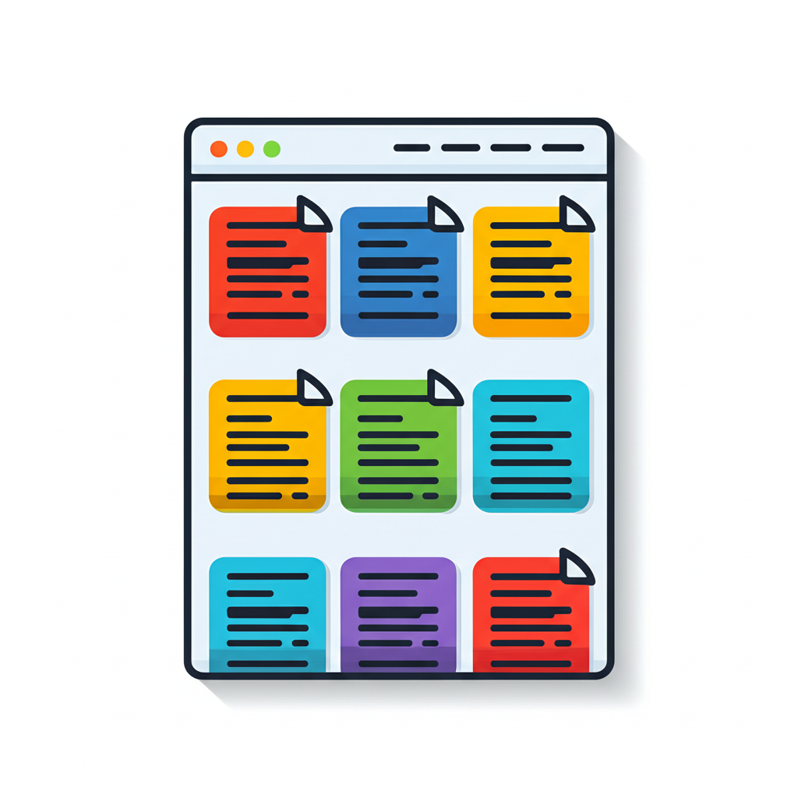
# 質疑応答

**わからないこと、もっと知りたいことはありますか？**

よくある質問：
- プロンプトがうまく書けない
- 画像が思い通りにならない
- 業務のどこで使えばいい？

---


# 最後に

## AIは怖くない、難しくない

- 使えば使うほど上達します
- 失敗を恐れずに試してください
- AIはあなたの**優秀なアシスタント**です

**今日から少しずつ、AIを味方につけて業務効率化を！**

---


# ありがとうございました！

実践あるのみ！

今日から**Gemini**を使ってみてください
